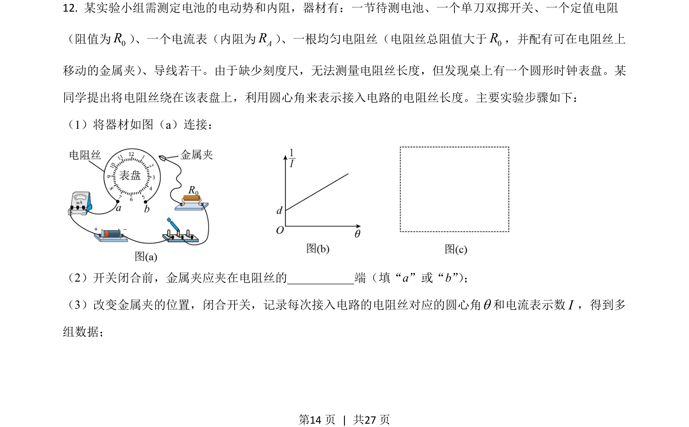
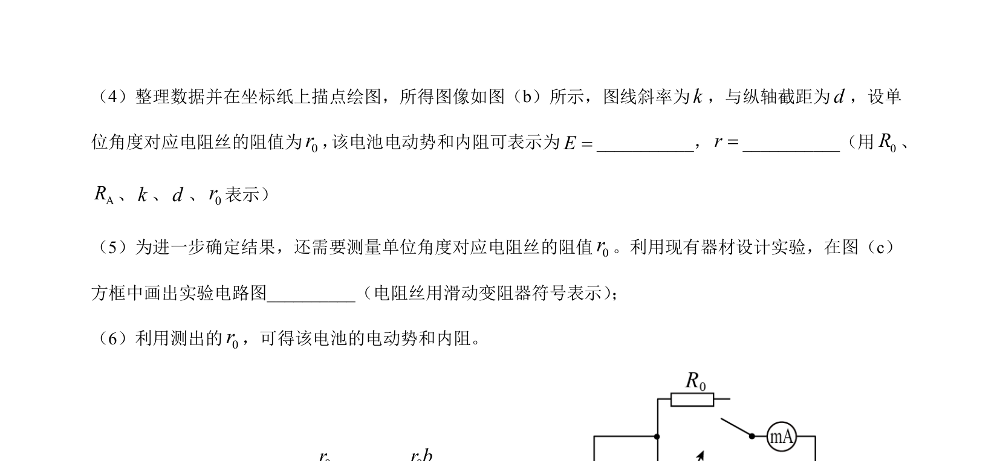
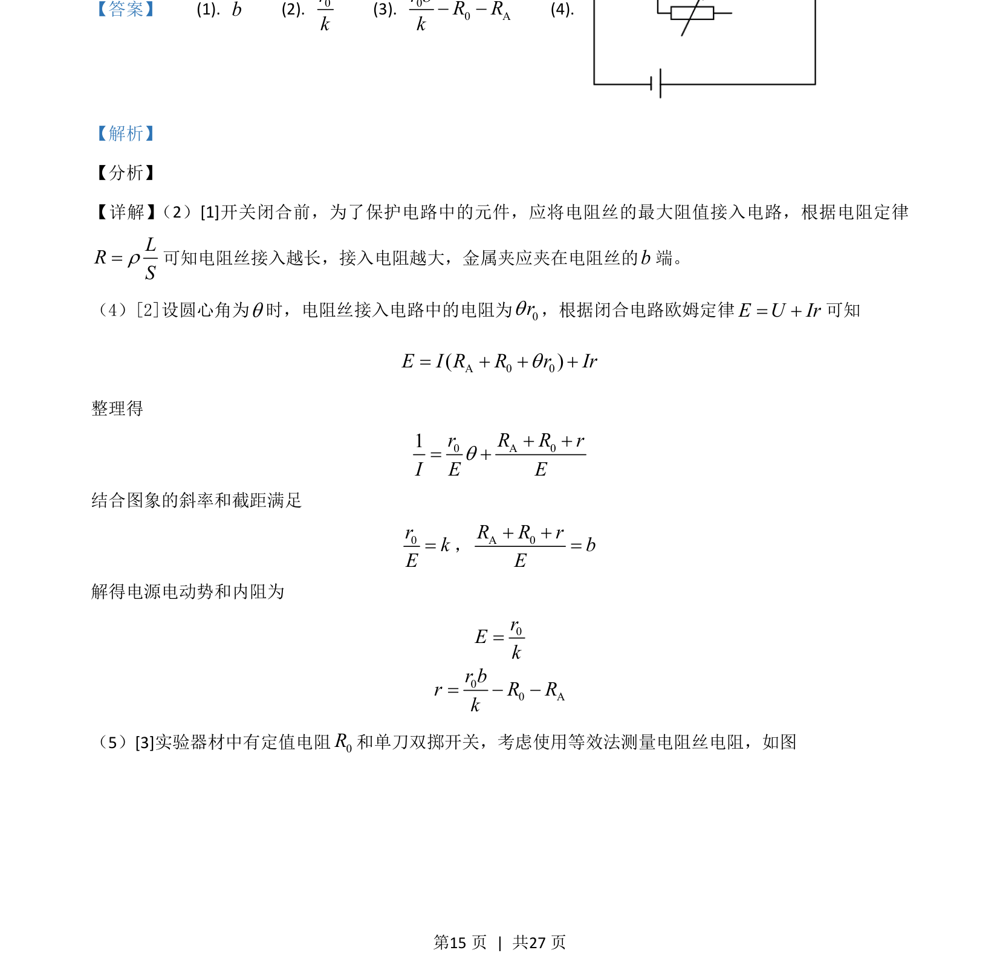
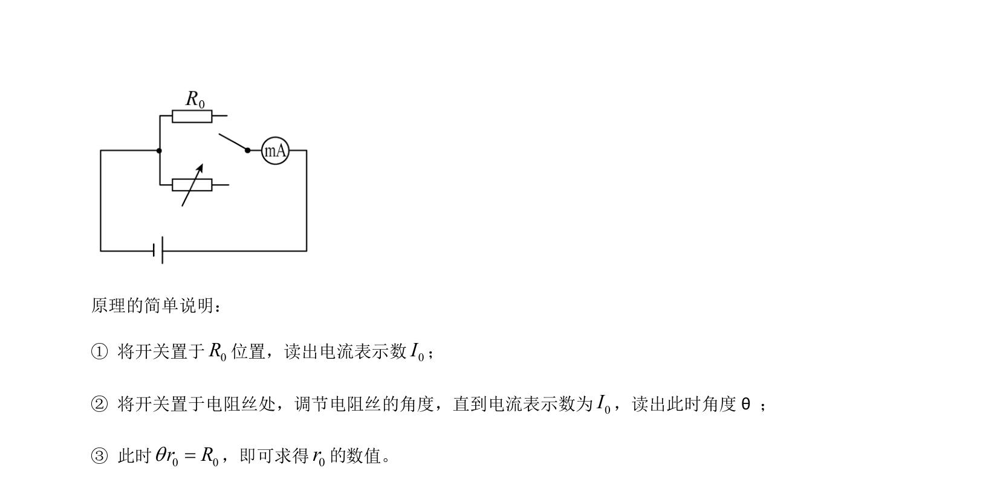

## 题面

## 摘要

该题考查利用电阻丝和闭合电路欧姆定律测量电源电动势、内阻，并设计等效法测电阻丝电阻。

## 关联考点

- [[332-闭合电路欧姆定律|闭合电路欧姆定律]]
- [[318-电阻定律|电阻定律]]
- [[861-图像法处理数据|图像法处理数据]]
- [[等效替代法测电阻]]

## 答案与解析

> 📄 原 PDF 第 14 页：`素材/真题/湖南/2008-2024·（湖南）物理高考真题/2021年高考物理试卷（湖南）（解析卷）.pdf`

<!-- 题干文本-start -->
## 题干文本
12. 某实验小组需测定电池的电动势和内阻，器材有：一节待测电池、一个单刀双掷开关、一个定值电阻
（阻值为0R） 、一个电流表（内阻为AR） 、一根均匀电阻丝（电阻丝总阻值大于0R，并配有可在电阻丝上
移动的金属夹） 、导线若干。由于缺少刻度尺，无法测量电阻丝长度，但发现桌上有一个圆形时钟表盘。某
同学提出将电阻丝绕在该表盘上，利用圆心角来表示接入电路的电阻丝长度。主要实验步骤如下：
（1）将器材如图（a）连接：
（2）开关闭合前，金属夹应夹在电阻丝的___________端（填“a”或“b”） ；
（3）改变金属夹的位置，闭合开关，记录每次接入电路的电阻丝对应的圆心角q和电流表示数I，得到多
组数据；
<!-- 题干文本-end -->

<!-- 解析文本-start -->
## 解析文本

<!-- 解析文本-end -->
