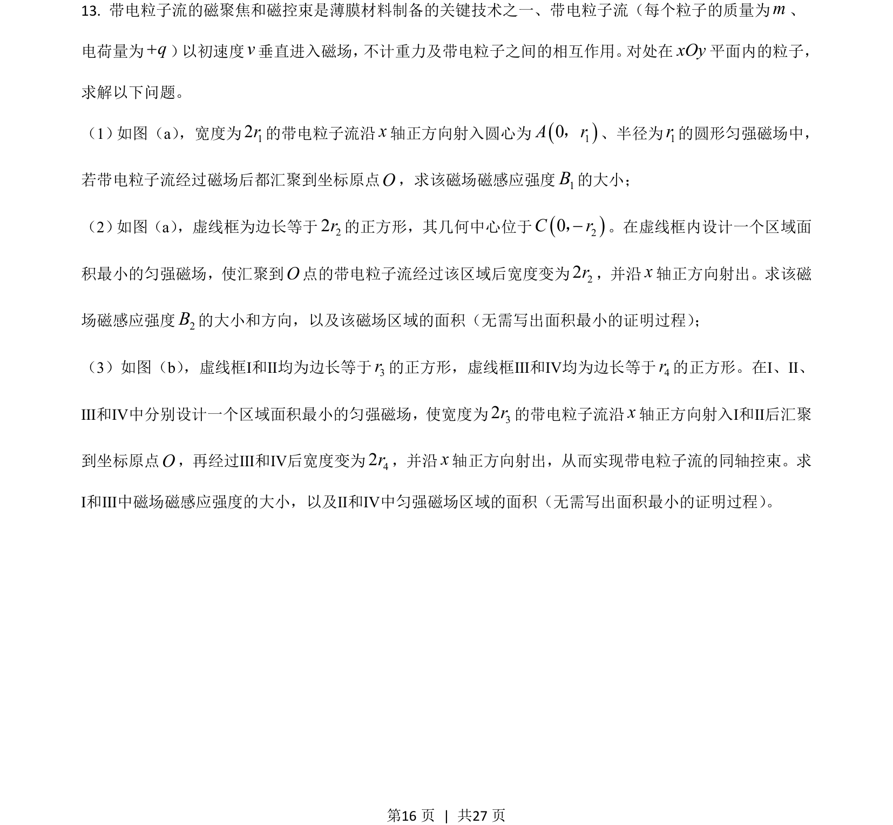
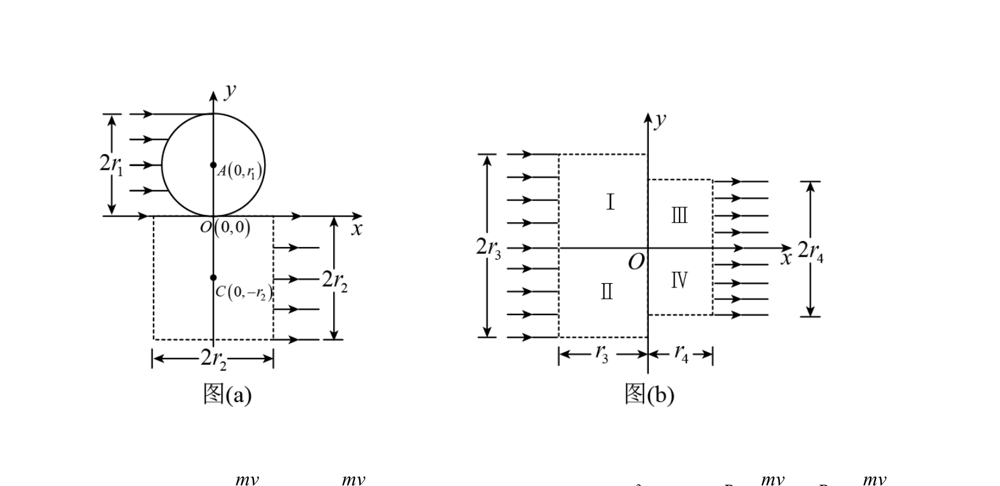
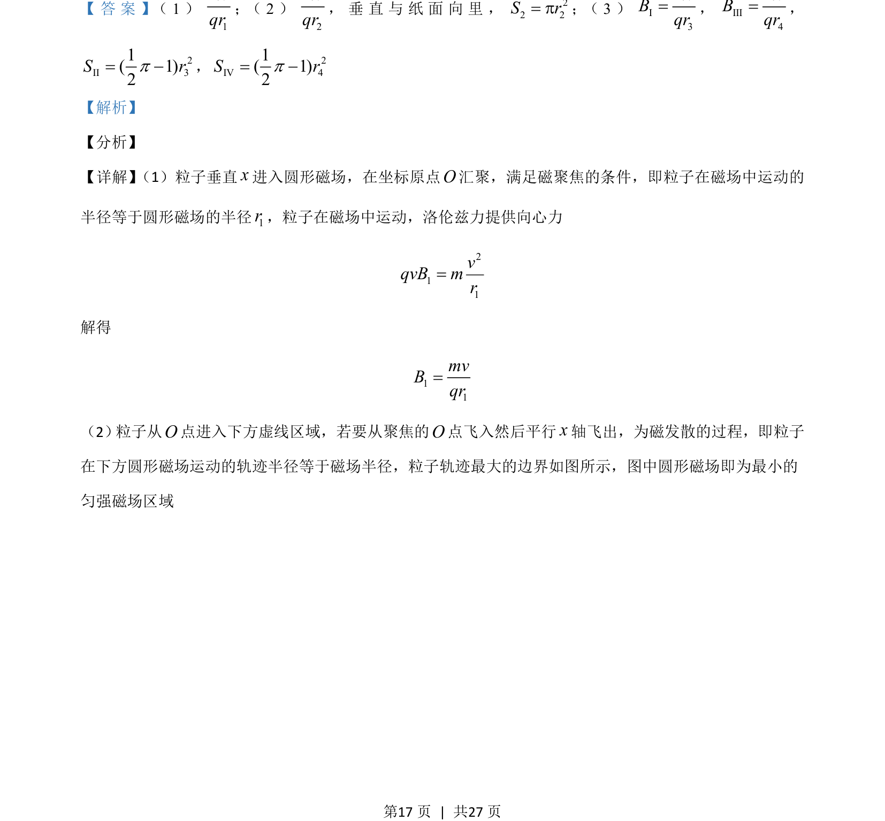
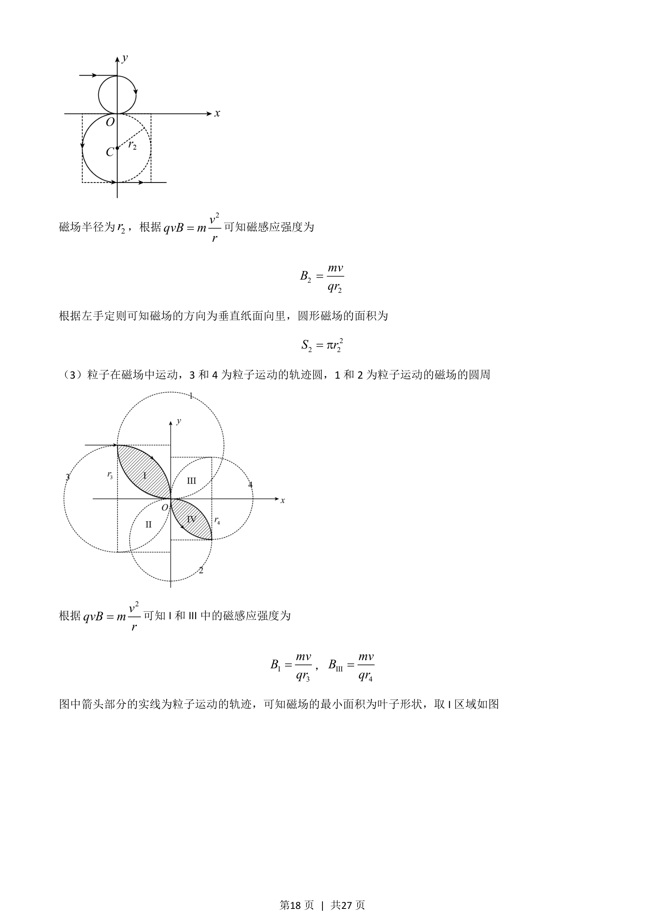
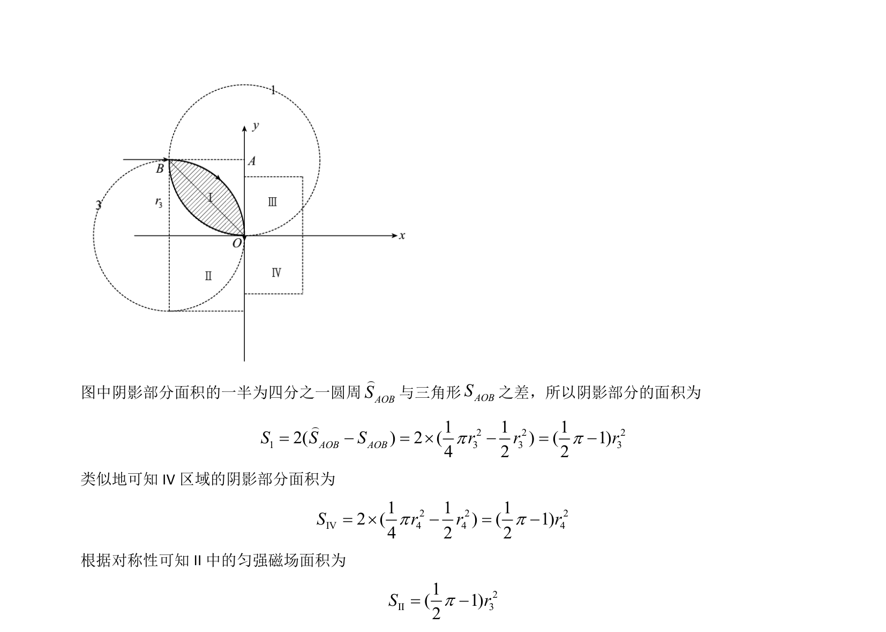

## 题面

## 摘要

本题通过圆形磁场实现粒子的磁聚焦与磁发散，并计算所需磁场区域的最小面积。

## 关联考点

- [[469-带电粒子在磁场中的运动|带电粒子在磁场中的运动]]
- [[磁聚焦]]
- [[磁发散]]
- [[649-洛伦兹力提供向心力|洛伦兹力提供向心力]]

## 答案与解析

> 📄 原 PDF 第 16 页：`素材/真题/湖南/2008-2024·（湖南）物理高考真题/2021年高考物理试卷（湖南）（解析卷）.pdf`
