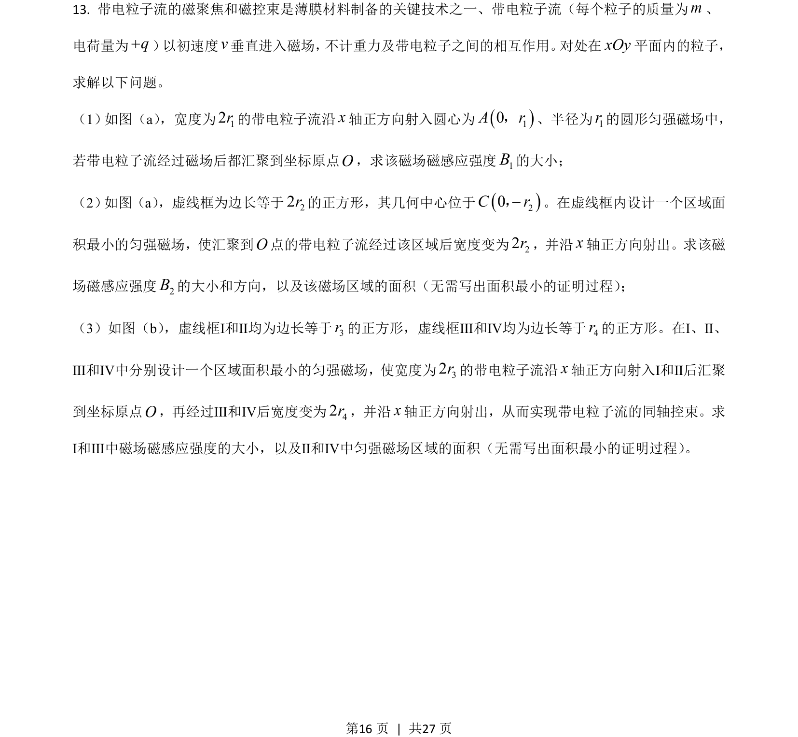
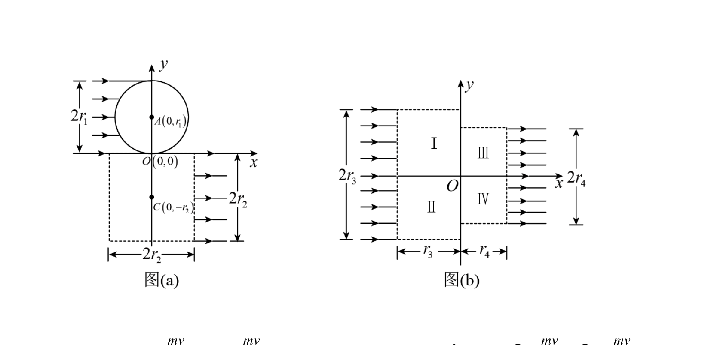
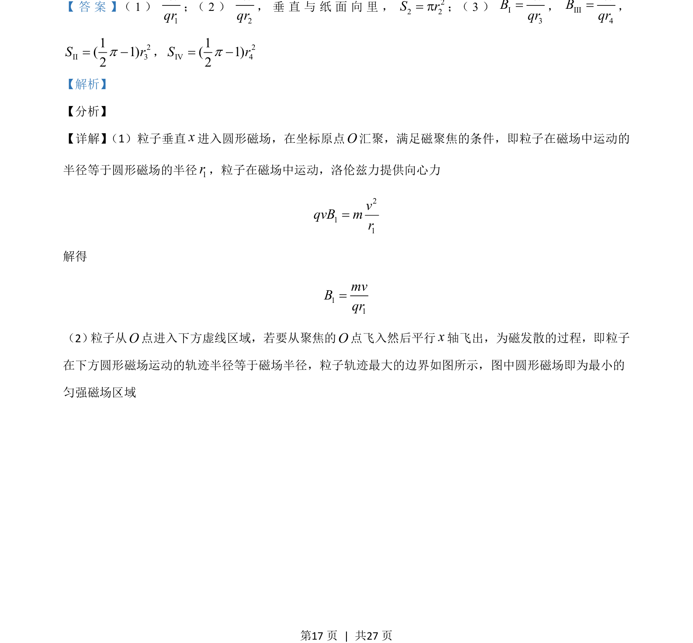
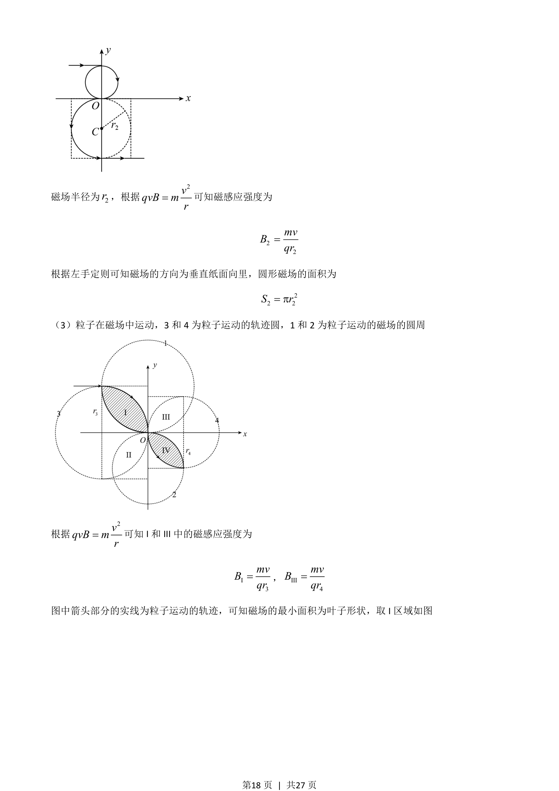
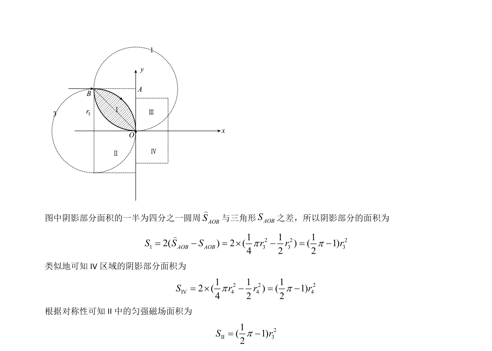

## 题面

## 摘要

本题通过圆形磁场实现粒子的磁聚焦与磁发散，并计算所需磁场区域的最小面积。

## 关联考点

- [[469-带电粒子在磁场中的运动|带电粒子在磁场中的运动]]
- [[磁聚焦]]
- [[磁发散]]
- [[649-洛伦兹力提供向心力|洛伦兹力提供向心力]]

## 答案与解析

> 📄 原 PDF 第 16 页：`素材/真题/湖南/2008-2024·（湖南）物理高考真题/2021年高考物理试卷（湖南）（解析卷）.pdf`

<!-- 题干文本-start -->
## 题干文本
13. 带电粒子流的磁聚焦和磁控束是薄膜材料制备的关键技术之一、带电粒子流（每个粒子的质量为m、
电荷量为q+） 以初速度v垂直进入磁场， 不计重力及带电粒子之间的相互作用。 对处在xOy平面内的粒子，
求解以下问题。
（1） 如图（a） ，宽度为12r的带电粒子流沿x轴正方向射入圆心为()10A r，、半径为1r的圆形匀强磁场中，
若带电粒子流经过磁场后都汇聚到坐标原点O，求该磁场磁感应强度1B的大小；
（2） 如图（a） ，虚线框为边长等于22r的正方形，其几何中心位于()20C r-，。在虚线框内设计一个区域面
积最小的匀强磁场，使汇聚到O点的带电粒子流经过该区域后宽度变为22r，并沿x轴正方向射出。求该磁
场磁感应强度2B的大小和方向，以及该磁场区域的面积（无需写出面积最小的证明过程） ；
（3）如图（b） ，虛线框Ⅰ和Ⅱ均为边长等于3r的正方形，虚线框Ⅲ和Ⅳ均为边长等于4r的正方形。在Ⅰ、Ⅱ、
Ⅲ和Ⅳ中分别设计一个区域面积最小的匀强磁场，使宽度为32r的带电粒子流沿x轴正方向射入Ⅰ和Ⅱ后汇聚
到坐标原点O，再经过Ⅲ和Ⅳ后宽度变为42r，并沿x轴正方向射出，从而实现带电粒子流的同轴控束。求
Ⅰ和Ⅲ中磁场磁感应强度的大小，以及Ⅱ和Ⅳ中匀强磁场区域的面积（无需写出面积最小的证明过程） 。
的
<!-- 题干文本-end -->

<!-- 解析文本-start -->
## 解析文本

<!-- 解析文本-end -->
