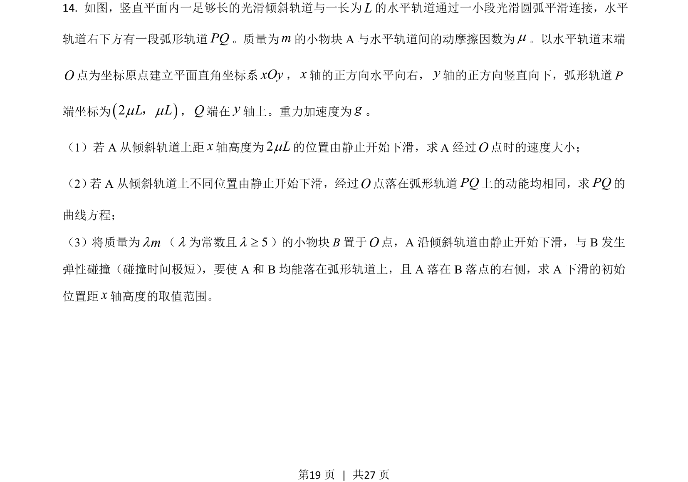
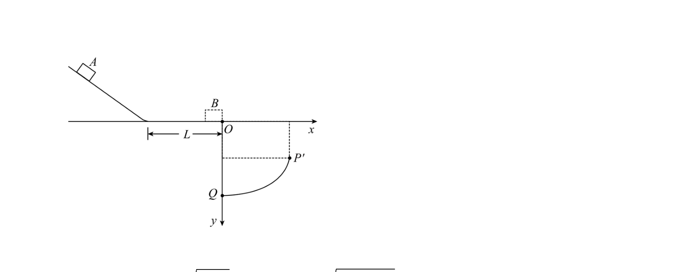
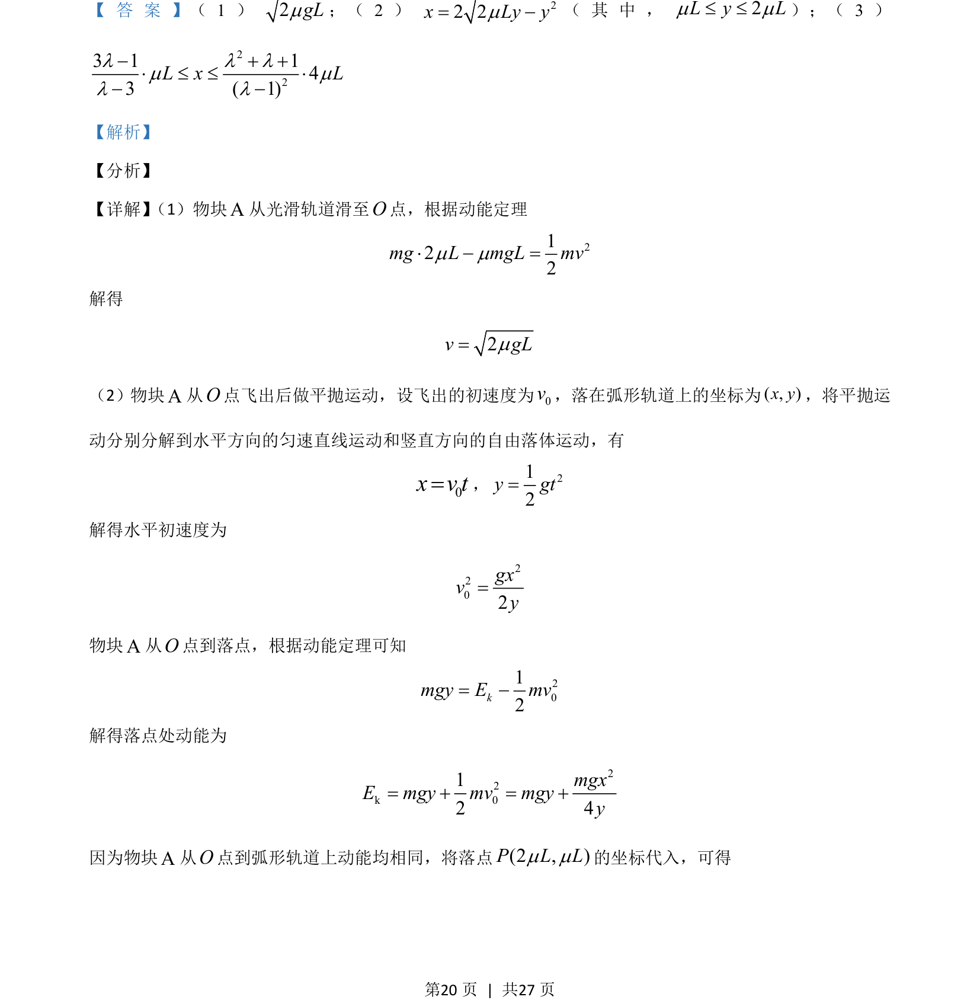
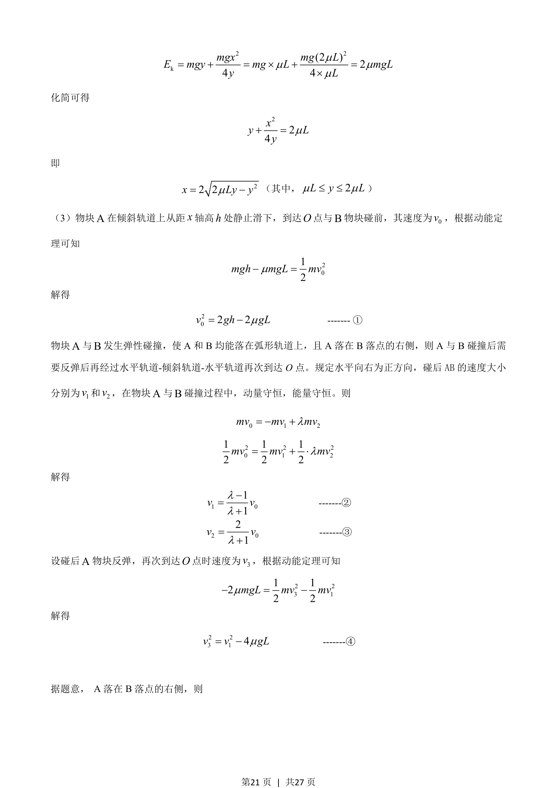
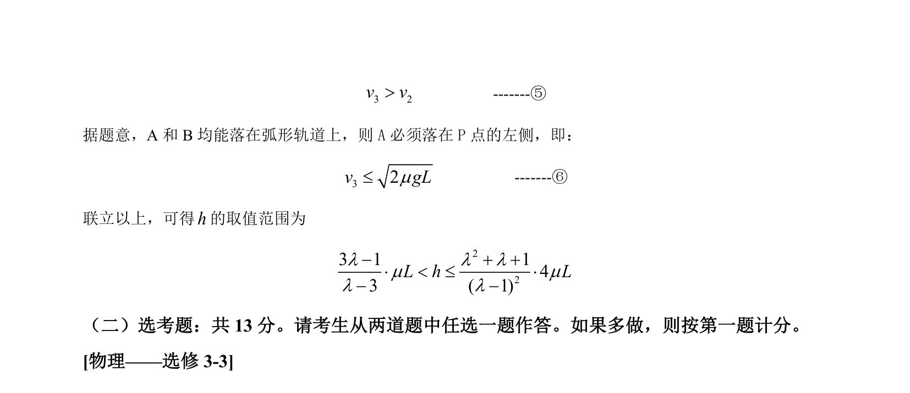

## 题面

## 摘要

物块在光滑轨道、平抛、弹性碰撞与动能定理综合问题，求下落高度范围。

## 关联考点

- [[251-动能定理|动能定理]]
- [[261-平抛运动|平抛运动]]
- [[359-弹性碰撞|弹性碰撞]]
- [[539-动量守恒|动量守恒]]

## 答案与解析

> 📄 原 PDF 第 19 页：`素材/真题/湖南/2008-2024·（湖南）物理高考真题/2021年高考物理试卷（湖南）（解析卷）.pdf`
