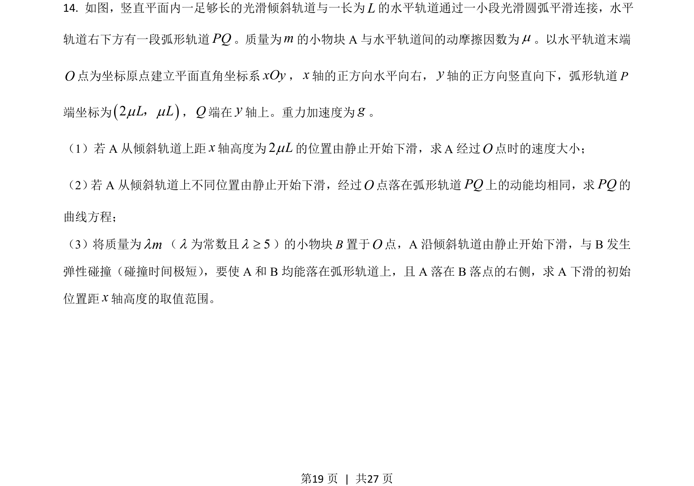
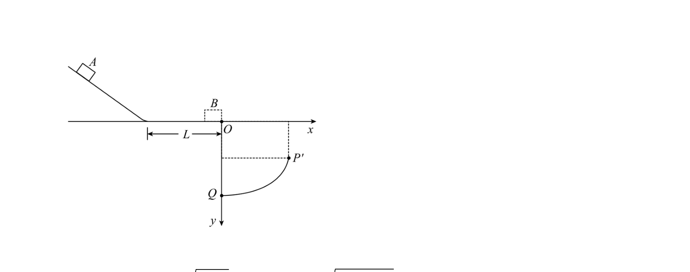
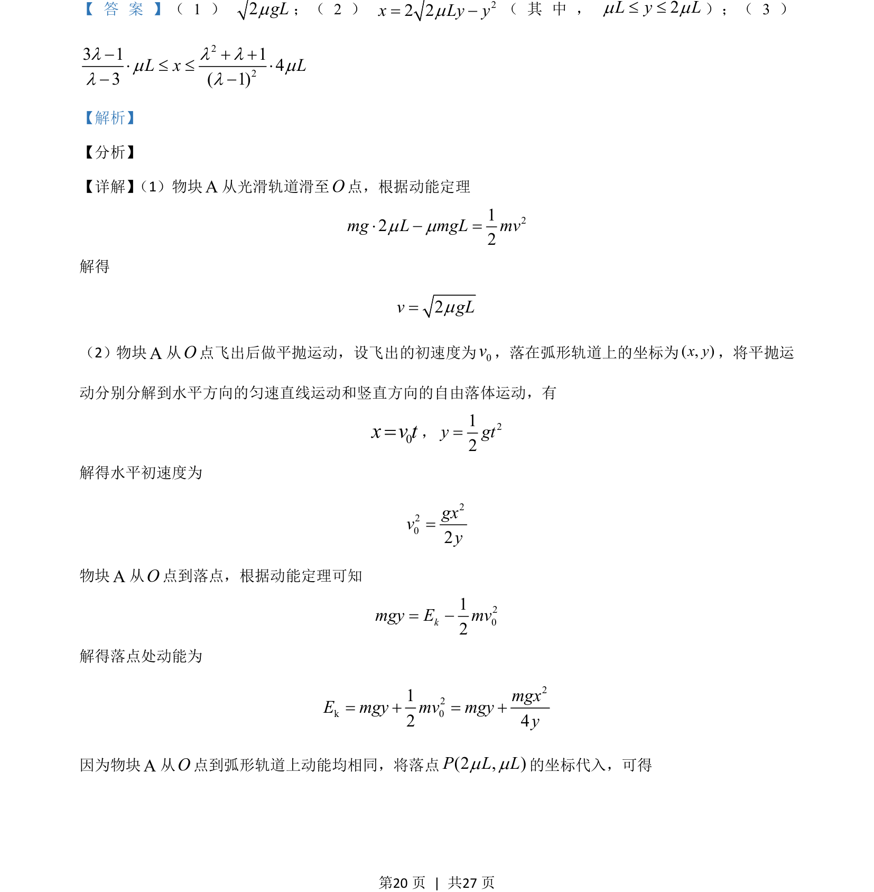
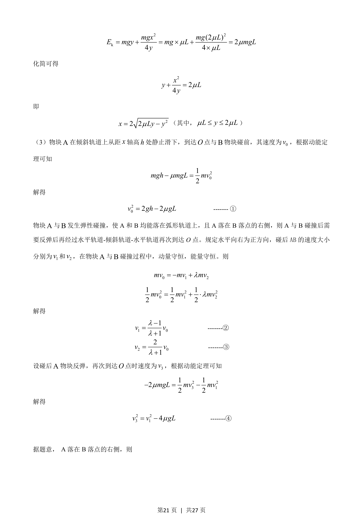
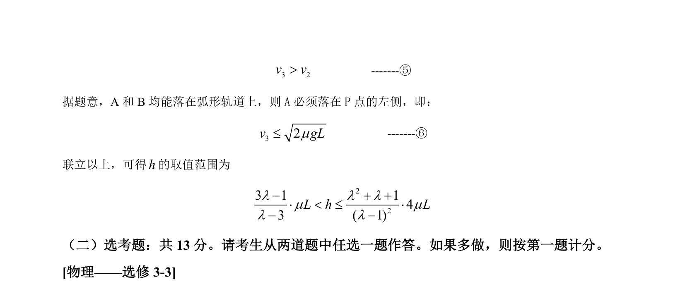

## 题面

## 摘要

物块在光滑轨道、平抛、弹性碰撞与动能定理综合问题，求下落高度范围。

## 关联考点

- [[251-动能定理|动能定理]]
- [[261-平抛运动|平抛运动]]
- [[359-弹性碰撞|弹性碰撞]]
- [[539-动量守恒|动量守恒]]

## 答案与解析

> 📄 原 PDF 第 19 页：`素材/真题/湖南/2008-2024·（湖南）物理高考真题/2021年高考物理试卷（湖南）（解析卷）.pdf`

<!-- 题干文本-start -->
## 题干文本
14. 如图，竖直平面内一足够长的光滑倾斜轨道与一长为L的水平轨道通过一小段光滑圆弧平滑连接，水平
轨道右下方有一段弧形轨道PQ。质量为m的小物块 A 与水平轨道间的动摩擦因数为μ。以水平轨道末端
O点为坐标原点建立平面直角坐标系xOy，x轴的正方向水平向右，y轴的正方向竖直向下，弧形轨道P
端坐标为()2L Lμ μ，，Q端在y轴上。重力加速度为g。
（1）若 A 从倾斜轨道上距x轴高度为2Lμ的位置由静止开始下滑，求A经过O点时的速度大小；
（2） 若A 从倾斜轨道上不同位置由静止开始下滑，经过O点落在弧形轨道PQ上的动能均相同，求PQ的
曲线方程；
（3）将质量为ml（l为常数且5l³）的小物块B置于O点，A 沿倾斜轨道由静止开始下滑，与 B发生
弹性碰撞（碰撞时间极短） ，要使A 和 B均能落在弧形轨道上，且 A 落在 B落点的右侧，求 A 下滑的初始
位置距x轴高度的取值范围。
<!-- 题干文本-end -->

<!-- 解析文本-start -->
## 解析文本

<!-- 解析文本-end -->
