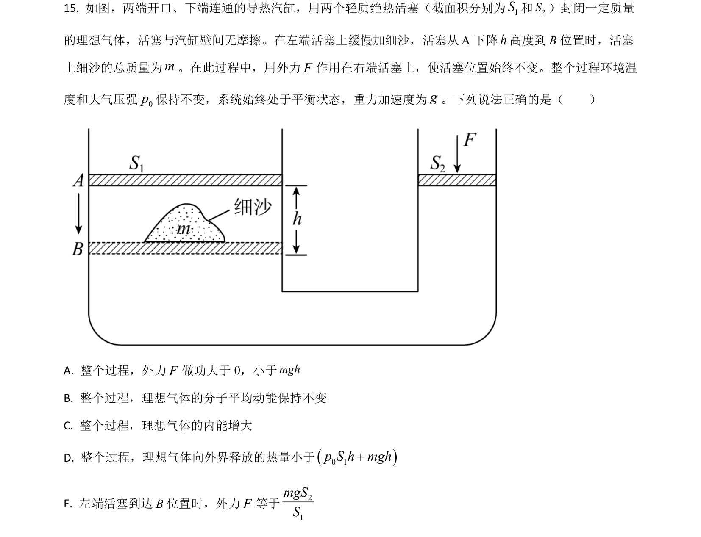
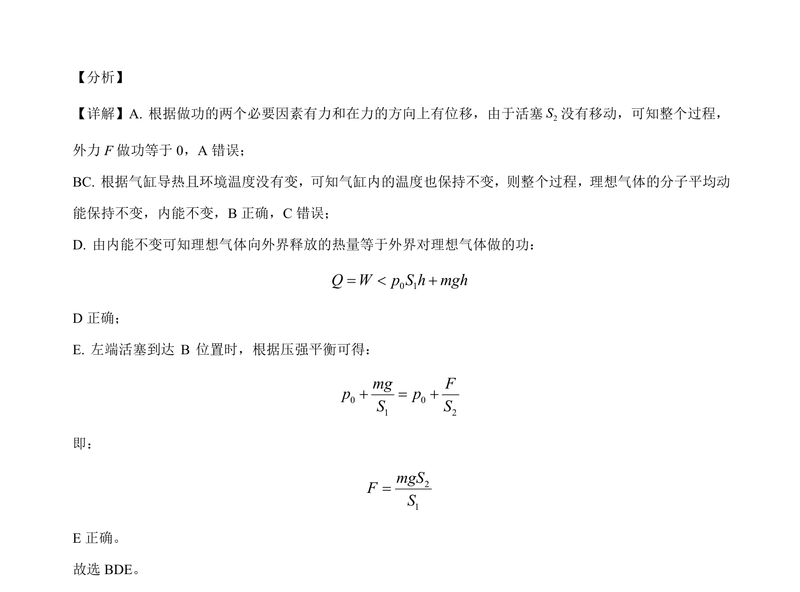

## 题面

## 摘要

根据活塞移动、外力做功、内能变化及热力学定律判断理想气体状态与能量关系

## 关联考点

- [[248-功的定义-高中|做功]]
- [[127-内能|内能]]
- [[440-热力学第一定律|热力学第一定律]]
- [[446-理想气体状态方程|理想气体状态方程]]

## 答案与解析

> 📄 原 PDF 第 22 页：`素材/真题/湖南/2008-2024·（湖南）物理高考真题/2021年高考物理试卷（湖南）（解析卷）.pdf`
