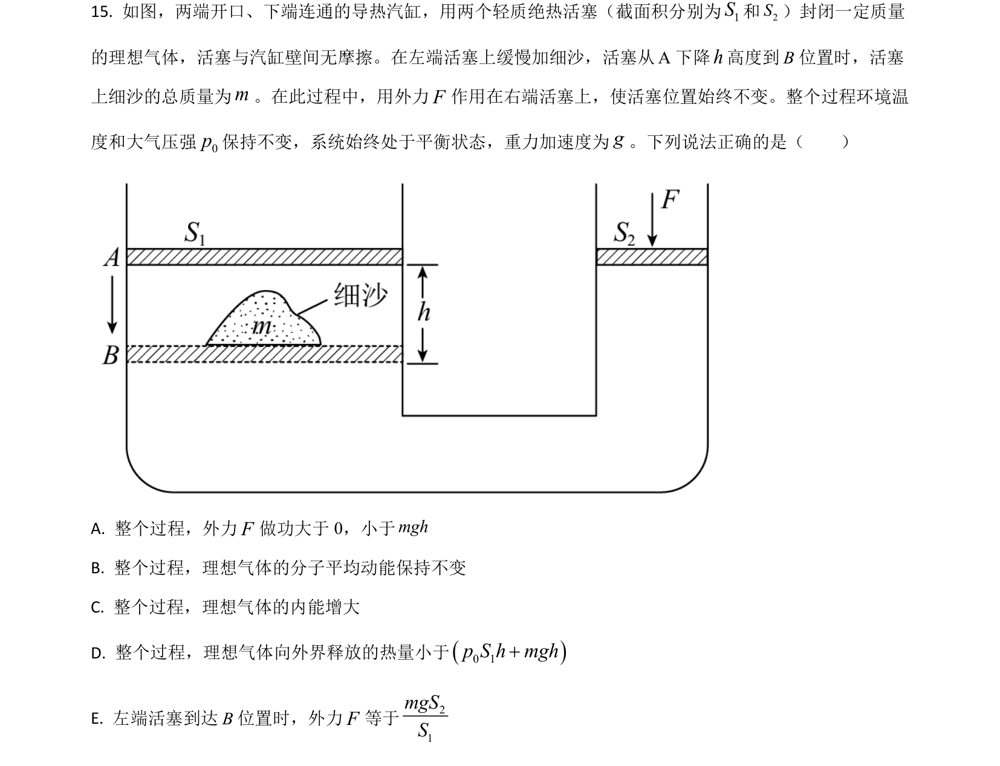
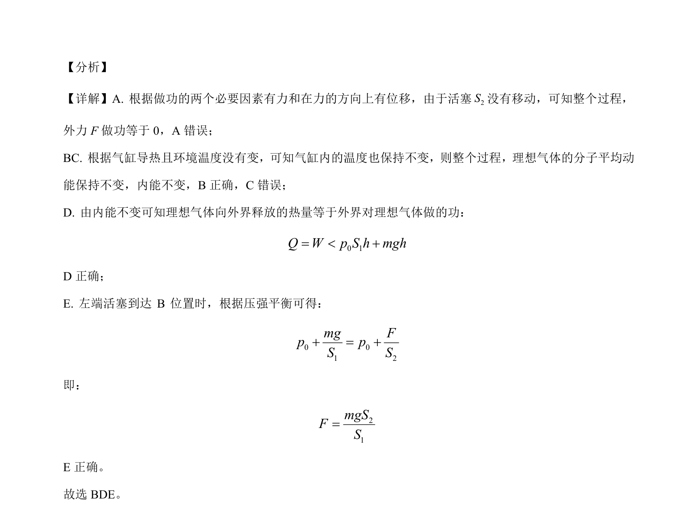

## 题面

## 摘要

根据活塞移动、外力做功、内能变化及热力学定律判断理想气体状态与能量关系

## 关联考点

- [[248-功的定义-高中|做功]]
- [[127-内能|内能]]
- [[440-热力学第一定律|热力学第一定律]]
- [[446-理想气体状态方程|理想气体状态方程]]

## 答案与解析

> 📄 原 PDF 第 22 页：`素材/真题/湖南/2008-2024·（湖南）物理高考真题/2021年高考物理试卷（湖南）（解析卷）.pdf`

<!-- 题干文本-start -->
## 题干文本
15. 如图，两端开口、下端连通的导热汽缸，用两个轻质绝热活塞（截面积分别为1S和2S）封闭一定质量
的理想气体，活塞与汽缸壁间无摩擦。在左端活塞上缓慢加细沙，活塞从A下降h高度到B位置时，活塞
上细沙的总质量为m。在此过程中，用外力F作用在右端活塞上，使活塞位置始终不变。整个过程环境温
度和大气压强0p保持不变，系统始终处于平衡状态，重力加速度为g。下列说法正确的是（　　）
A. 整个过程，外力F做功大于 0，小于mgh
B. 整个过程，理想气体的分子平均动能保持不变
C. 整个过程，理想气体的内能增大
D. 整个过程，理想气体向外界释放的热量小于0 1p S h mgh+
E. 左端活塞到达B位置时，外力F等于21mgSS
<!-- 题干文本-end -->

<!-- 解析文本-start -->
## 解析文本
【答案】BDE
【解析】
<!-- 解析文本-end -->
