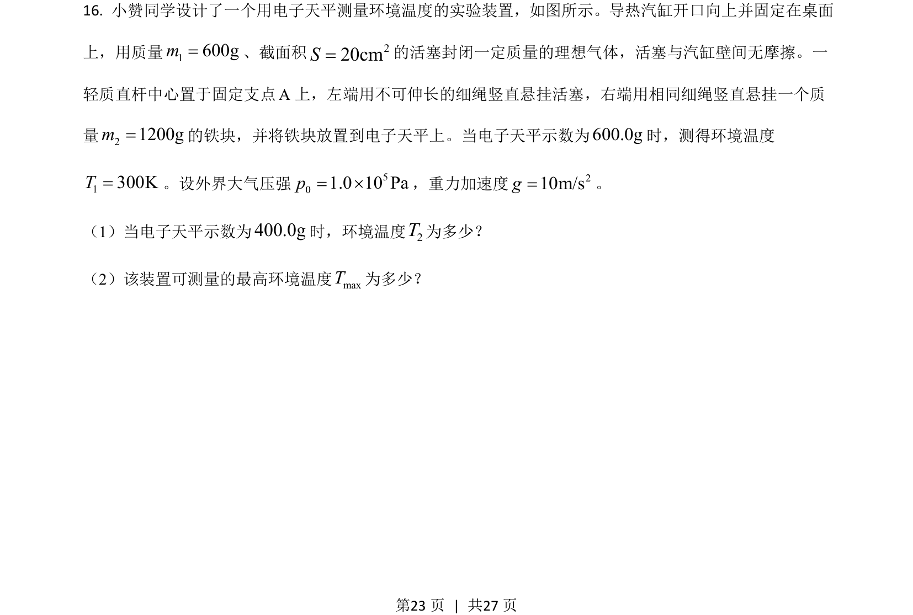
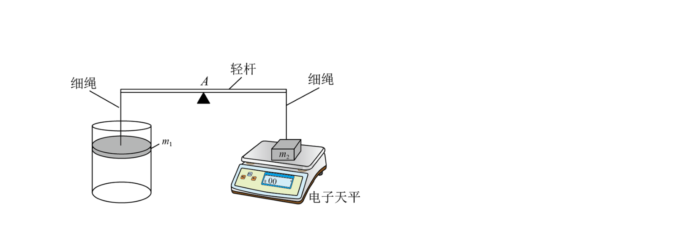
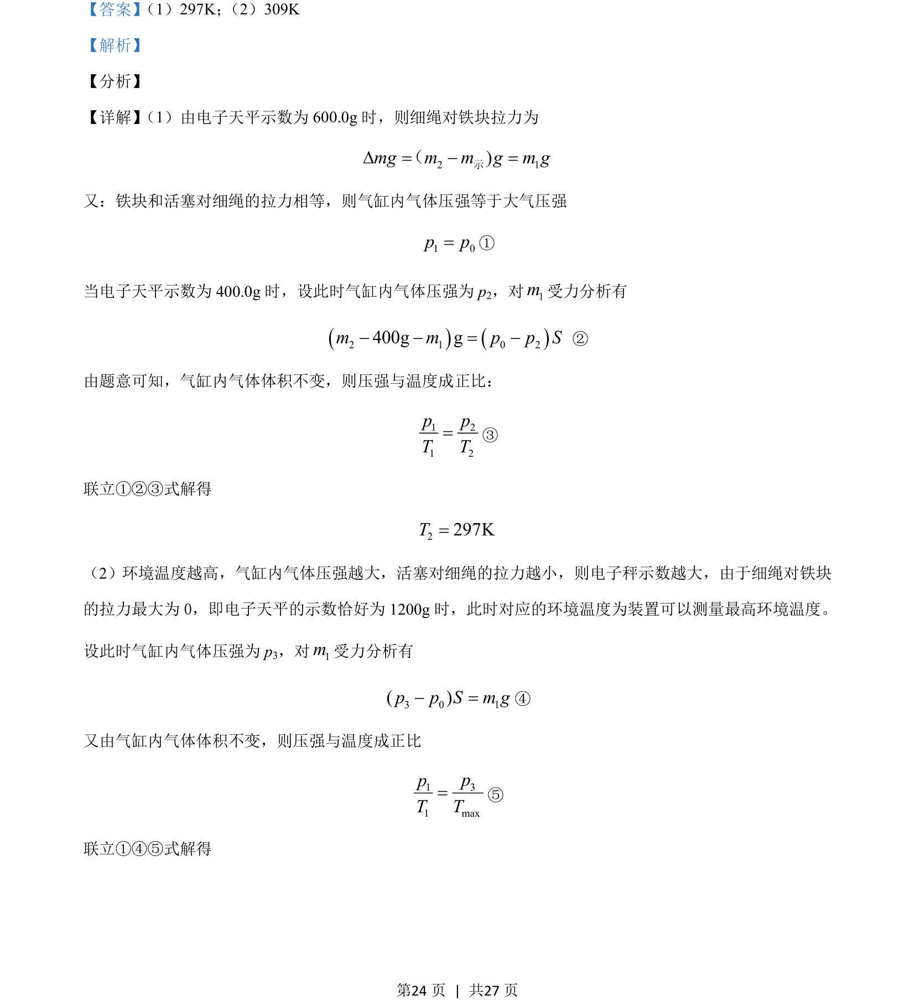
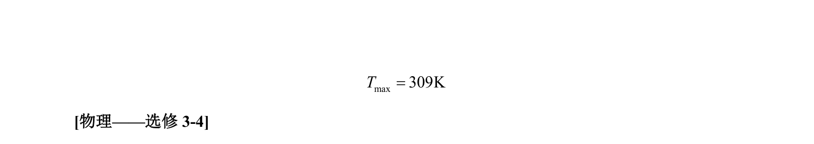

## 题面

## 摘要

该题通过电子天平示数变化，结合受力分析与气体等容变化规律，考查压强、温度的计算及最高环境温度的求解。

## 关联考点

- [[气体等容变化]]
- [[压强与温度正比]]
- [[554-受力平衡|受力平衡]]
- [[阿伏伽德罗定律]]

## 答案与解析

> 📄 原 PDF 第 23 页：`素材/真题/湖南/2008-2024·（湖南）物理高考真题/2021年高考物理试卷（湖南）（解析卷）.pdf`
