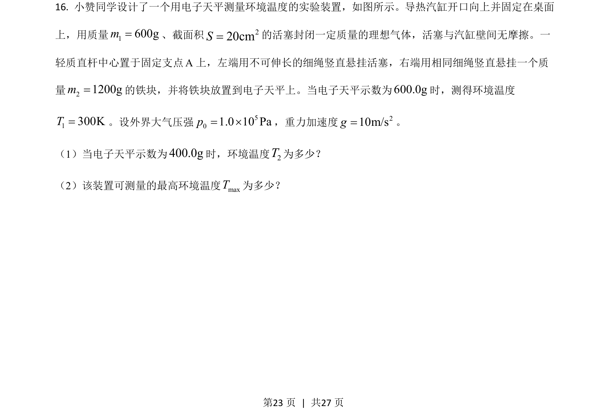
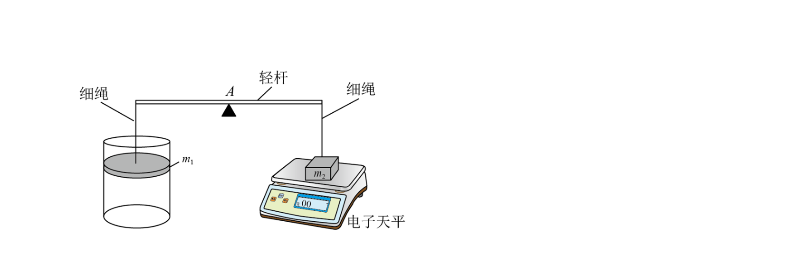
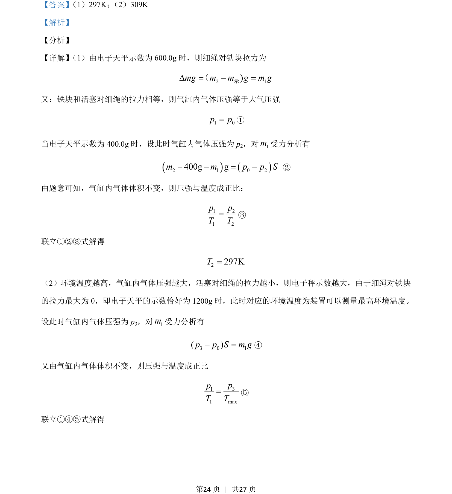

## 题面

## 摘要

该题通过电子天平示数变化，结合受力分析与气体等容变化规律，考查压强、温度的计算及最高环境温度的求解。

## 关联考点

- [[气体等容变化]]
- [[压强与温度正比]]
- [[554-受力平衡|受力平衡]]
- [[阿伏伽德罗定律]]

## 答案与解析

> 📄 原 PDF 第 23 页：`素材/真题/湖南/2008-2024·（湖南）物理高考真题/2021年高考物理试卷（湖南）（解析卷）.pdf`

<!-- 题干文本-start -->
## 题干文本
16. 小赞同学设计了一个用电子天平测量环境温度的实验装置，如图所示。导热汽缸开口向上并固定在桌面
上，用质量1600gm=、截面积 220cmS=的活塞封闭一定质量的理想气体，活塞与汽缸壁间无摩擦。一
轻质直杆中心置于固定支点A上，左端用不可伸长的细绳竖直悬挂活塞，右端用相同细绳竖直悬挂一个质
量21200gm=的铁块，并将铁块放置到电子天平上。当电子天平示数为600.0g时，测得环境温度
1300KT=。设外界大气压强 501.010Pap=´，重力加速度 210m/sg=。
（1）当电子天平示数为400.0g时，环境温度2T为多少？
（2）该装置可测量的最高环境温度maxT为多少？
<!-- 题干文本-end -->

<!-- 解析文本-start -->
## 解析文本

<!-- 解析文本-end -->
