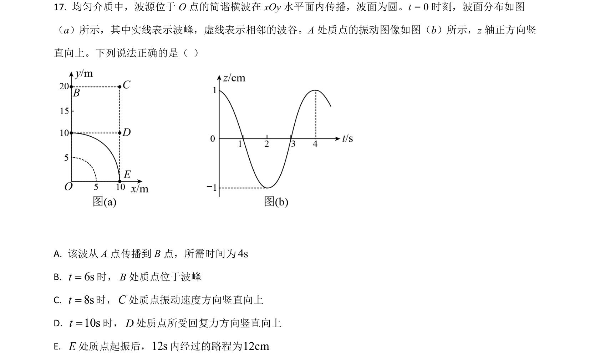
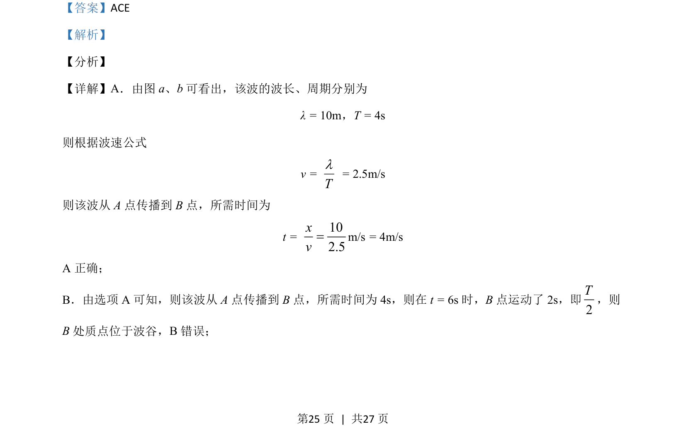
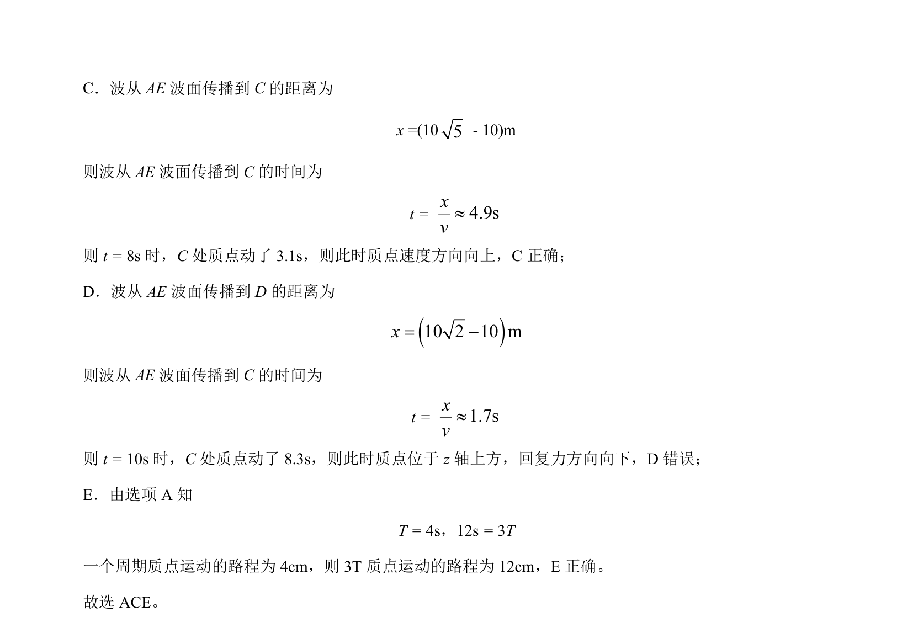

## 题面

## 摘要

根据波形图计算波速、传播时间，判断不同时刻质点振动位置和路程。

## 关联考点

- [[362-机械波|机械波]]
- [[858-波速公式|波速公式]]
- [[763-质点振动|质点振动]]
- [[波长周期频率关系]]

## 答案与解析

> 📄 原 PDF 第 25 页：`素材/真题/湖南/2008-2024·（湖南）物理高考真题/2021年高考物理试卷（湖南）（解析卷）.pdf`
