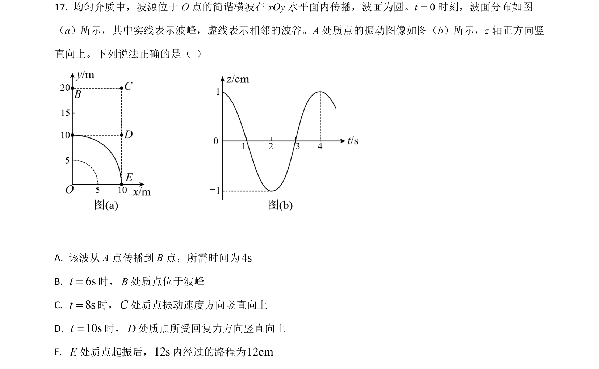
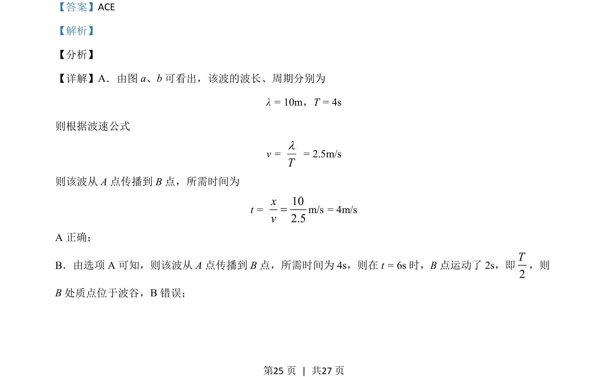
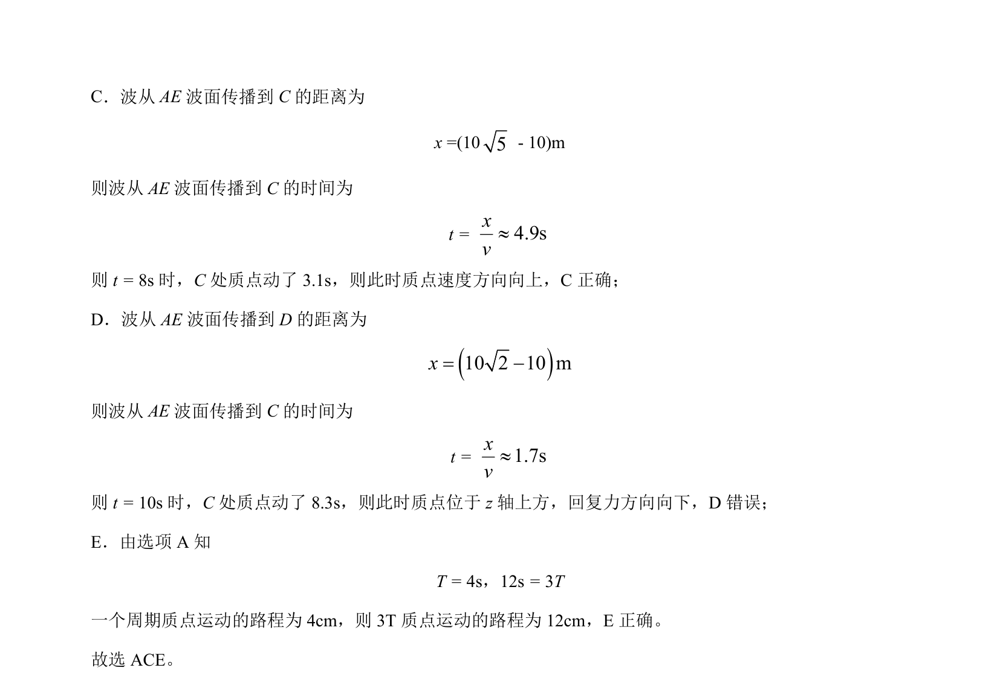

## 题面

## 摘要

根据波形图计算波速、传播时间，判断不同时刻质点振动位置和路程。

## 关联考点

- [[362-机械波|机械波]]
- [[858-波速公式|波速公式]]
- [[763-质点振动|质点振动]]
- [[波长周期频率关系]]

## 答案与解析

> 📄 原 PDF 第 25 页：`素材/真题/湖南/2008-2024·（湖南）物理高考真题/2021年高考物理试卷（湖南）（解析卷）.pdf`

<!-- 题干文本-start -->
## 题干文本
17. 均匀介质中，波源位于 O 点的简谐横波在 xOy水平面内传播，波面为圆。t = 0时刻，波面分布如图
（a）所示，其中实线表示波峰，虚线表示相邻的波谷。A处质点的振动图像如图（b）所示，z 轴正方向竖
直向上。下列说法正确的是（ ）
A. 该波从 A点传播到 B点，所需时间为4s
B. 6st=时，B处质点位于波峰
C. 8st=时，C处质点振动速度方向竖直向上
D. 10st=时，D处质点所受回复力方向竖直向上
E. E处质点起振后，12s内经过的路程为12cm
<!-- 题干文本-end -->

<!-- 解析文本-start -->
## 解析文本
【答案】ACE
【解析】
【分析】
【详解】A．由图 a、b 可看出，该波的波长、周期分别为
λ = 10m，T = 4s
则根据波速公式
v = 
Tl = 2.5m/s
则该波从 A点传播到 B点，所需时间为
t = 102.5xv=m/s = 4m/s
A 正确；
B．由选项 A 可知，则该波从 A点传播到 B点，所需时间为 4s，则在 t = 6s时，B点运动了 2s，即
2T，则
B处质点位于波谷，B错误；
<!-- 解析文本-end -->
