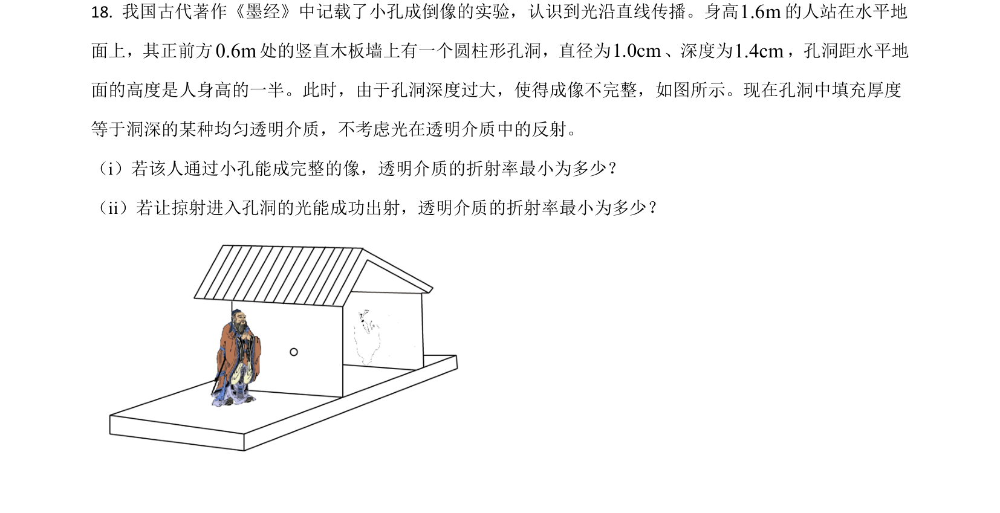
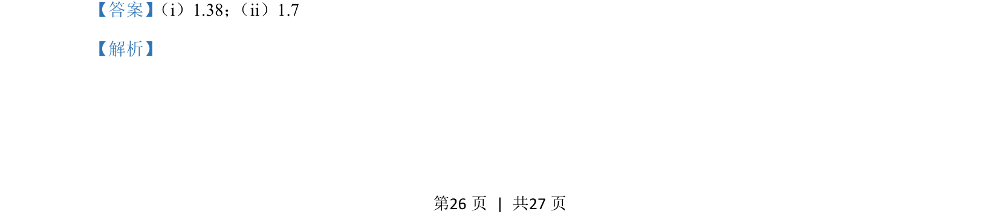
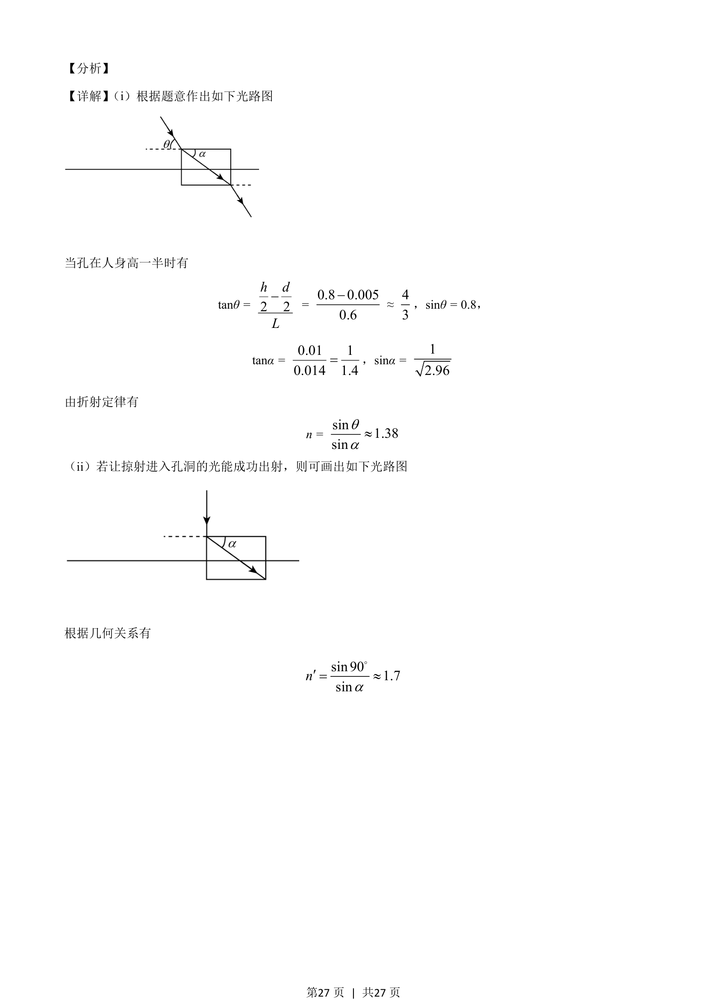

## 题面

## 摘要

利用几何光学和折射定律计算光线在不同入射条件下的折射率。

## 关联考点

- [[520-光的折射定律|光的折射定律]]
- [[360-折射率|折射率]]
- [[光路图]]

## 答案与解析

> 📄 原 PDF 第 26 页：`素材/真题/湖南/2008-2024·（湖南）物理高考真题/2021年高考物理试卷（湖南）（解析卷）.pdf`

<!-- 题干文本-start -->
## 题干文本
18. 我国古代著作《墨经》中记载了小孔成倒像的实验，认识到光沿直线传播。身高1.6m的人站在水平地
面上，其正前方0.6m处的竖直木板墙上有一个圆柱形孔洞，直径为1.0cm、深度为1.4cm，孔洞距水平地
面的高度是人身高的一半。此时，由于孔洞深度过大，使得成像不完整，如图所示。现在孔洞中填充厚度
等于洞深的某种均匀透明介质，不考虑光在透明介质中的反射。
（i）若该人通过小孔能成完整的像，透明介质的折射率最小为多少？
（ii）若让掠射进入孔洞的光能成功出射，透明介质的折射率最小为多少？
<!-- 题干文本-end -->

<!-- 解析文本-start -->
## 解析文本
【答案】 （i）1.38； （ii）1.7
【解析】
<!-- 解析文本-end -->
