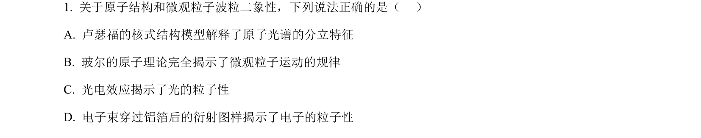
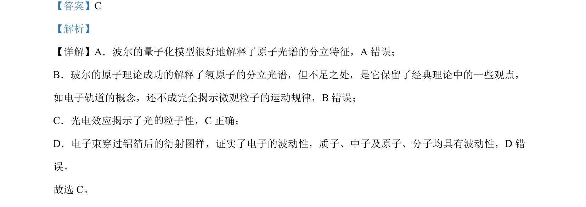

## 题面

## 摘要

本题考查玻尔原子模型、氢原子光谱、光电效应及物质波的理解与辨析。

## 关联考点

- [[443-玻尔原子模型|玻尔原子模型]]
- [[436-氢原子能级|氢原子光谱]]
- [[417-光电效应|光电效应]]
- [[德布罗意波]]

## 答案与解析

> 📄 原 PDF 第 1 页：`素材/真题/湖南/2008-2024·（湖南）物理高考真题/2022年高考物理试卷（湖南）（解析卷）.pdf`
