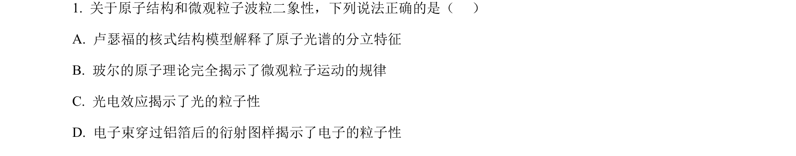
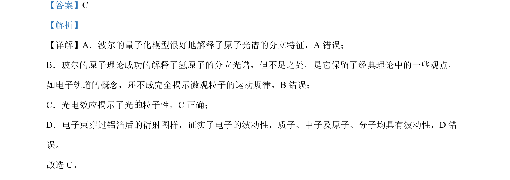

## 题面

## 摘要

本题考查玻尔原子模型、氢原子光谱、光电效应及物质波的理解与辨析。

## 关联考点

- [[443-玻尔原子模型|玻尔原子模型]]
- [[436-氢原子能级|氢原子光谱]]
- [[417-光电效应|光电效应]]
- [[德布罗意波]]

## 答案与解析

> 📄 原 PDF 第 1 页：`素材/真题/湖南/2008-2024·（湖南）物理高考真题/2022年高考物理试卷（湖南）（解析卷）.pdf`

<!-- 题干文本-start -->
## 题干文本
1. 关于原子结构和微观粒子波粒二象性，下列说法正确的是（   ）
A. 卢瑟福的核式结构模型解释了原子光谱的分立特征
B. 玻尔的原子理论完全揭示了微观粒子运动的规律
C. 光电效应揭示了光的粒子性
D. 电子束穿过铝箔后的衍射图样揭示了电子的粒子性
<!-- 题干文本-end -->

<!-- 解析文本-start -->
## 解析文本
【答案】C
【解析】
【详解】A．波尔的量子化模型很好地解释了原子光谱的分立特征，A 错误；
B．玻尔的原子理论成功的解释了氢原子的分立光谱，但不足之处，是它保留了经典理论中的一些观点，
如电子轨道的概念，还不成完全揭示微观粒子的运动规律，B错误；
C．光电效应揭示了光 粒子性， C正确；
D．电子束穿过铝箔后的衍射图样，证实了电子的波动性，质子、中子及原子、分子均具有波动性，D 错
误。
故选 C。
<!-- 解析文本-end -->
