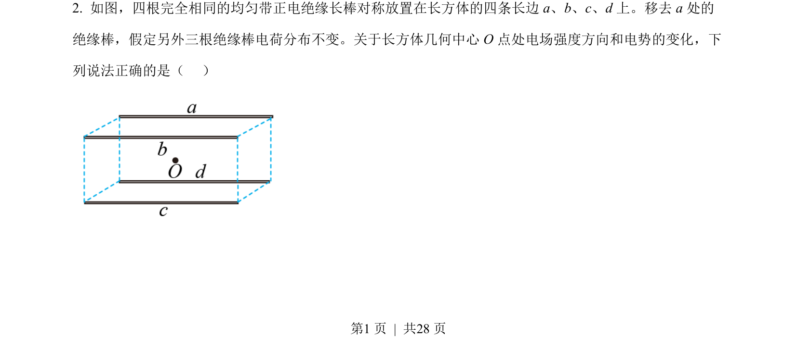
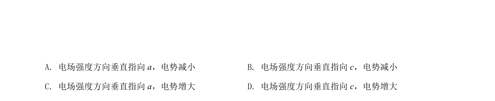
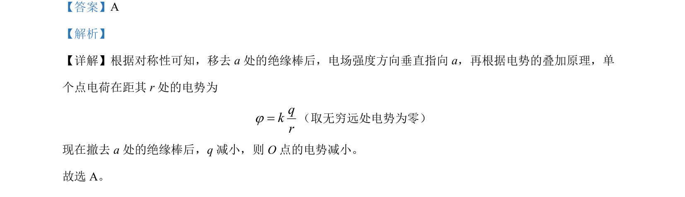

## 题面

## 摘要

本题考查对称性法分析电场强度方向及电势叠加原理，判断移去电荷后电势变化。

## 关联考点

- [[277-电场强度|电场强度]]
- [[668-电势叠加|电势叠加]]
- [[834-对称性|对称性]]
- [[863-点电荷电势|点电荷电势]]

## 答案与解析

> 📄 原 PDF 第 1 页：`素材/真题/湖南/2008-2024·（湖南）物理高考真题/2022年高考物理试卷（湖南）（解析卷）.pdf`
