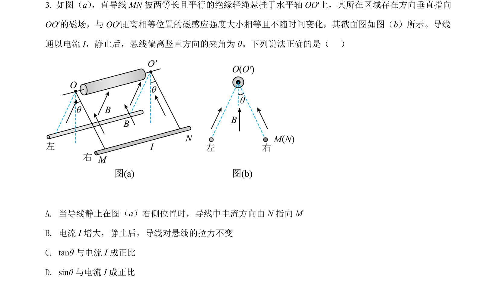
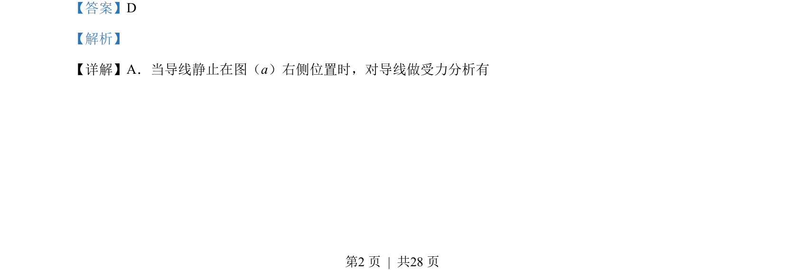
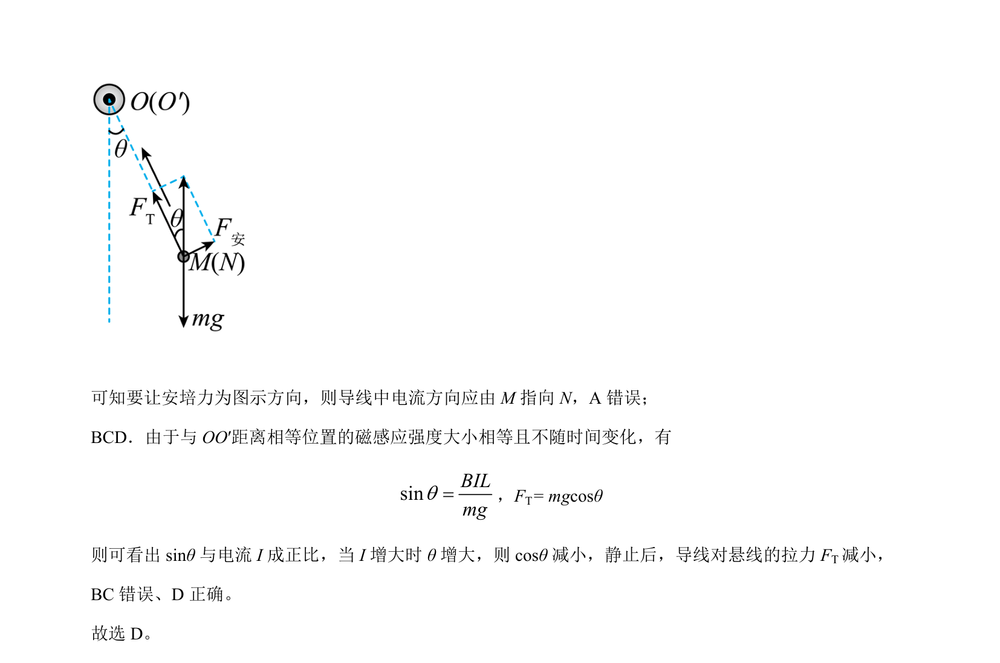

## 题面

## 摘要

通电导线在磁场中的受力平衡，电流方向、安培力方向及悬线拉力随电流变化的动态分析。

## 关联考点

- [[安培力方向判定]]
- [[208-共点力平衡|共点力平衡]]
- [[284-化学平衡|动态平衡]]

## 答案与解析

> 📄 原 PDF 第 2 页：`素材/真题/湖南/2008-2024·（湖南）物理高考真题/2022年高考物理试卷（湖南）（解析卷）.pdf`
