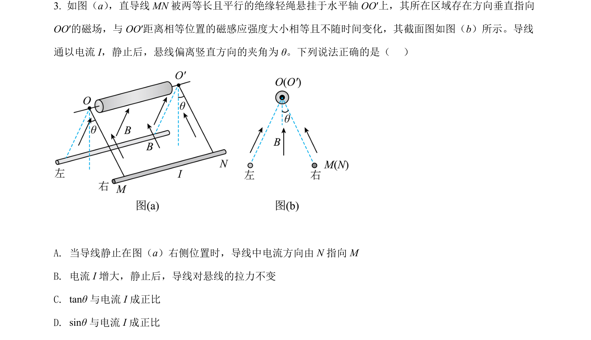
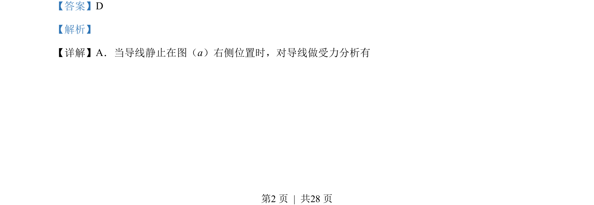
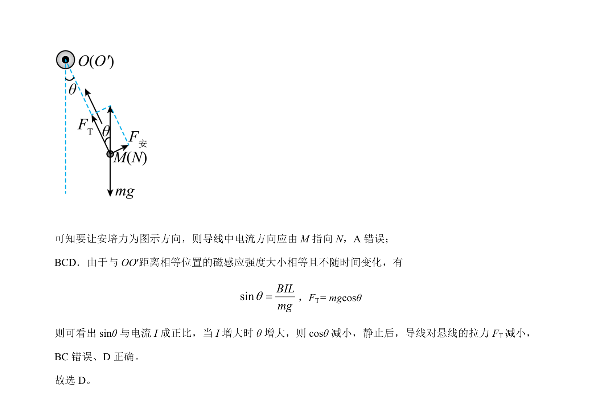

## 题面

## 摘要

通电导线在磁场中的受力平衡，电流方向、安培力方向及悬线拉力随电流变化的动态分析。

## 关联考点

- [[安培力方向判定]]
- [[208-共点力平衡|共点力平衡]]
- [[284-化学平衡|动态平衡]]

## 答案与解析

> 📄 原 PDF 第 2 页：`素材/真题/湖南/2008-2024·（湖南）物理高考真题/2022年高考物理试卷（湖南）（解析卷）.pdf`

<!-- 题干文本-start -->
## 题干文本
3. 如图（a） ，直导线MN 被两等长且平行的绝缘轻绳悬挂于水平轴 OO′上，其所在区域存在方向垂直指向
OO′的磁场，与 OO′距离相等位置的磁感应强度大小相等且不随时间变化，其截面图如图（b）所示。导线
通以电流 I，静止后，悬线偏离竖直方向的夹角为 θ。下列说法正确的是（   ）
A. 当导线静止在图（a）右侧位置时，导线中电流方向由 N指向 M
B. 电流 I 增大，静止后，导线对悬线的拉力不变
C. tanθ与电流 I 成正比
D. sinθ 与电流 I 成正比
<!-- 题干文本-end -->

<!-- 解析文本-start -->
## 解析文本
【答案】D
【解析】
【详解】A．当导线静止在图（a）右侧位置时，对导线做受力分析有
<!-- 解析文本-end -->
