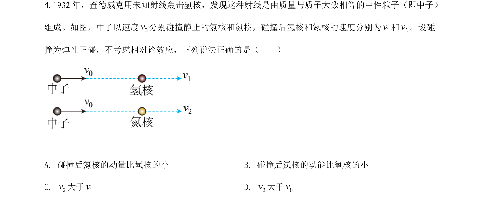
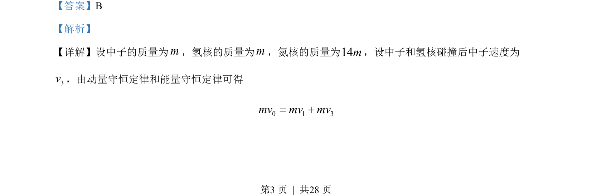
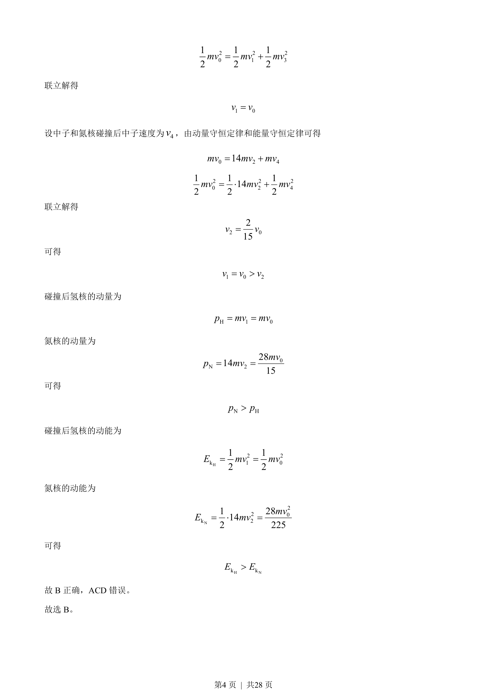

## 题面

## 摘要

考查中子与氢核、氮核的弹性碰撞，通过动量守恒和能量守恒定律计算并比较速度、动量及动能。

## 关联考点

- [[347-动量守恒定律|动量守恒定律]]
- [[197-能量守恒定律|能量守恒定律]]
- [[359-弹性碰撞|弹性碰撞]]

## 答案与解析

> 📄 原 PDF 第 3 页：`素材/真题/湖南/2008-2024·（湖南）物理高考真题/2022年高考物理试卷（湖南）（解析卷）.pdf`
