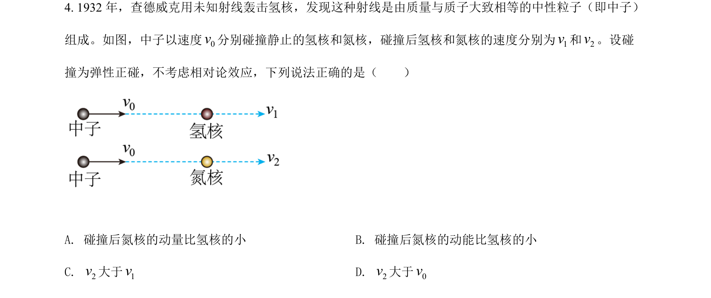
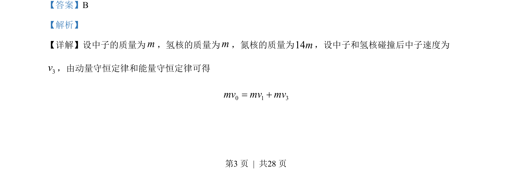
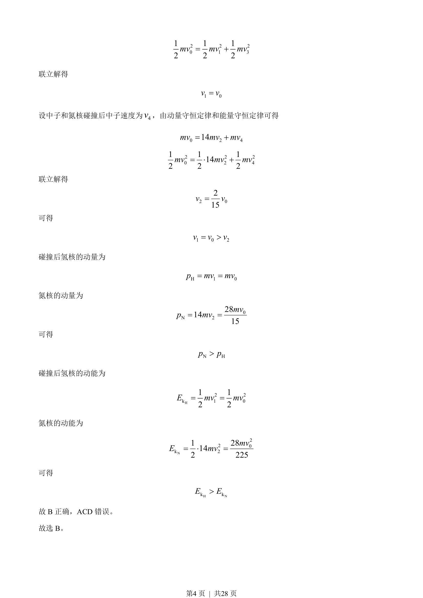

## 题面

## 摘要

考查中子与氢核、氮核的弹性碰撞，通过动量守恒和能量守恒定律计算并比较速度、动量及动能。

## 关联考点

- [[347-动量守恒定律|动量守恒定律]]
- [[197-能量守恒定律|能量守恒定律]]
- [[359-弹性碰撞|弹性碰撞]]

## 答案与解析

> 📄 原 PDF 第 3 页：`素材/真题/湖南/2008-2024·（湖南）物理高考真题/2022年高考物理试卷（湖南）（解析卷）.pdf`

<!-- 题干文本-start -->
## 题干文本
4. 1932 年，查德威克用未知射线轰击氢核，发现这种射线是由质量与质子大致相等的中性粒子（即中子）
组成。如图，中子以速度0v分别碰撞静止的氢核和氮核，碰撞后氢核和氮核的速度分别为1v和2v。设碰
撞为弹性正碰，不考虑相对论效应，下列说法正确的是（　　）
A. 碰撞后氮核的动量比氢核的小B. 碰撞后氮核的动能比氢核的小
C. 2v大于1v D. 2v大于0v
<!-- 题干文本-end -->

<!-- 解析文本-start -->
## 解析文本
【答案】B
【解析】
【详解】设中子的质量为m，氢核的质量为m，氮核的质量为14m，设中子和氢核碰撞后中子速度为
3v，由动量守恒定律和能量守恒定律可得
30 1mv mv mv= +
<!-- 解析文本-end -->
