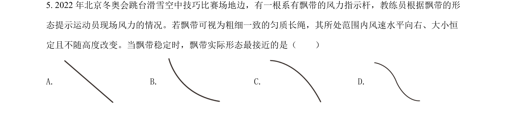
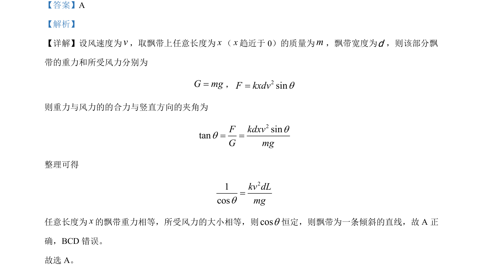

## 题面

## 摘要

通过微元法分析飘带在风力和重力作用下的平衡，判断飘带形状

## 关联考点

- [[532-力的合成与分解|力的合成与分解]]
- [[208-共点力平衡|共点力平衡]]
- [[610-微元法|微元法]]

## 答案与解析

> 📄 原 PDF 第 5 页：`素材/真题/湖南/2008-2024·（湖南）物理高考真题/2022年高考物理试卷（湖南）（解析卷）.pdf`

<!-- 题干文本-start -->
## 题干文本
5. 2022 年北京冬奥会跳台滑雪空中技巧比赛场地边，有一根系有飘带的风力指示杆，教练员根据飘带的形
态提示运动员现场风力的情况。若飘带可视为粗细一致的匀质长绳，其所处范围内风速水平向右、大小恒
定且不随高度改变。当飘带稳定时，飘带实际形态最接近的是（　　）
A. B. C. D.
<!-- 题干文本-end -->

<!-- 解析文本-start -->
## 解析文本
【答案】A
【解析】
【详解】设风速度为v，取飘带上任意长度为x（x趋近于 0）的质量为m，飘带宽度为d，则该部分飘
带的重力和所受风力分别为
G mg=， 2sinF kxdvq=
则重力与风力的的合力与竖直方向的夹角为
2sintanF kdxvG mgqq= =
整理可得
21coskv dLmgq=
任意长度为x的飘带重力相等，所受风力的大小相等，则cosq恒定，则飘带为一条倾斜的直线，故 A 正
确，BCD 错误。
故选 A。
<!-- 解析文本-end -->
