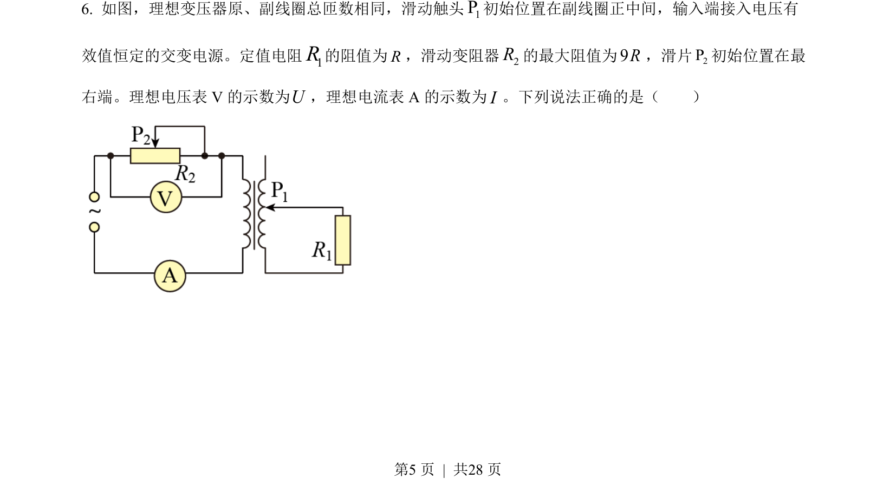
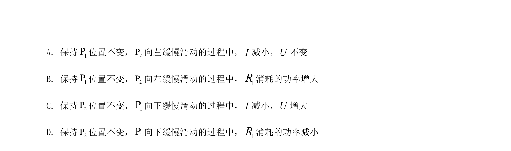
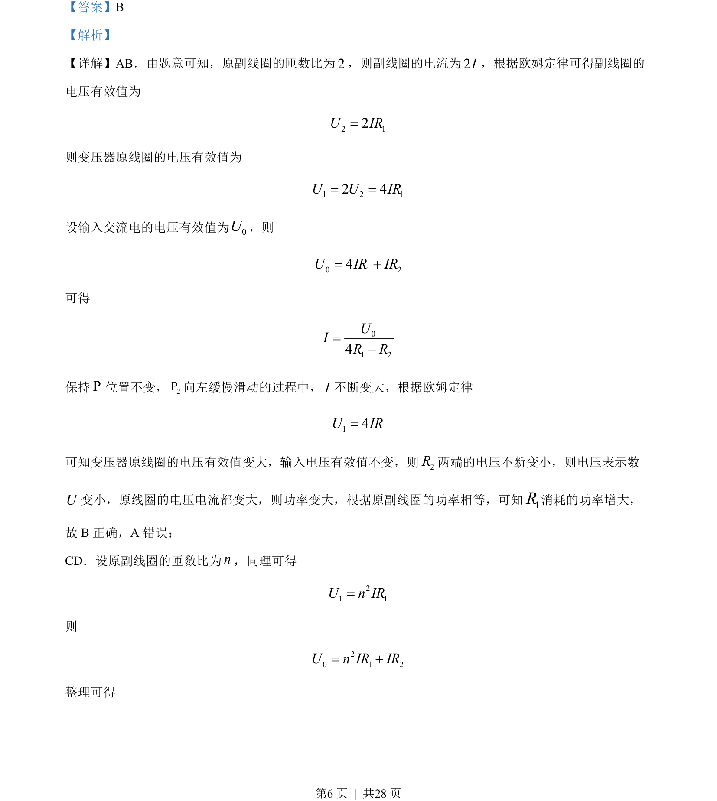
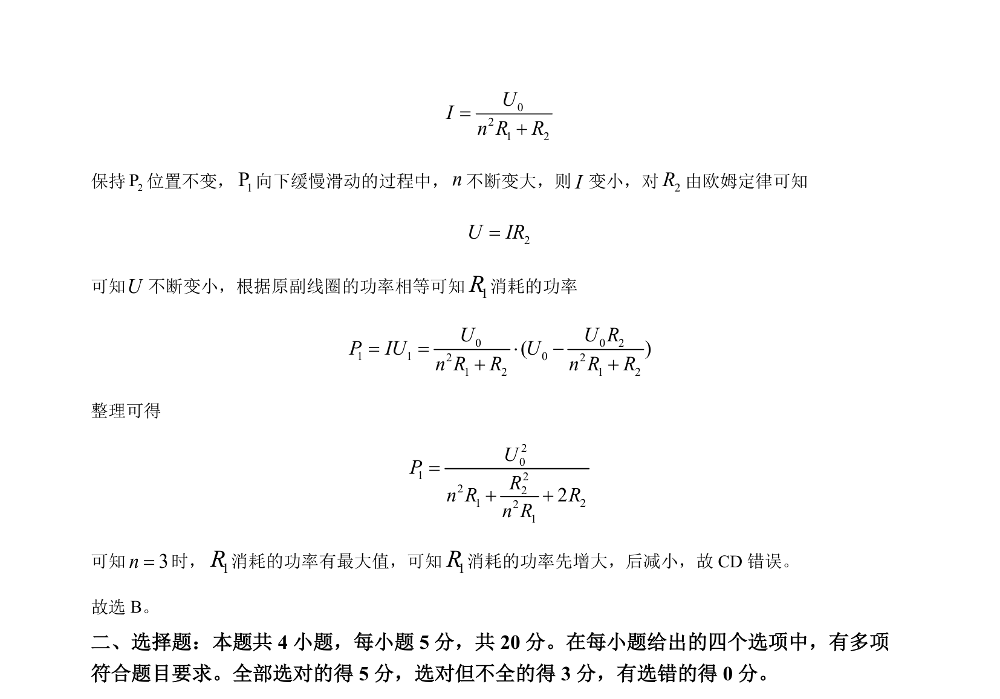

## 题面

## 摘要

理想变压器动态分析，匝数比或负载变化对原副线圈电压、电流及功率的影响。

## 关联考点

- [[398-理想变压器|理想变压器]]
- [[792-动态电路分析|动态电路分析]]
- [[功率极值]]
- [[141-欧姆定律-初中|欧姆定律]]

## 答案与解析

> 📄 原 PDF 第 5 页：`素材/真题/湖南/2008-2024·（湖南）物理高考真题/2022年高考物理试卷（湖南）（解析卷）.pdf`
