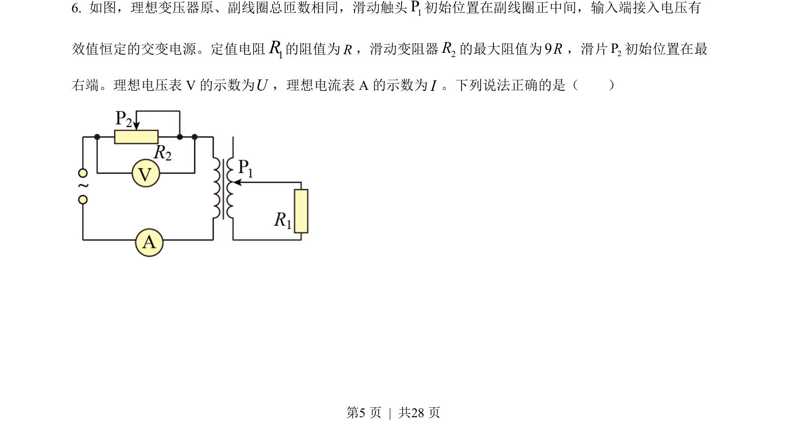
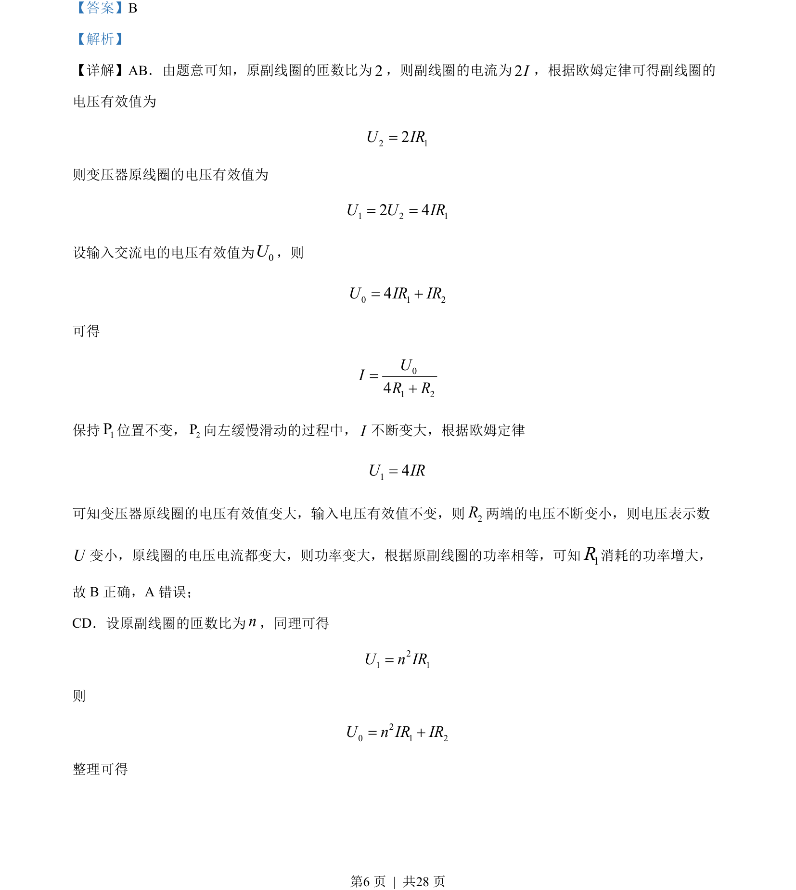
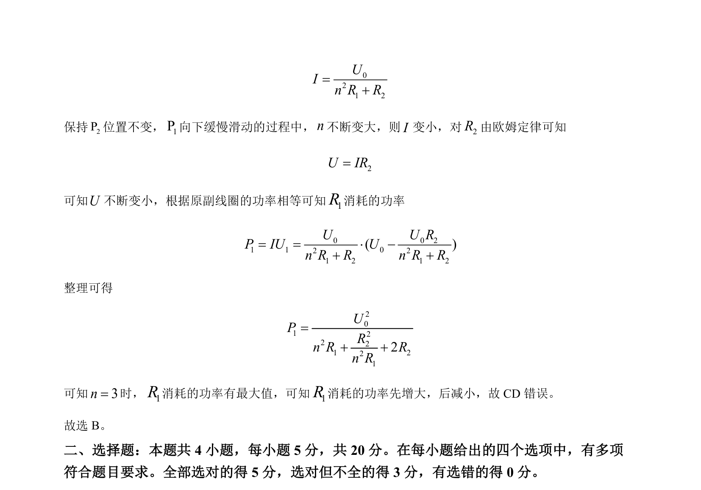

## 题面

## 摘要

理想变压器动态分析，匝数比或负载变化对原副线圈电压、电流及功率的影响。

## 关联考点

- [[398-理想变压器|理想变压器]]
- [[792-动态电路分析|动态电路分析]]
- [[功率极值]]
- [[141-欧姆定律-初中|欧姆定律]]

## 答案与解析

> 📄 原 PDF 第 5 页：`素材/真题/湖南/2008-2024·（湖南）物理高考真题/2022年高考物理试卷（湖南）（解析卷）.pdf`

<!-- 题干文本-start -->
## 题干文本
6. 如图，理想变压器原、副线圈总匝数相同，滑动触头1P初始位置在副线圈正中间，输入端接入电压有
效值恒定的交变电源。定值电阻1R的阻值为R，滑动变阻器2R的最大阻值为9R，滑片2P初始位置在最
右端。理想电压表 V 的示数为U，理想电流表 A 的示数为I。下列说法正确的是（　　）
<!-- 题干文本-end -->

<!-- 解析文本-start -->
## 解析文本

<!-- 解析文本-end -->
