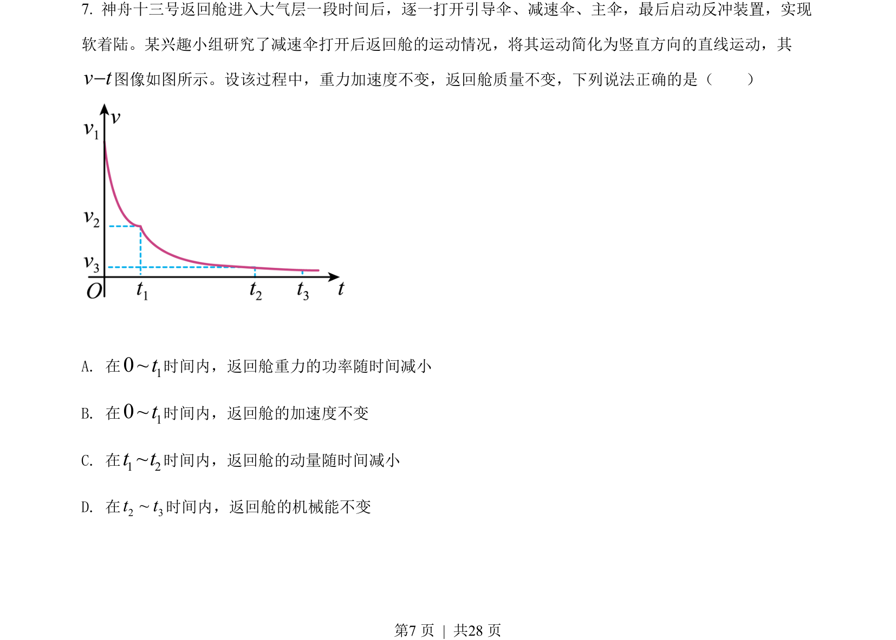
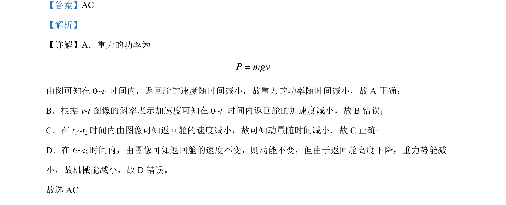

## 题面

## 摘要

返回舱v-t图像分析，判断重力功率、加速度、动量及机械能变化

## 关联考点

- [[功率计算]]
- [[v-t图像斜率与加速度]]
- [[动量概念]]
- [[机械能守恒条件]]

## 答案与解析

> 📄 原 PDF 第 7 页：`素材/真题/湖南/2008-2024·（湖南）物理高考真题/2022年高考物理试卷（湖南）（解析卷）.pdf`

<!-- 题干文本-start -->
## 题干文本
7. 神舟十三号返回舱进入大气层一段时间后，逐一打开引导伞、减速伞、主伞，最后启动反冲装置，实现
软着陆。某兴趣小组研究了减速伞打开后返回舱的运动情况，将其运动简化为竖直方向的直线运动，其
v t-图像如图所示。设该过程中，重力加速度不变，返回舱质量不变，下列说法正确的是（　　）
A. 在10 ~t时间内，返回舱重力的功率随时间减小
B. 在10 ~t时间内，返回舱的加速度不变
C. 在21~t t时间内，返回舱的动量随时间减小
D. 在2 3~t t时间内，返回舱的机械能不变
<!-- 题干文本-end -->

<!-- 解析文本-start -->
## 解析文本

<!-- 解析文本-end -->
