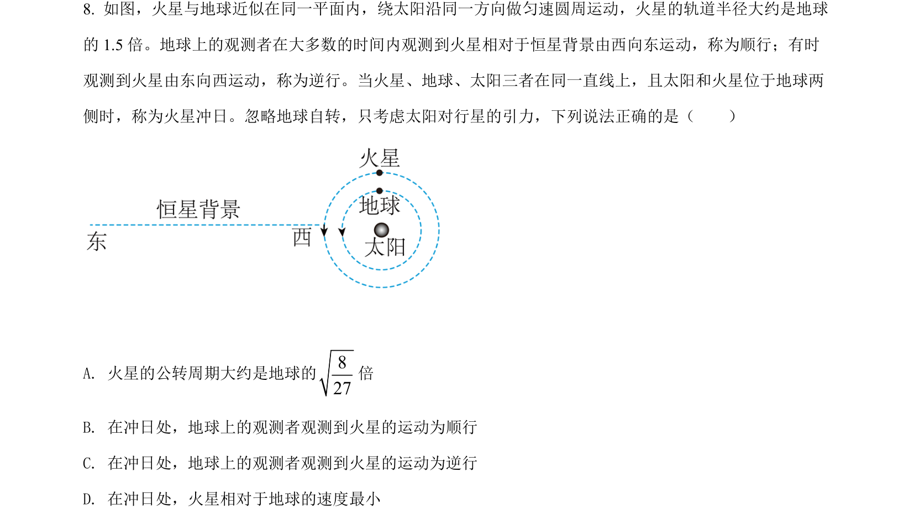
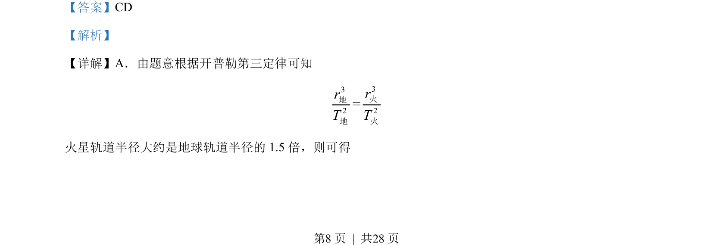
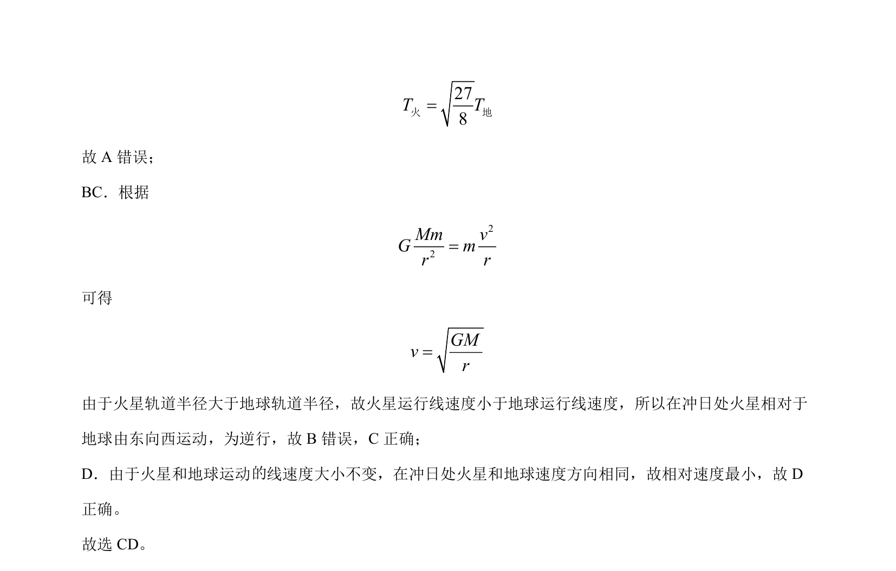

## 题面

## 摘要

考查开普勒第三定律和万有引力定律，比较火星与地球轨道参数及冲日时相对运动。

## 关联考点

- [[266-开普勒第三定律|开普勒第三定律]]
- [[246-万有引力定律|万有引力定律]]
- [[线速度与轨道半径关系]]
- [[280-相对运动|相对运动]]

## 答案与解析

> 📄 原 PDF 第 8 页：`素材/真题/湖南/2008-2024·（湖南）物理高考真题/2022年高考物理试卷（湖南）（解析卷）.pdf`
