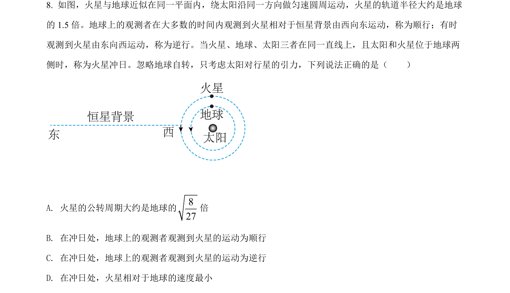
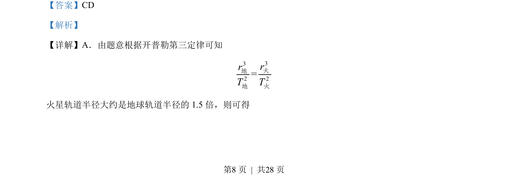
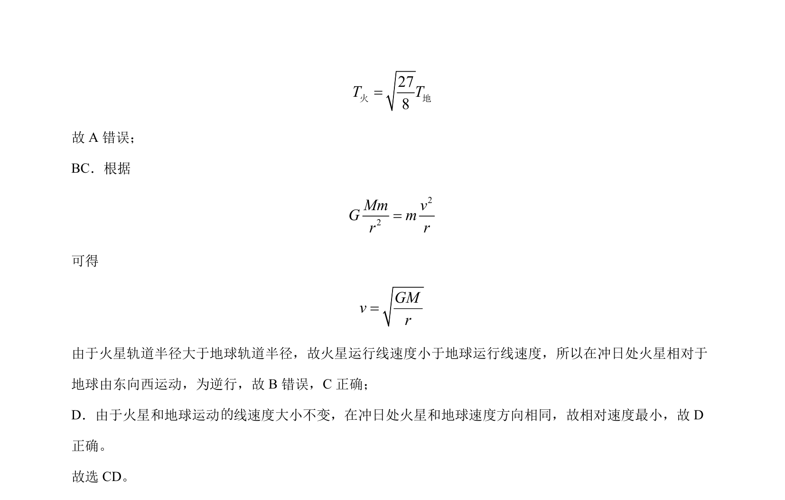

## 题面

## 摘要

考查开普勒第三定律和万有引力定律，比较火星与地球轨道参数及冲日时相对运动。

## 关联考点

- [[266-开普勒第三定律|开普勒第三定律]]
- [[246-万有引力定律|万有引力定律]]
- [[线速度与轨道半径关系]]
- [[280-相对运动|相对运动]]

## 答案与解析

> 📄 原 PDF 第 8 页：`素材/真题/湖南/2008-2024·（湖南）物理高考真题/2022年高考物理试卷（湖南）（解析卷）.pdf`

<!-- 题干文本-start -->
## 题干文本
8. 如图，火星与地球近似在同一平面内，绕太阳沿同一方向做匀速圆周运动，火星的轨道半径大约是地球
的 1.5 倍。地球上的观测者在大多数的时间内观测到火星相对于恒星背景由西向东运动，称为顺行；有时
观测到火星由东向西运动，称为逆行。当火星、地球、太阳三者在同一直线上，且太阳和火星位于地球两
侧时，称为火星冲日。忽略地球自转，只考虑太阳对行星的引力，下列说法正确的是（　　）
A. 火星的公转周期大约是地球的827
倍
B. 在冲日处，地球上的观测者观测到火星的运动为顺行
C. 在冲日处，地球上的观测者观测到火星的运动为逆行
D. 在冲日处，火星相对于地球的速度最小
<!-- 题干文本-end -->

<!-- 解析文本-start -->
## 解析文本
【答案】CD
【解析】
【详解】A．由题意根据开普勒第三定律可知
332 2=rrT T火地地火
火星轨道半径大约是地球轨道半径的 1.5 倍，则可得
<!-- 解析文本-end -->
