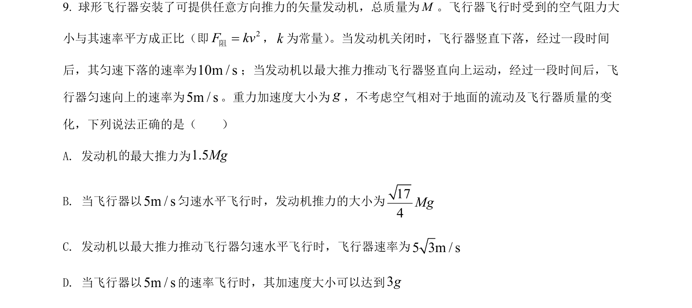
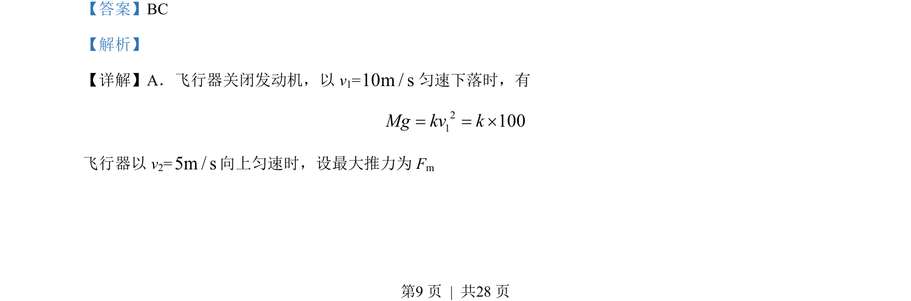
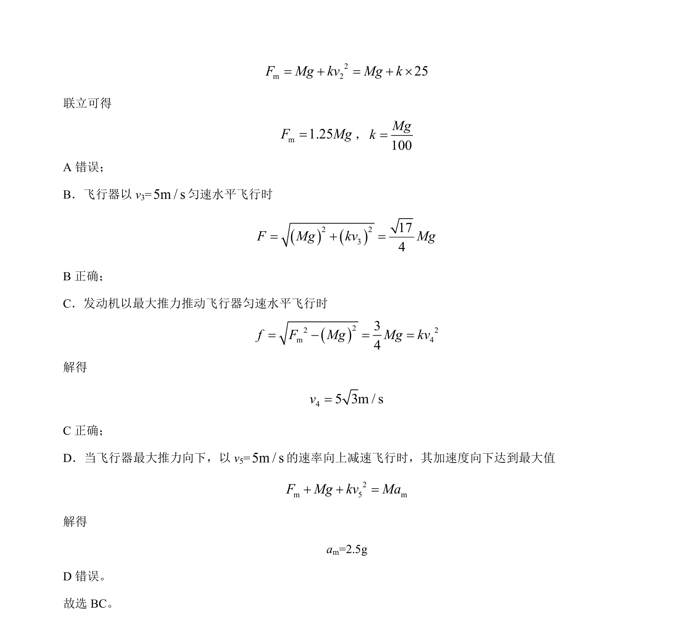

## 题面

## 摘要

飞行器在不同运动状态下的受力分析与平衡条件应用，涉及空气阻力与速度平方成正比的动力学模型。

## 关联考点

- [[208-共点力平衡|共点力平衡]]
- [[229-牛顿第二定律|牛顿第二定律]]
- [[阻力模型]]
- [[临界状态分析]]

## 答案与解析

> 📄 原 PDF 第 9 页：`素材/真题/湖南/2008-2024·（湖南）物理高考真题/2022年高考物理试卷（湖南）（解析卷）.pdf`
