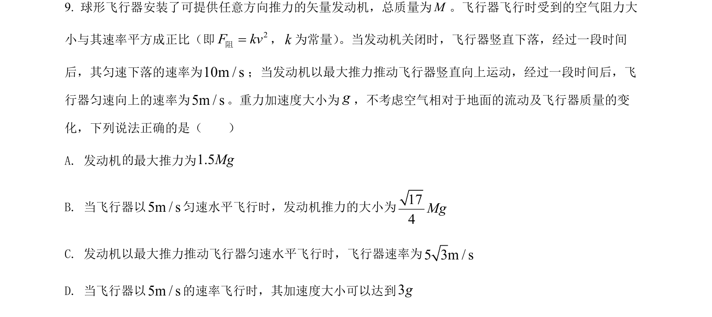
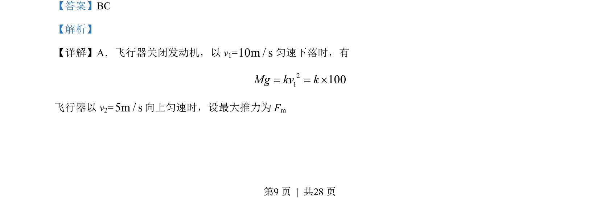
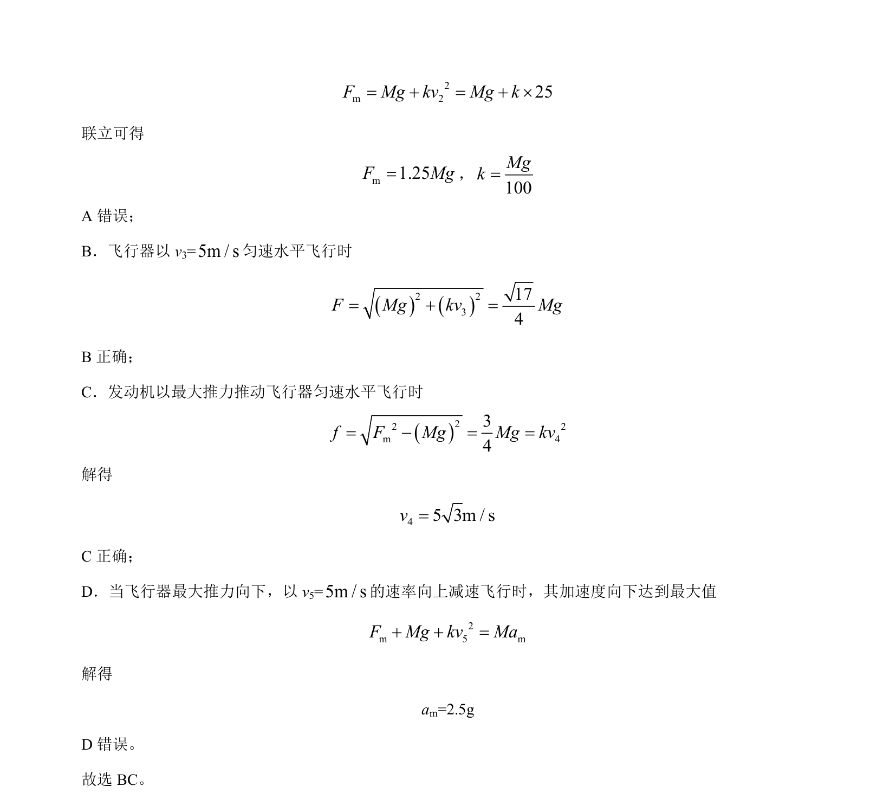

## 题面

## 摘要

飞行器在不同运动状态下的受力分析与平衡条件应用，涉及空气阻力与速度平方成正比的动力学模型。

## 关联考点

- [[208-共点力平衡|共点力平衡]]
- [[229-牛顿第二定律|牛顿第二定律]]
- [[阻力模型]]
- [[临界状态分析]]

## 答案与解析

> 📄 原 PDF 第 9 页：`素材/真题/湖南/2008-2024·（湖南）物理高考真题/2022年高考物理试卷（湖南）（解析卷）.pdf`

<!-- 题干文本-start -->
## 题干文本
9. 球形飞行器安装了可提供任意方向推力的矢量发动机，总质量为M。飞行器飞行时受到的空气阻力大
小与其速率平方成正比（即 2F kv=阻，k为常量） 。当发动机关闭时，飞行器竖直下落，经过一段时间
后，其匀速下落的速率为10m / s；当发动机以最大推力推动飞行器竖直向上运动，经过一段时间后，飞
行器匀速向上的速率为5m / s。重力加速度大小为g，不考虑空气相对于地面的流动及飞行器质量的变
化，下列说法正确的是（　　）
A. 发动机 最大推力为1.5Mg
B. 当飞行器以5m / s匀速水平飞行时，发动机推力的大小为174Mg
C. 发动机以最大推力推动飞行器匀速水平飞行时，飞行器速率为5 3m / s
D. 当飞行器以5m / s的速率飞行时，其加速度大小可以达到3g
<!-- 题干文本-end -->

<!-- 解析文本-start -->
## 解析文本
【答案】BC
【解析】
【详解】A．飞行器关闭发动机，以 v1=10m / s匀速下落时，有
21100Mg kv k= = ´
飞行器以 v2=5m / s向上匀速时，设最大推力为 Fm
的的
<!-- 解析文本-end -->
