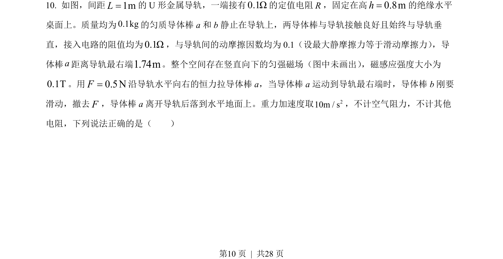
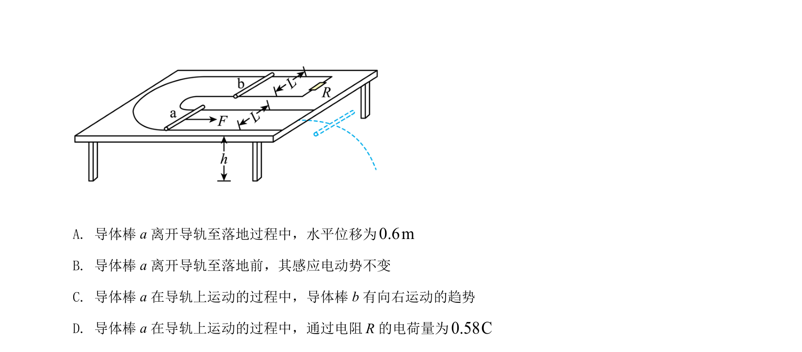
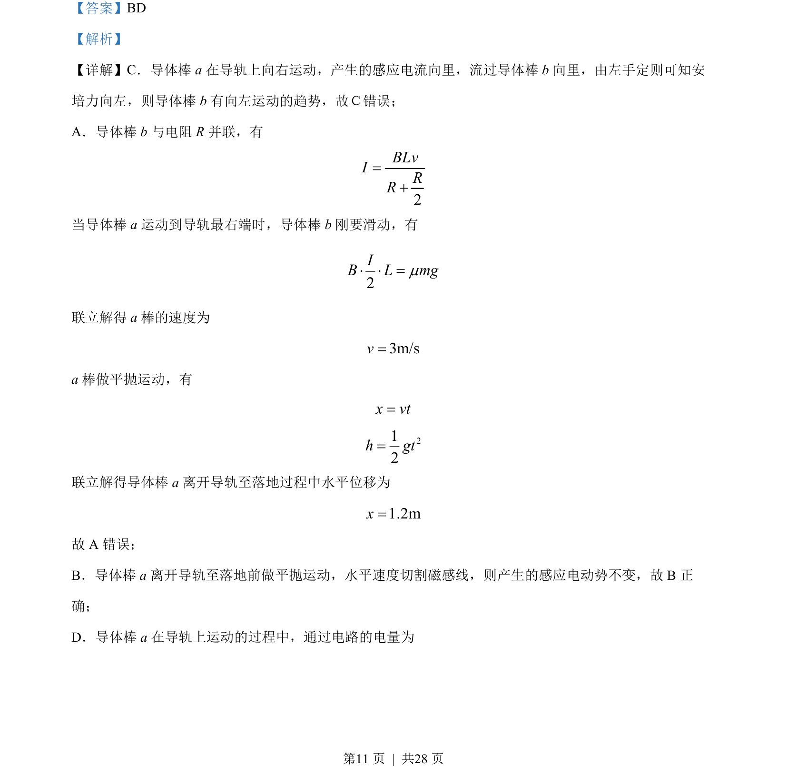
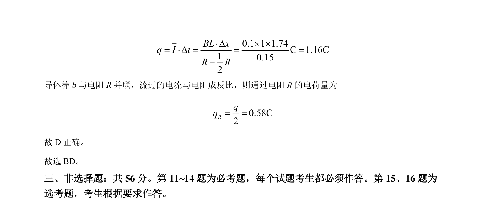

## 题面

## 摘要

导体棒切割磁感线产生感应电流，结合电路并联、安培力平衡、平抛运动及电荷量计算分析选项。

## 关联考点

- [[175-电磁感应|电磁感应]]
- [[188-磁场对通电导体的作用|安培力]]
- [[261-平抛运动|平抛运动]]
- [[180-电荷量|电荷量]]

## 答案与解析

> 📄 原 PDF 第 10 页：`素材/真题/湖南/2008-2024·（湖南）物理高考真题/2022年高考物理试卷（湖南）（解析卷）.pdf`
