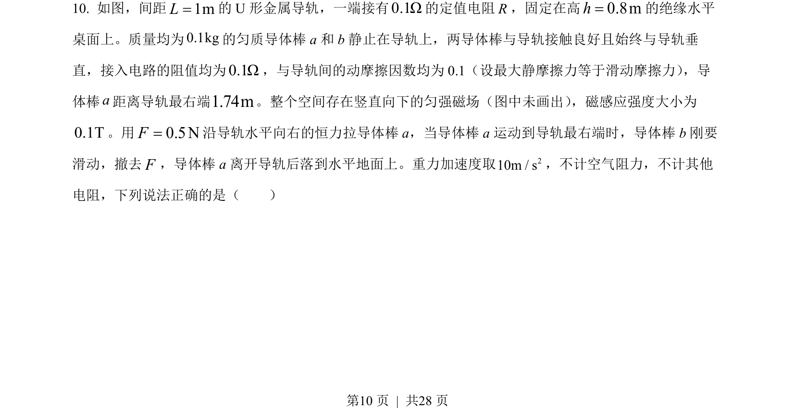
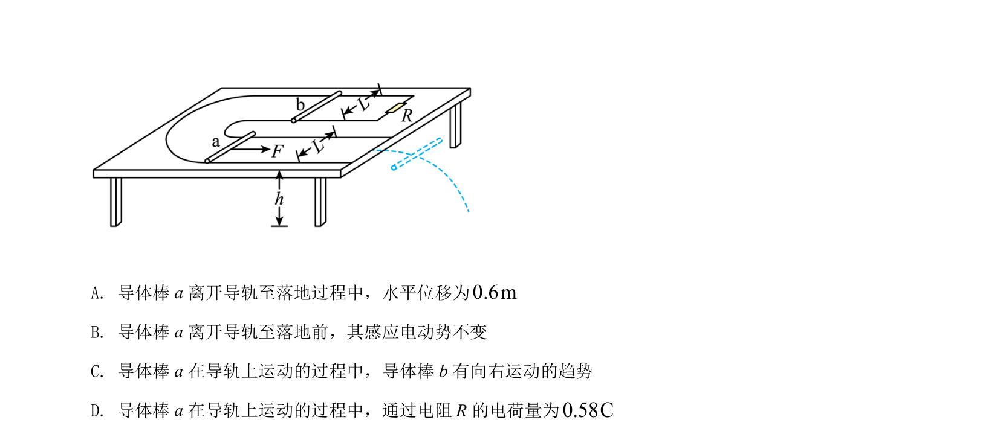
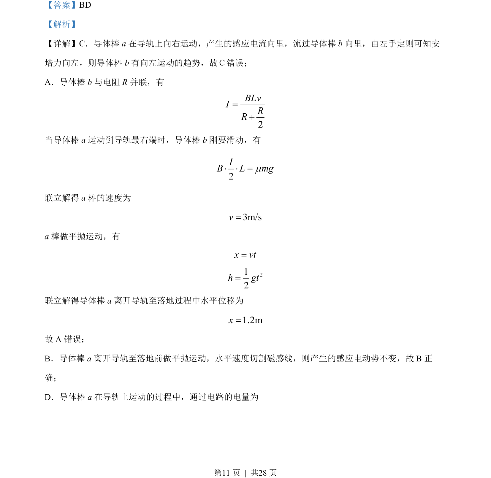
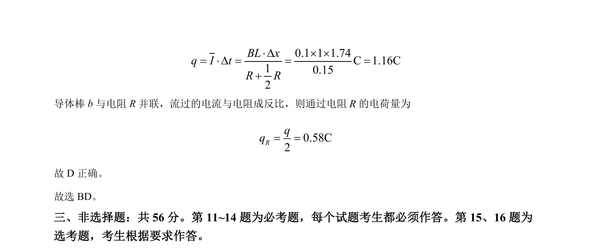

## 题面

## 摘要

导体棒切割磁感线产生感应电流，结合电路并联、安培力平衡、平抛运动及电荷量计算分析选项。

## 关联考点

- [[175-电磁感应|电磁感应]]
- [[188-磁场对通电导体的作用|安培力]]
- [[261-平抛运动|平抛运动]]
- [[180-电荷量|电荷量]]

## 答案与解析

> 📄 原 PDF 第 10 页：`素材/真题/湖南/2008-2024·（湖南）物理高考真题/2022年高考物理试卷（湖南）（解析卷）.pdf`

<!-- 题干文本-start -->
## 题干文本
10. 如图，间距1mL=的 U 形金属导轨，一端接有0.1Ω的定值电阻R，固定在高0.8mh=的绝缘水平
桌面上。质量均为0.1kg的匀质导体棒 a 和 b静止在导轨上，两导体棒与导轨接触良好且始终与导轨垂
直，接入电路的阻值均为0.1Ω，与导轨间的动摩擦因数均为 0.1（设最大静摩擦力等于滑动摩擦力） ，导
体棒a距离导轨最右端1.74m。整个空间存在竖直向下的匀强磁场（图中未画出） ，磁感应强度大小为
0.1T。用0.5 NF=沿导轨水平向右的恒力拉导体棒 a，当导体棒 a 运动到导轨最右端时，导体棒 b 刚要
滑动，撤去F，导体棒 a 离开导轨后落到水平地面上。重力加速度取 210m / s，不计空气阻力，不计其他
电阻，下列说法正确的是（　　）
<!-- 题干文本-end -->

<!-- 解析文本-start -->
## 解析文本

<!-- 解析文本-end -->
