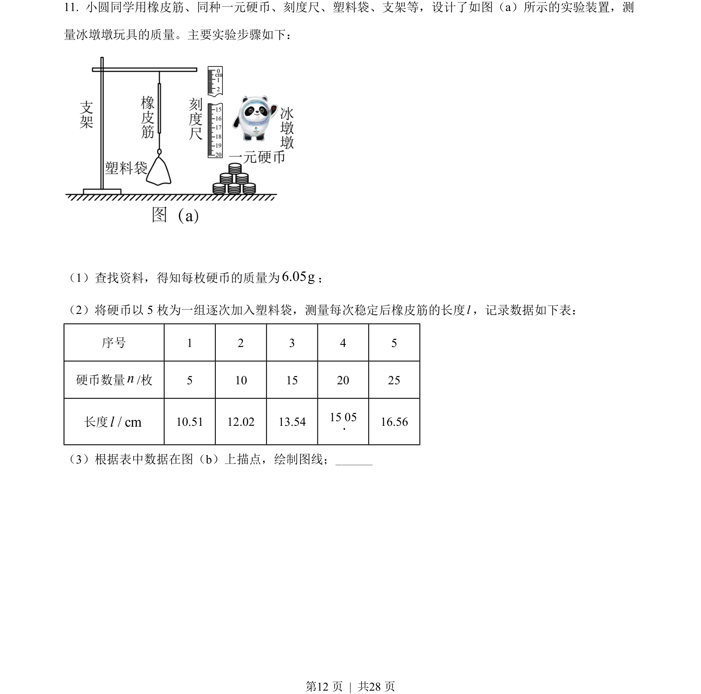
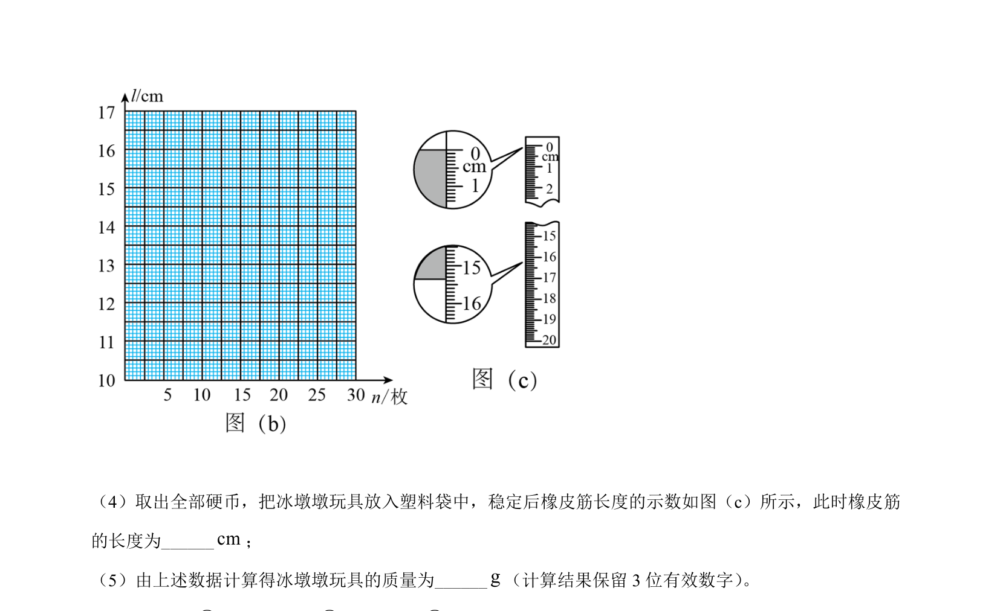
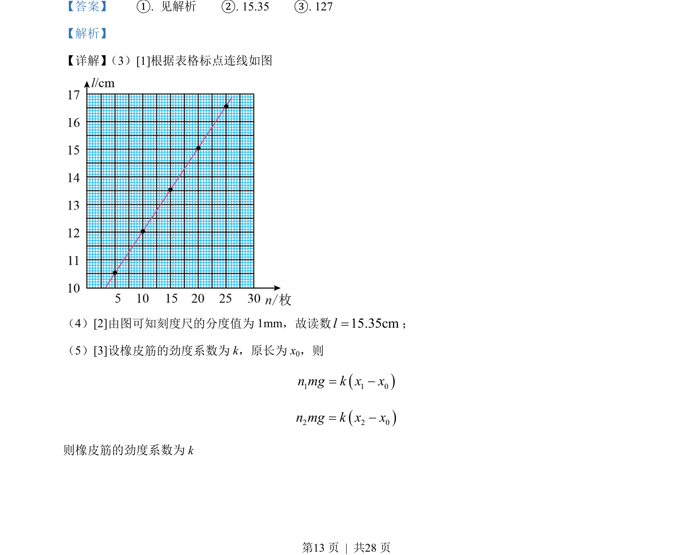
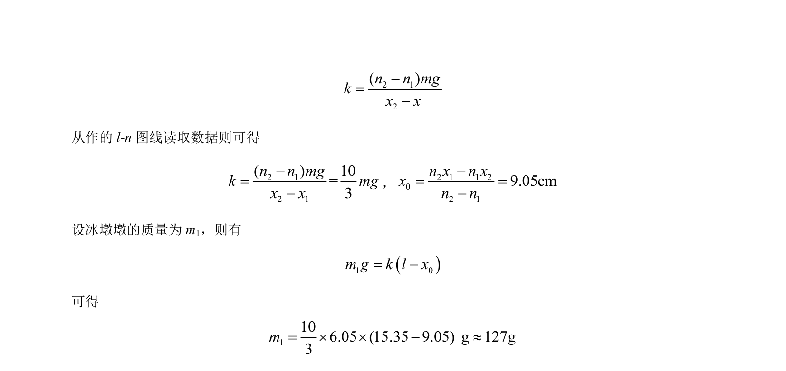

## 题面

## 摘要

该题考查利用橡皮筋悬挂钩码测量劲度系数并推算物体质量的实验，涉及数据描点连线、刻度尺读数及公式推导。

## 关联考点

- [[233-胡克定律|胡克定律]]
- [[582-实验数据处理|实验数据处理]]
- [[图像法求劲度系数]]
- [[724-误差分析|误差分析]]

## 答案与解析

> 📄 原 PDF 第 12 页：`素材/真题/湖南/2008-2024·（湖南）物理高考真题/2022年高考物理试卷（湖南）（解析卷）.pdf`
