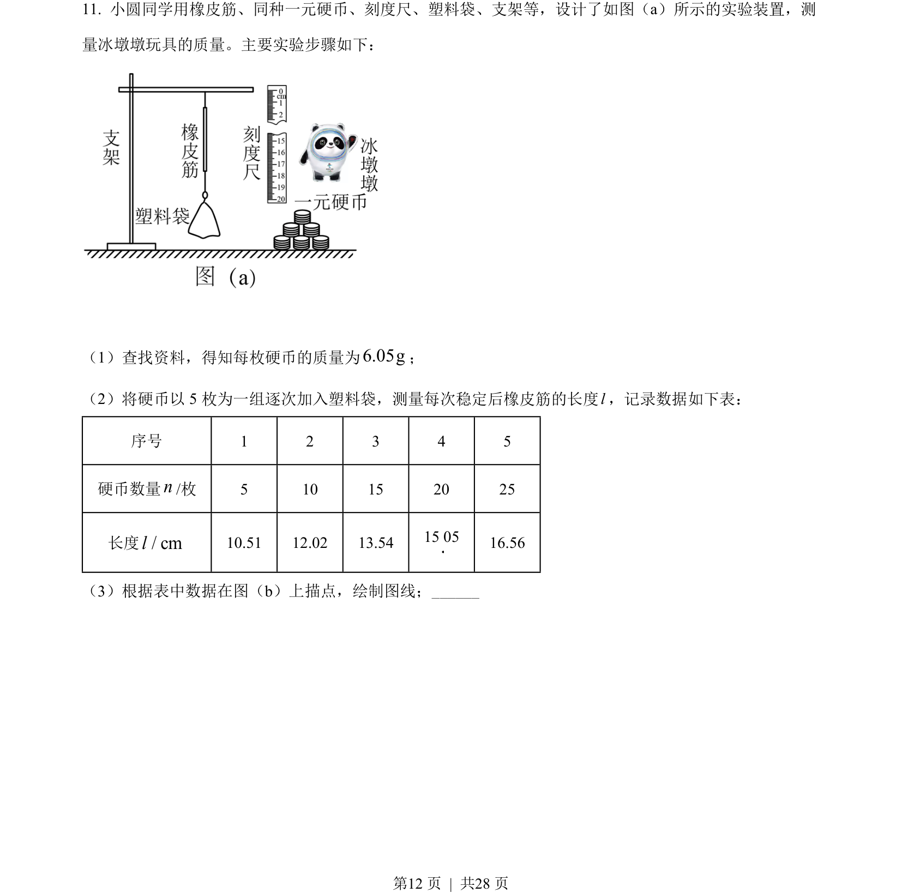
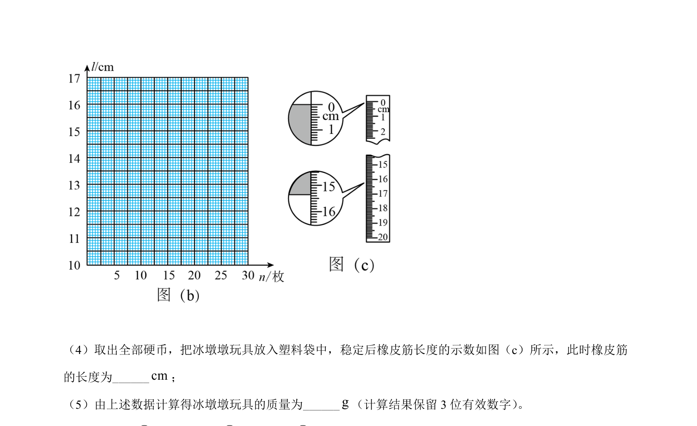
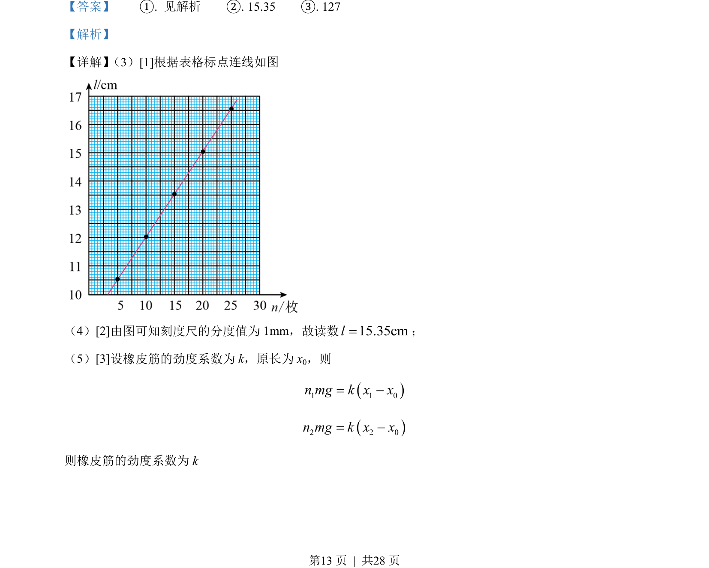
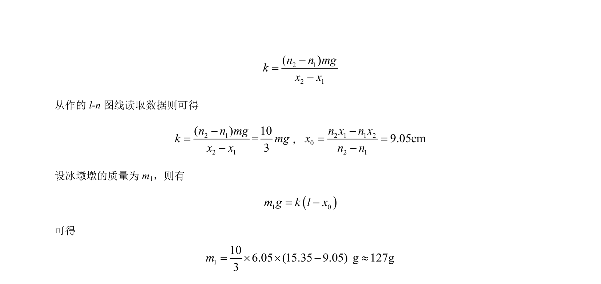

## 题面

## 摘要

该题考查利用橡皮筋悬挂钩码测量劲度系数并推算物体质量的实验，涉及数据描点连线、刻度尺读数及公式推导。

## 关联考点

- [[233-胡克定律|胡克定律]]
- [[582-实验数据处理|实验数据处理]]
- [[图像法求劲度系数]]
- [[724-误差分析|误差分析]]

## 答案与解析

> 📄 原 PDF 第 12 页：`素材/真题/湖南/2008-2024·（湖南）物理高考真题/2022年高考物理试卷（湖南）（解析卷）.pdf`

<!-- 题干文本-start -->
## 题干文本
11. 小圆同学用橡皮筋、同种一元硬币、刻度尺、塑料袋、支架等，设计了如图（a）所示的实验装置，测
量冰墩墩玩具的质量。主要实验步骤如下：
（1）查找资料，得知每枚硬币的质量为6.05g；
（2）将硬币以 5 枚为一组逐次加入塑料袋，测量每次稳定后橡皮筋的长度l，记录数据如下表：
序号 1 2 3 4 5
硬币数量n/枚 5 10 15 20 25
长度/ cml10.51 12.02 13.54 15 05 16.56
（3）根据表中数据在图（b）上描点，绘制图线；______
.
<!-- 题干文本-end -->

<!-- 解析文本-start -->
## 解析文本

<!-- 解析文本-end -->
