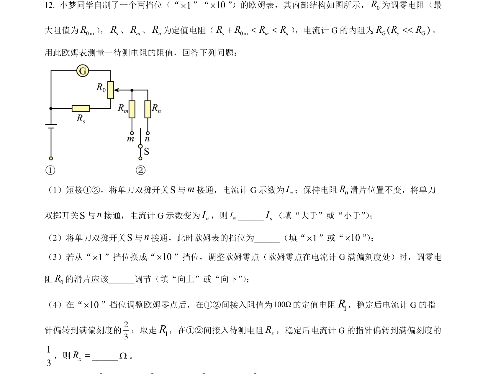
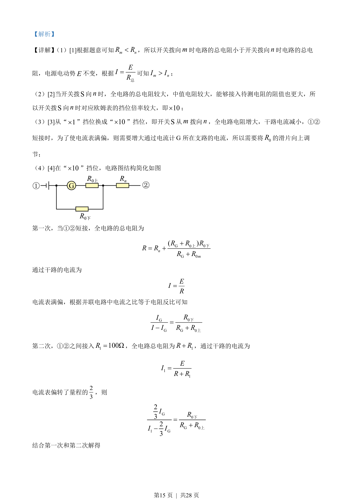
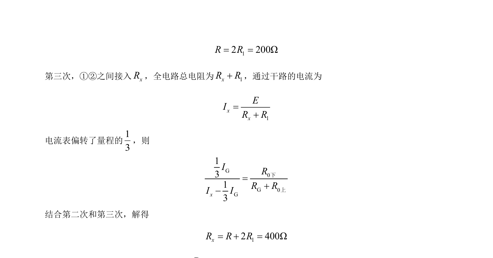

## 题面

## 摘要

本题通过改变欧姆表内部电路连接切换倍率，结合闭合电路欧姆定律和并联分流规律，计算未知电阻阻值。

## 关联考点

- [[332-闭合电路欧姆定律|闭合电路欧姆定律]]
- [[欧姆表原理]]
- [[862-并联分流|并联分流]]
- [[772-电阻测量|电阻测量]]

## 答案与解析

> 📄 原 PDF 第 14 页：`素材/真题/湖南/2008-2024·（湖南）物理高考真题/2022年高考物理试卷（湖南）（解析卷）.pdf`
