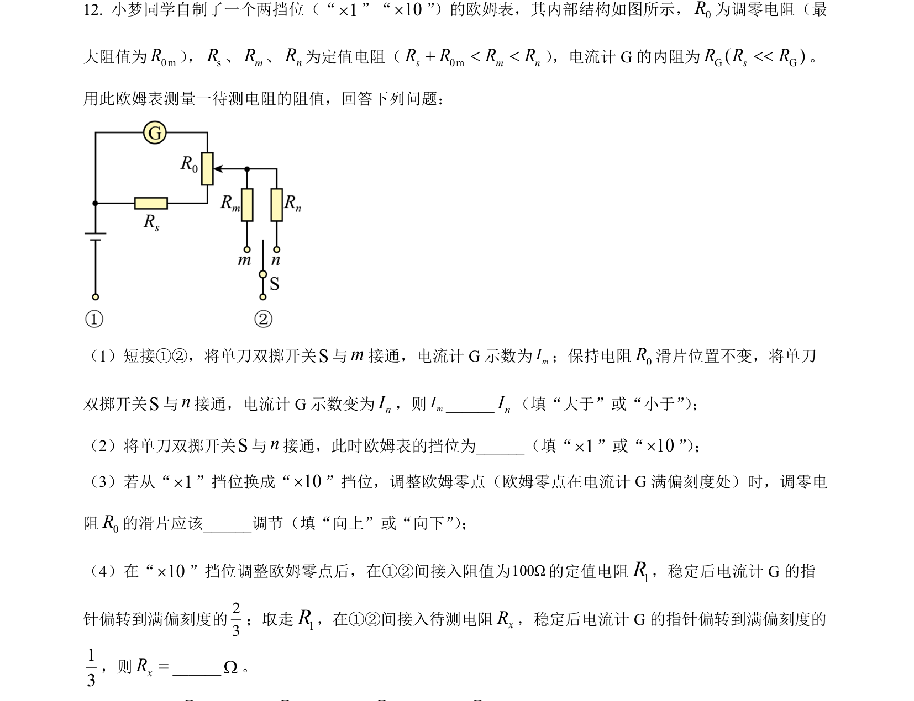
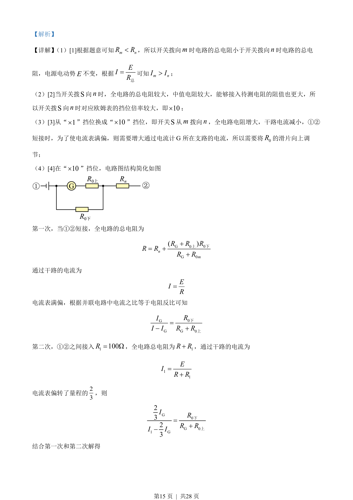
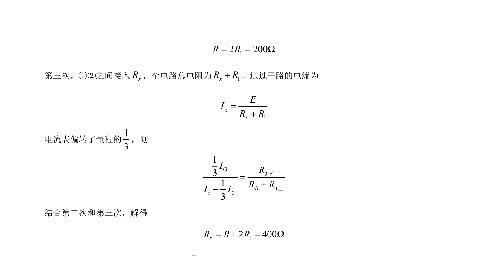

## 题面

## 摘要

本题通过改变欧姆表内部电路连接切换倍率，结合闭合电路欧姆定律和并联分流规律，计算未知电阻阻值。

## 关联考点

- [[332-闭合电路欧姆定律|闭合电路欧姆定律]]
- [[欧姆表原理]]
- [[862-并联分流|并联分流]]
- [[772-电阻测量|电阻测量]]

## 答案与解析

> 📄 原 PDF 第 14 页：`素材/真题/湖南/2008-2024·（湖南）物理高考真题/2022年高考物理试卷（湖南）（解析卷）.pdf`

<!-- 题干文本-start -->
## 题干文本
12. 小梦同学自制了一个两挡位（“1´”“10´”）的欧姆表，其内部结构如图所示，0R为调零电阻（最
大阻值为0 mR） ，sR、mR、nR为定值电阻（ 0ms m nR R R R+ < <） ，电流计G 的内阻为G G( )sR R R<<。
用此欧姆表测量一待测电阻的阻值，回答下列问题：
（1）短接①②，将单刀双掷开关S与m接通，电流计 G 示数为mI；保持电阻0R滑片位置不变，将单刀
双掷开关S与n接通，电流计 G 示数变为nI，则mI______nI（填“大于”或“小于”） ；
（2）将单刀双掷开关S与n接通，此时欧姆表的挡位为______（填“1´”或“10´”） ；
（3）若从“1´”挡位换成“10´”挡位，调整欧姆零点（欧姆零点在电流计 G 满偏刻度处）时，调零电
阻0R的滑片应该______调节（填“向上”或“向下”） ；
（4）在“10´”挡位调整欧姆零点后，在①②间接入阻值为100Ω的定值电阻1R，稳定后电流计 G 的指
针偏转到满偏刻度的23；取走1R，在①②间接入待测电阻xR，稳定后电流计 G 的指针偏转到满偏刻度的
13
，则xR=______W。
<!-- 题干文本-end -->

<!-- 解析文本-start -->
## 解析文本
【答案】    ①. 大于    ②. 10´    ③. 向上    ④. 400
<!-- 解析文本-end -->
