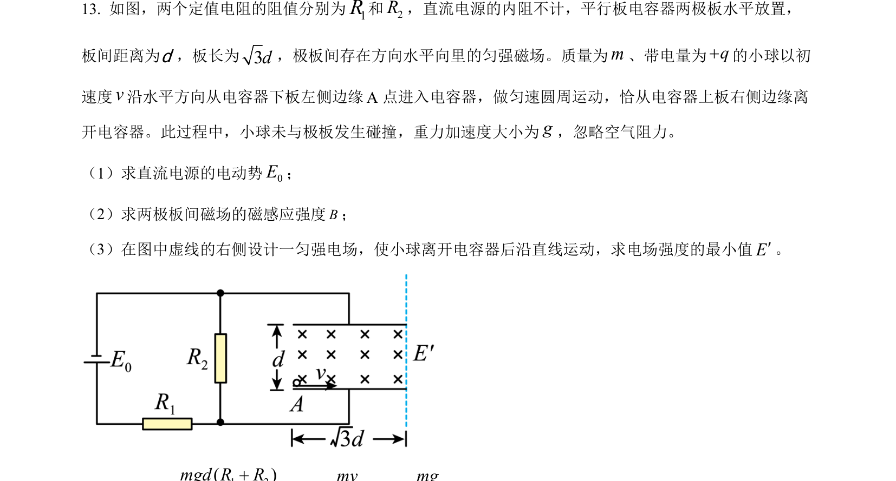
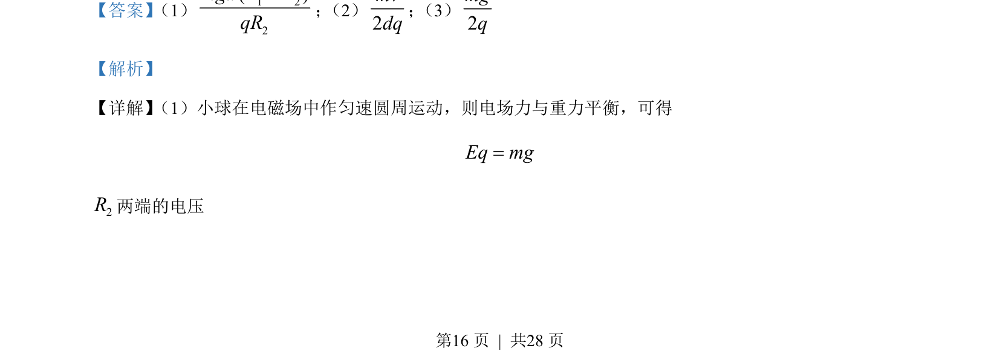
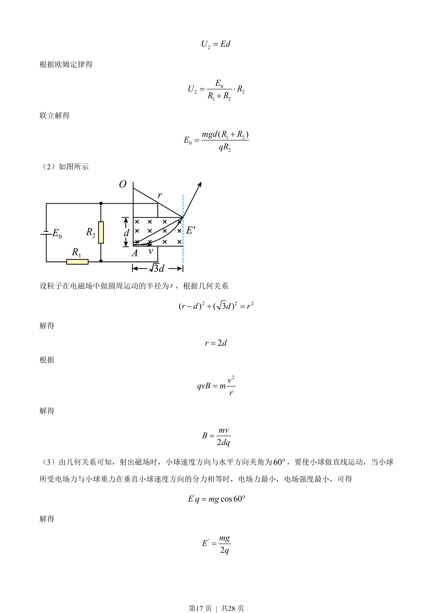

## 题面

## 摘要

带电小球在电磁复合场中做匀速圆周运动，结合电路计算、洛伦兹力及平衡条件求解。

## 关联考点

- [[844-带电粒子在复合场中的运动|带电粒子在复合场中的运动]]
- [[604-平衡条件|平衡条件]]
- [[304-洛伦兹力|洛伦兹力]]
- [[141-欧姆定律-初中|欧姆定律]]

## 答案与解析

> 📄 原 PDF 第 16 页：`素材/真题/湖南/2008-2024·（湖南）物理高考真题/2022年高考物理试卷（湖南）（解析卷）.pdf`
