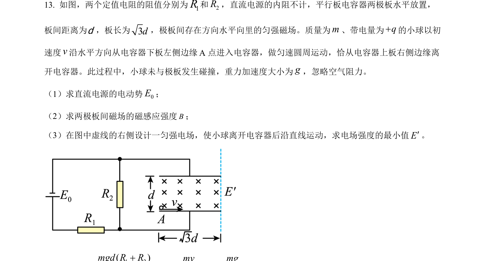
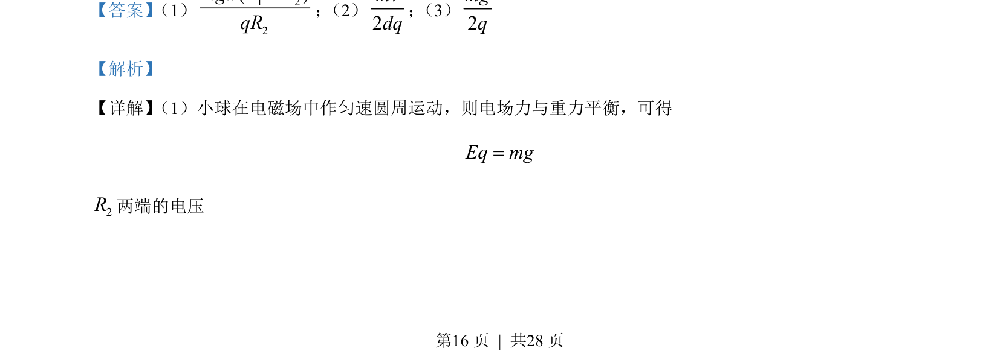
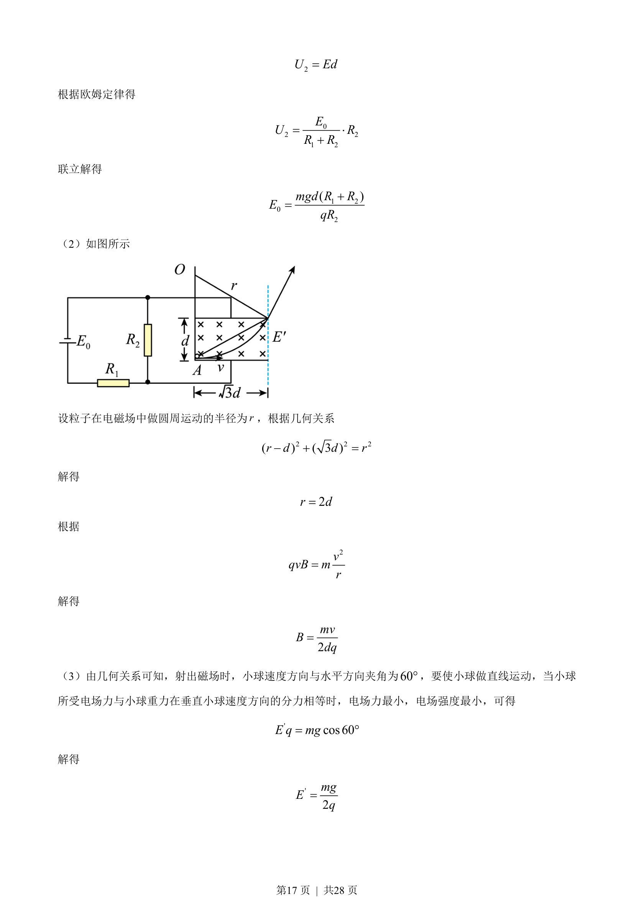

## 题面

## 摘要

带电小球在电磁复合场中做匀速圆周运动，结合电路计算、洛伦兹力及平衡条件求解。

## 关联考点

- [[844-带电粒子在复合场中的运动|带电粒子在复合场中的运动]]
- [[604-平衡条件|平衡条件]]
- [[304-洛伦兹力|洛伦兹力]]
- [[141-欧姆定律-初中|欧姆定律]]

## 答案与解析

> 📄 原 PDF 第 16 页：`素材/真题/湖南/2008-2024·（湖南）物理高考真题/2022年高考物理试卷（湖南）（解析卷）.pdf`

<!-- 题干文本-start -->
## 题干文本
13. 如图，两个定值电阻的阻值分别为1R和2R，直流电源的内阻不计，平行板电容器两极板水平放置，
板间距离为d，板长为3d，极板间存在方向水平向里的匀强磁场。质量为m、带电量为q+的小球以初
速度v沿水平方向从电容器下板左侧边缘A点进入电容器，做匀速圆周运动，恰从电容器上板右侧边缘离
开电容器。此过程中，小球未与极板发生碰撞，重力加速度大小为g，忽略空气阻力。
（1）求直流电源的电动势0E；
（2）求两极板间磁场的磁感应强度B；
（3）在图中虚线的右侧设计一匀强电场，使小球离开电容器后沿直线运动，求电场强度的最小值E¢。
<!-- 题干文本-end -->

<!-- 解析文本-start -->
## 解析文本
【答案】 （1） 1 22( )mgd R RqR+
； （2）2mvdq； （3）2mgq
【解析】
【详解】 （1）小球在电磁场中作匀速圆周运动，则电场力与重力平衡，可得
Eq mg=2R两端的电压
<!-- 解析文本-end -->
