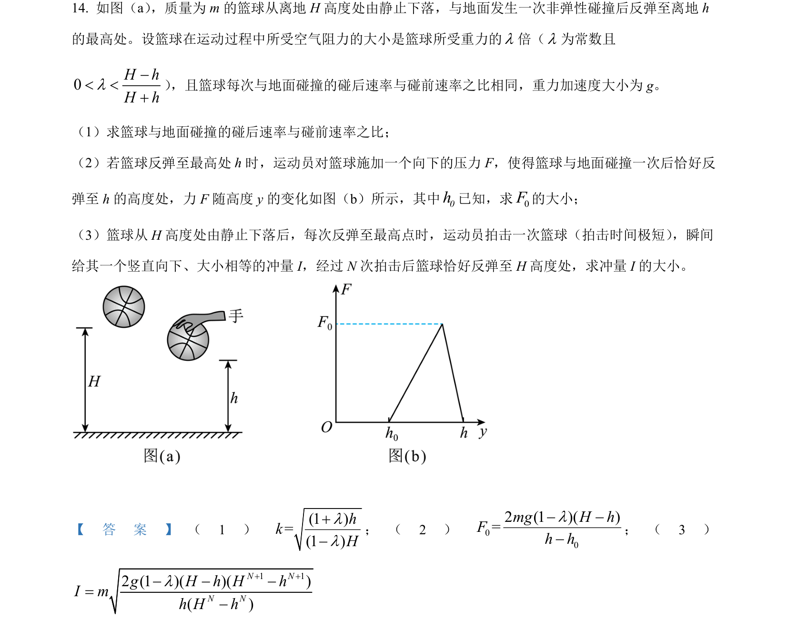
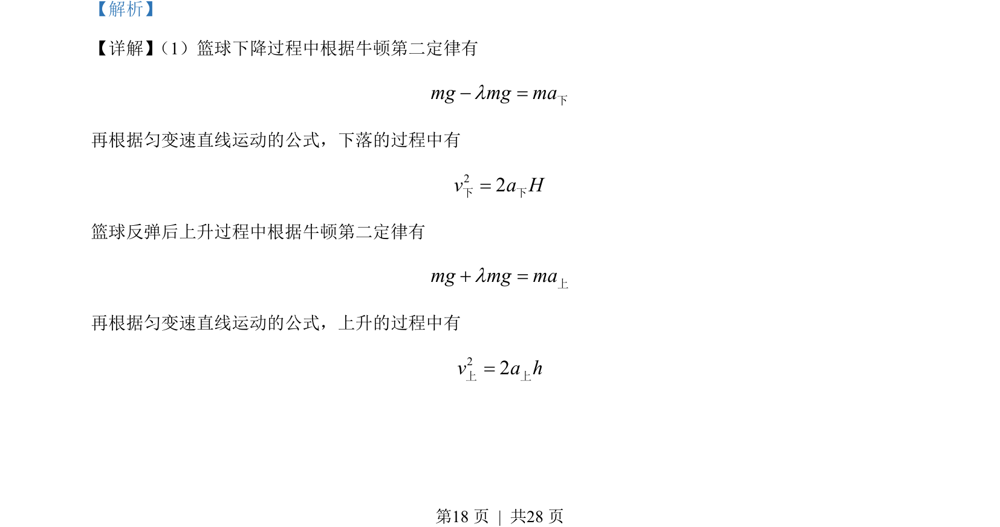
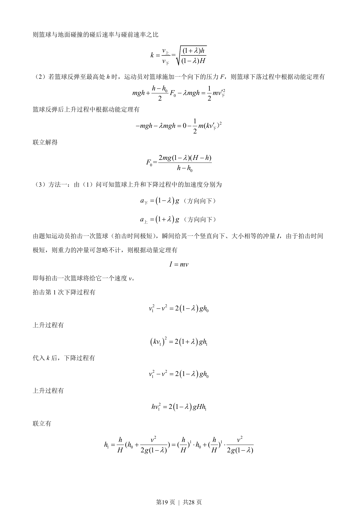
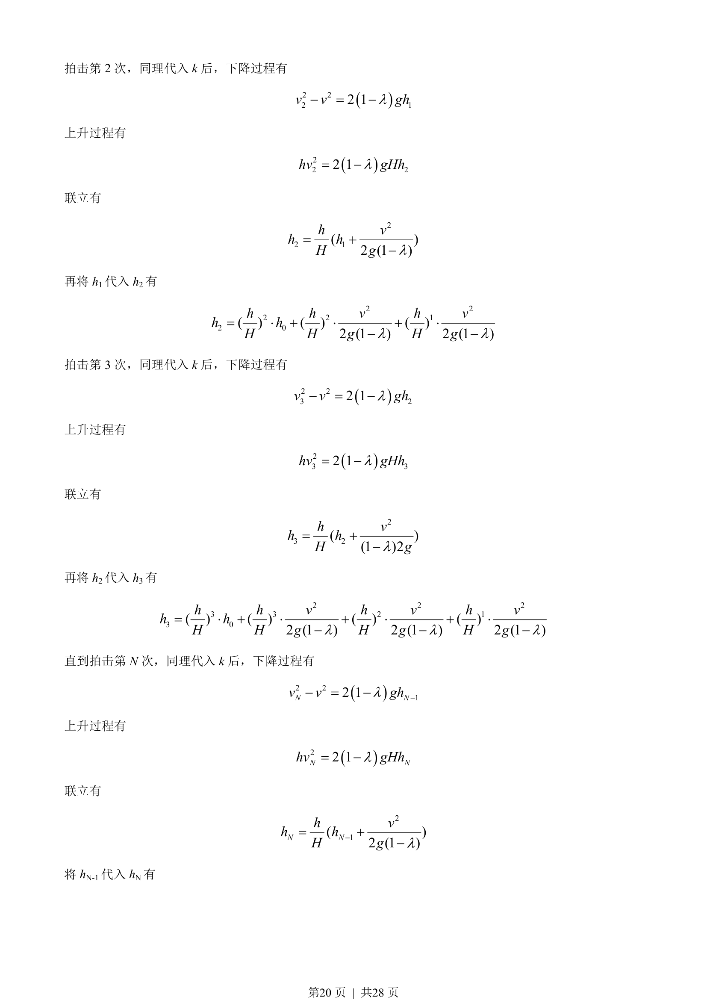
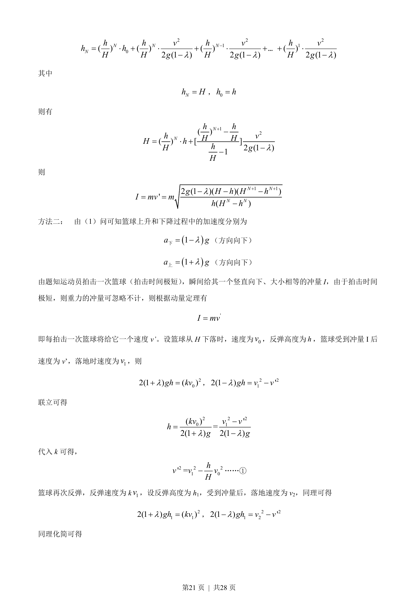
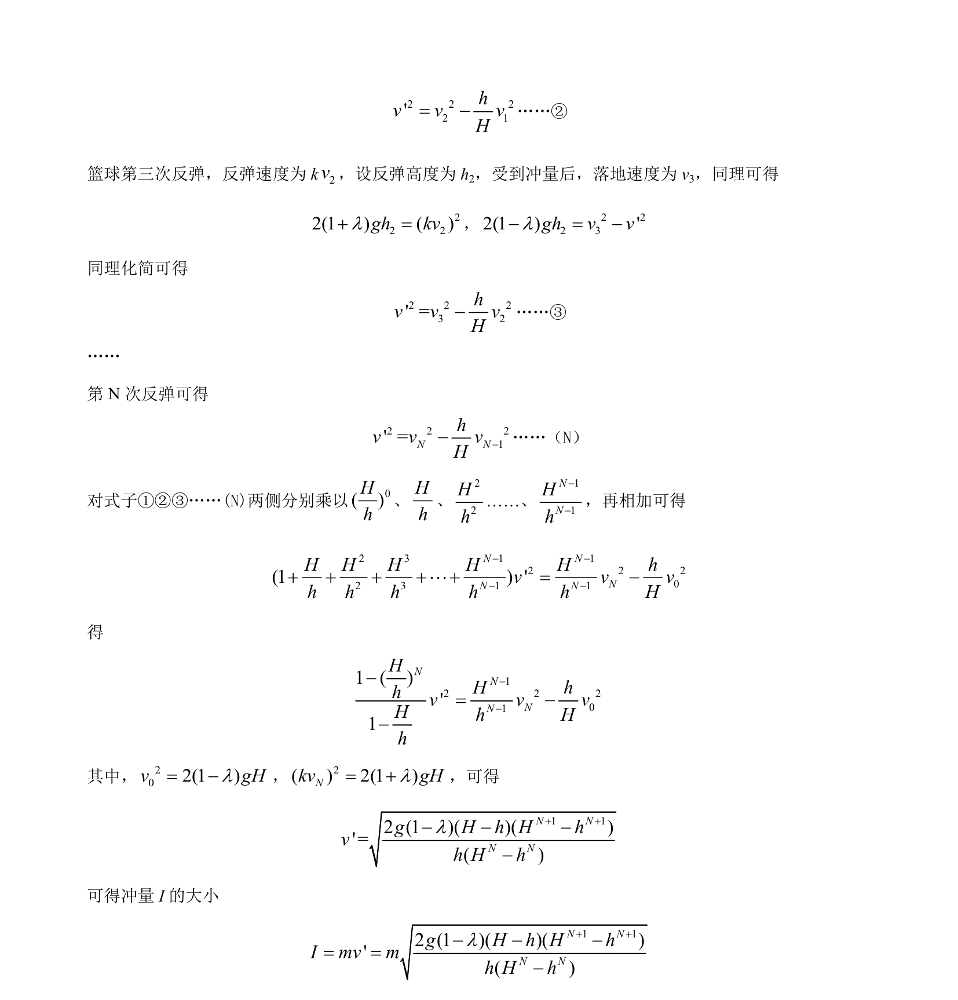

## 题面

## 摘要

篮球受空气阻力下落与反弹的多过程运动，涉及多次拍击冲量及高度递推关系。

## 关联考点

- [[229-牛顿第二定律|牛顿第二定律]]
- [[215-匀变速直线运动|匀变速直线运动]]
- [[251-动能定理|动能定理]]
- [[349-动量定理|动量定理]]

## 答案与解析

> 📄 原 PDF 第 18 页：`素材/真题/湖南/2008-2024·（湖南）物理高考真题/2022年高考物理试卷（湖南）（解析卷）.pdf`
