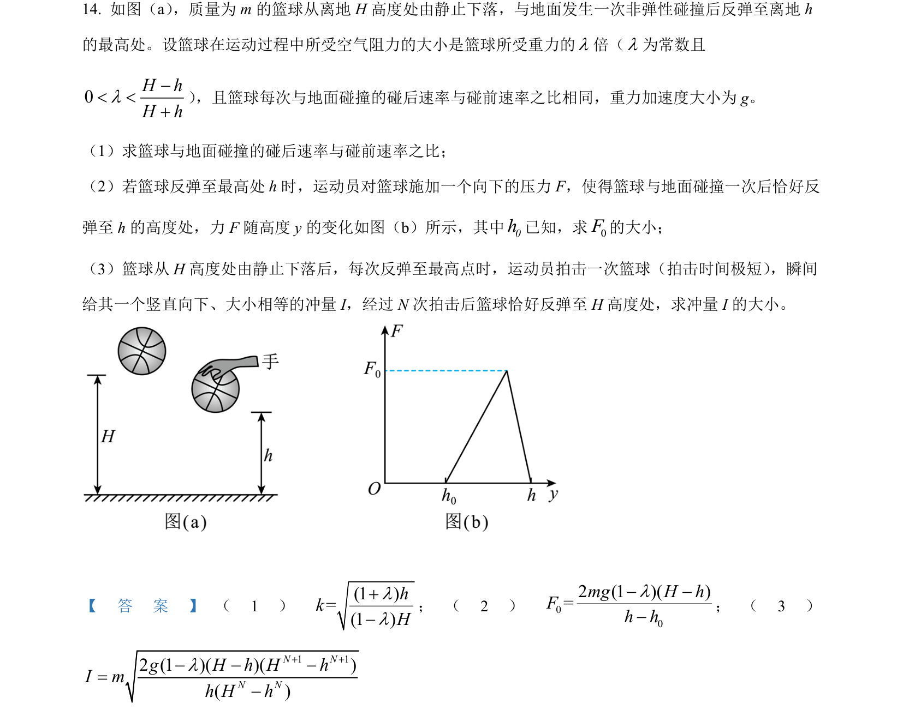
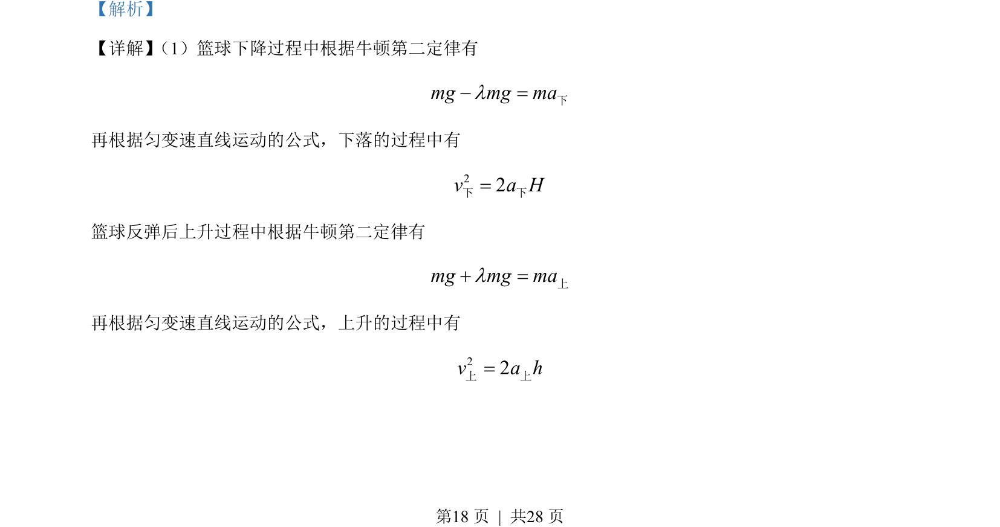
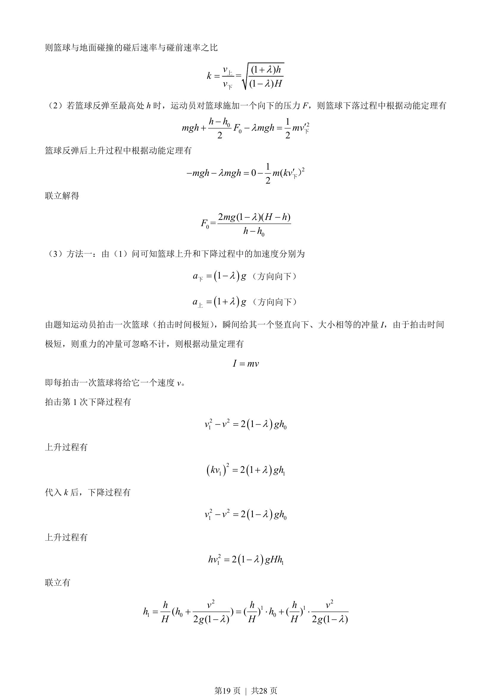
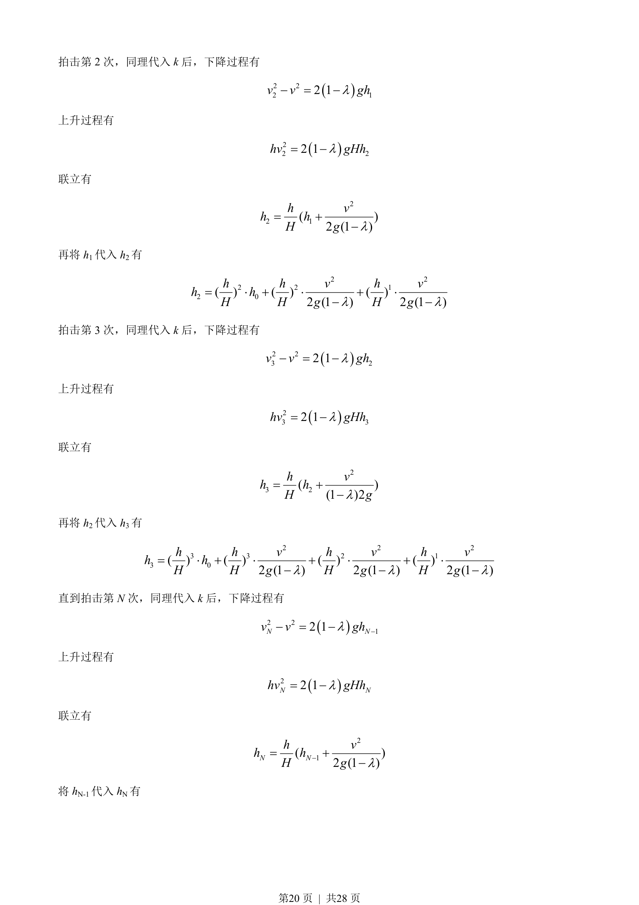
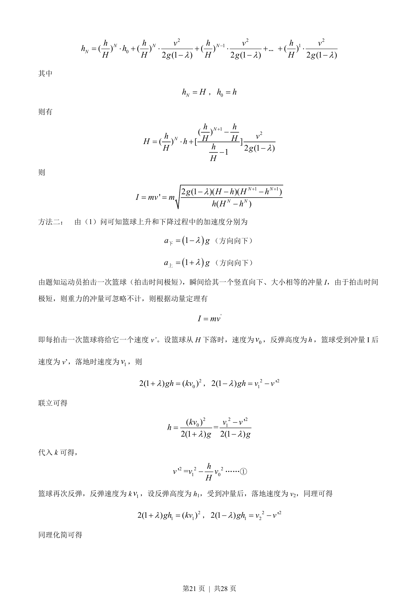
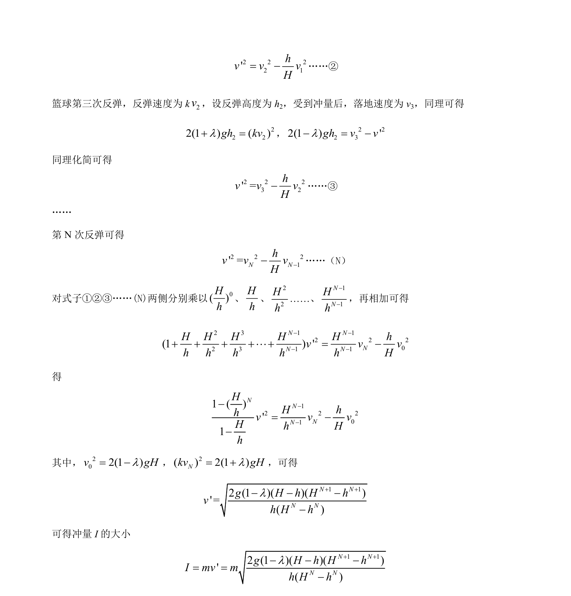

## 题面

## 摘要

篮球受空气阻力下落与反弹的多过程运动，涉及多次拍击冲量及高度递推关系。

## 关联考点

- [[229-牛顿第二定律|牛顿第二定律]]
- [[215-匀变速直线运动|匀变速直线运动]]
- [[251-动能定理|动能定理]]
- [[349-动量定理|动量定理]]

## 答案与解析

> 📄 原 PDF 第 18 页：`素材/真题/湖南/2008-2024·（湖南）物理高考真题/2022年高考物理试卷（湖南）（解析卷）.pdf`

<!-- 题干文本-start -->
## 题干文本
14. 如图（a） ，质量为m 的篮球从离地 H 高度处由静止下落，与地面发生一次非弹性碰撞后反弹至离地 h
的最高处。设篮球在运动过程中所受空气阻力的大小是篮球所受重力的l倍（l为常数且
0H hH hl-< <+
） ，且篮球每次与地面碰撞的碰后速率与碰前速率之比相同，重力加速度大小为g。
（1）求篮球与地面碰撞的碰后速率与碰前速率之比；
（2）若篮球反弹至最高处 h 时，运动员对篮球施加一个向下的压力 F，使得篮球与地面碰撞一次后恰好反
弹至 h 的高度处，力 F随高度 y的变化如图（b）所示，其中0h已知，求0F的大小；
（3）篮球从 H 高度处由静止下落后，每次反弹至最高点时，运动员拍击一次篮球（拍击时间极短） ，瞬间
给其一个竖直向下、大小相等的冲量 I，经过 N次拍击后篮球恰好反弹至 H 高度处，求冲量 I 的大小。
【 答 案 】 （ 1 ）(1 )=(1 )hkHll+-
； （ 2 ）002 (1 )( )=mg H hFh hl- --； （ 3 ）
1 12 (1 )( )( )( )N NN Ng H h H hh H hI ml+ +- - --=
<!-- 题干文本-end -->

<!-- 解析文本-start -->
## 解析文本
【解析】
【详解】 （1）篮球下降过程中根据牛顿第二定律有
mg mg mal- =下
再根据匀变速直线运动的公式，下落的过程中有
22v a H=下下
篮球反弹后上升过程中根据牛顿第二定律有
mg mg mal+ =上
再根据匀变速直线运动的公式，上升的过程中有
22v a h=上上
<!-- 解析文本-end -->
