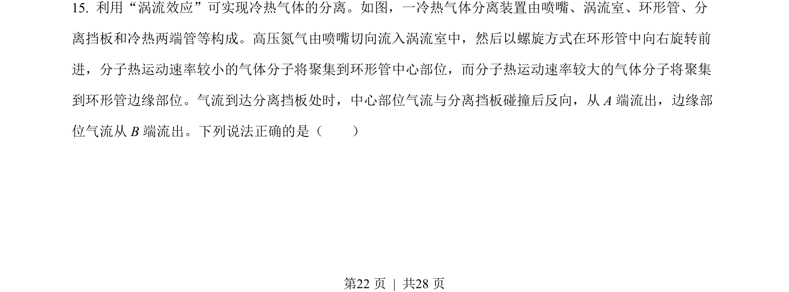
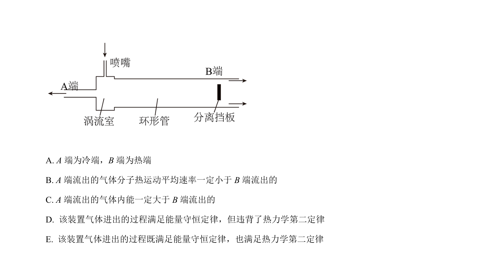
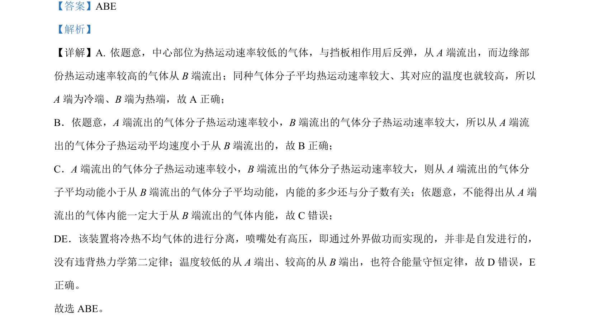

## 题面

## 摘要

该题通过装置分离冷热气体的情境，考查分子热运动速率与温度的关系、平均动能、内能及热力学定律。

## 关联考点

- [[分子热运动速率与温度]]
- [[839-分子平均动能|分子平均动能]]
- [[127-内能|内能]]
- [[441-热力学第二定律|热力学第二定律]]

## 答案与解析

> 📄 原 PDF 第 22 页：`素材/真题/湖南/2008-2024·（湖南）物理高考真题/2022年高考物理试卷（湖南）（解析卷）.pdf`
