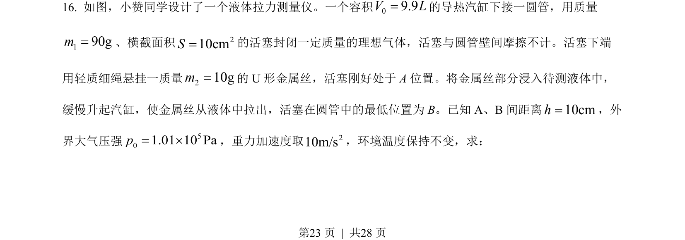
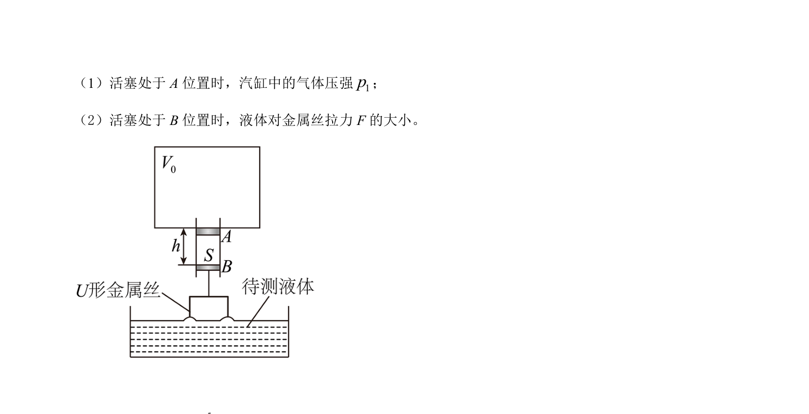
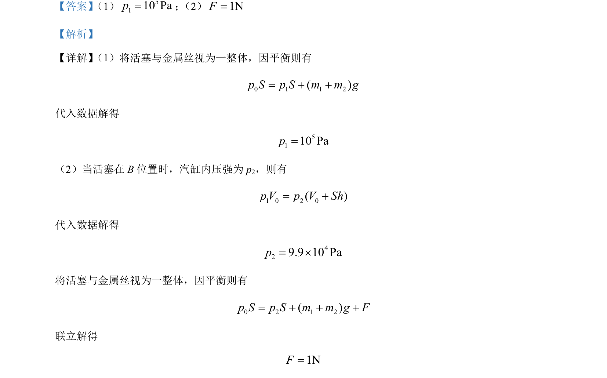

## 题面

## 摘要

活塞平衡求压强与拉力，考查等温变化与受力分析

## 关联考点

- [[446-理想气体状态方程|理想气体状态方程]]
- [[208-共点力平衡|共点力平衡]]
- [[550-压强计算|压强计算]]

## 答案与解析

> 📄 原 PDF 第 23 页：`素材/真题/湖南/2008-2024·（湖南）物理高考真题/2022年高考物理试卷（湖南）（解析卷）.pdf`
