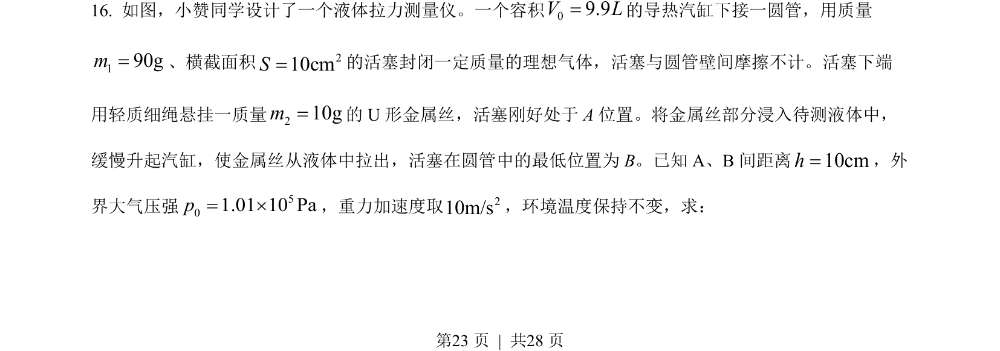
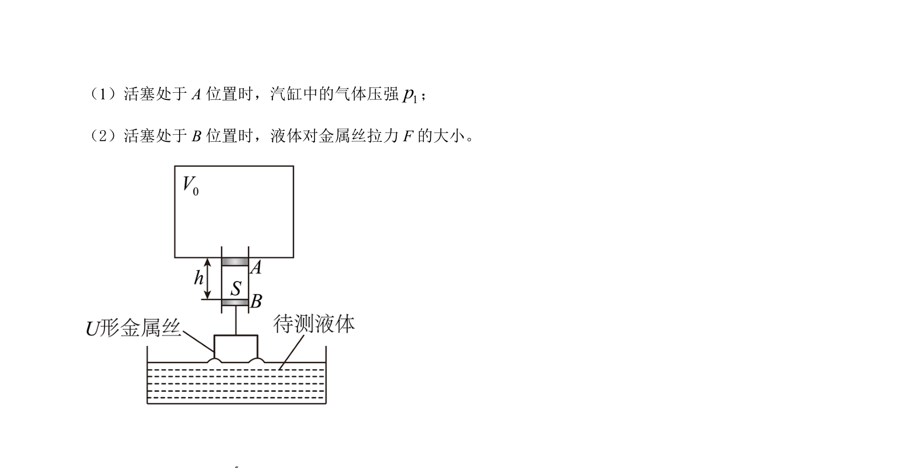
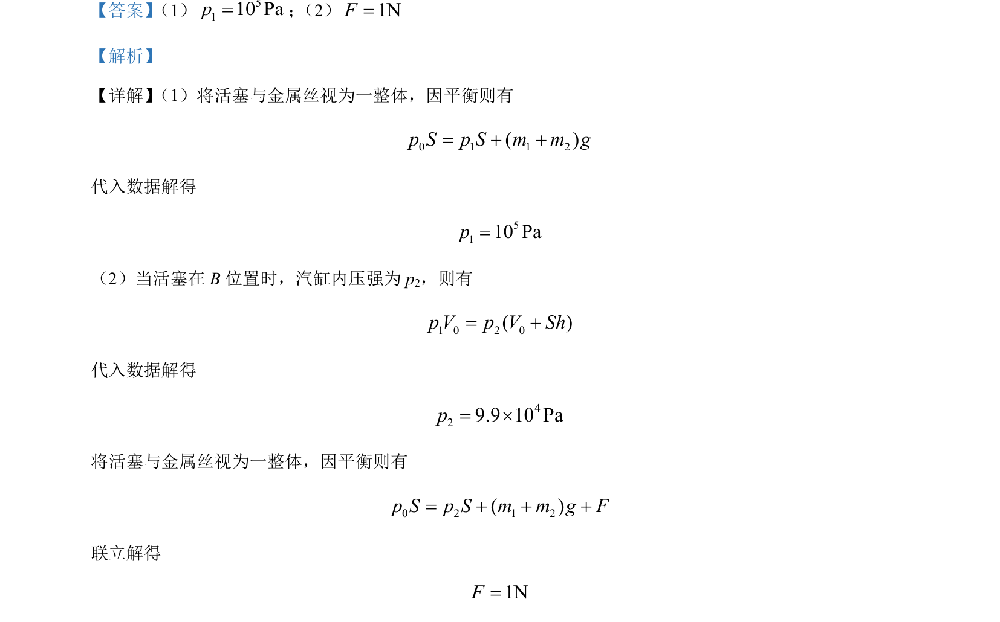

## 题面

## 摘要

活塞平衡求压强与拉力，考查等温变化与受力分析

## 关联考点

- [[446-理想气体状态方程|理想气体状态方程]]
- [[208-共点力平衡|共点力平衡]]
- [[550-压强计算|压强计算]]

## 答案与解析

> 📄 原 PDF 第 23 页：`素材/真题/湖南/2008-2024·（湖南）物理高考真题/2022年高考物理试卷（湖南）（解析卷）.pdf`

<!-- 题干文本-start -->
## 题干文本
16. 如图，小赞同学设计了一个液体拉力测量仪。一个容积09.9V L=的导热汽缸下接一圆管，用质量
190gm=、横截面积 210cm=S的活塞封闭一定质量的理想气体，活塞与圆管壁间摩擦不计。活塞下端
用轻质细绳悬挂一质量210gm=的 U 形金属丝，活塞刚好处于 A位置。将金属丝部分浸入待测液体中，
缓慢升起汽缸，使金属丝从液体中拉出，活塞在圆管中的最低位置为 B。已知 A、B间距离10cmh=，外
界大气压强 501.01 10 Pap= ´，重力加速度取 210m/s，环境温度保持不变，求：
的
<!-- 题干文本-end -->

<!-- 解析文本-start -->
## 解析文本

<!-- 解析文本-end -->
