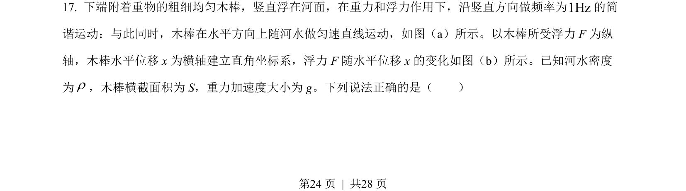
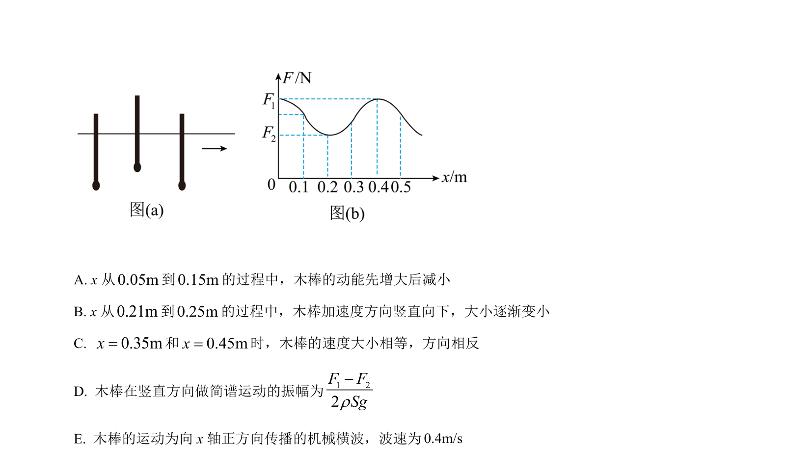
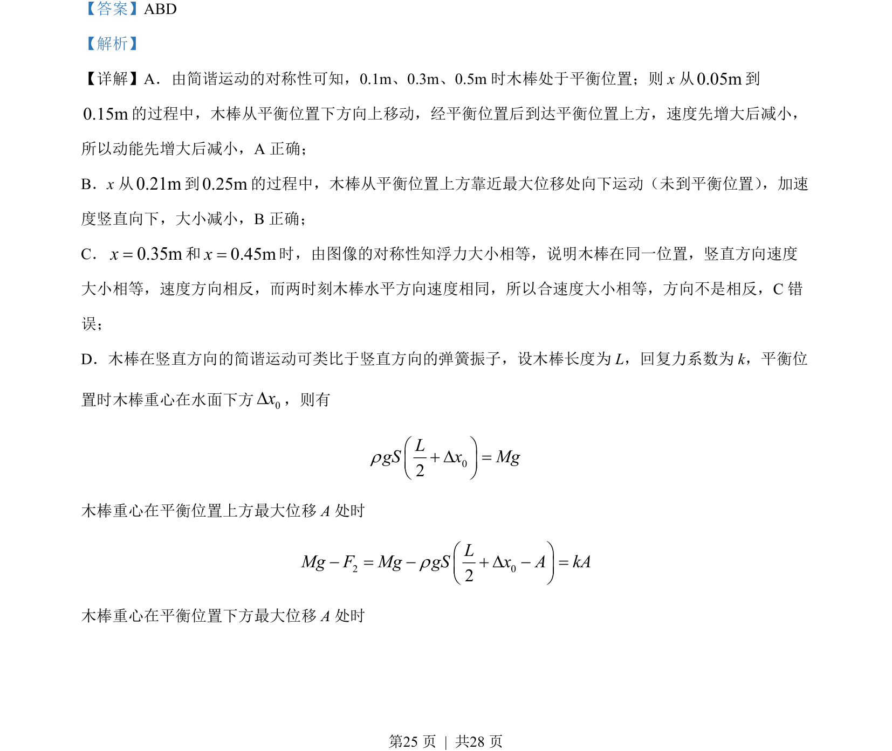
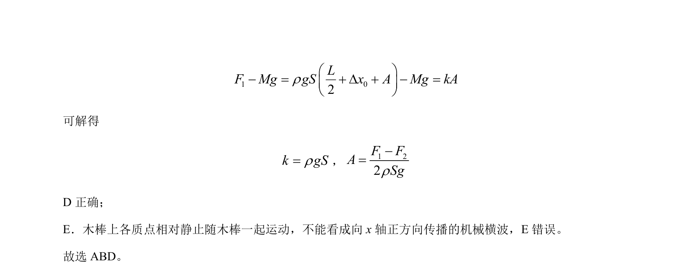

## 题面

## 摘要

木棒竖直简谐运动结合浮力与回复力，分析不同阶段的动能、加速度、速度关系和横波条件。

## 关联考点

- [[714-简谐运动对称性|简谐运动对称性]]
- [[动能变化]]
- [[356-回复力|回复力]]
- [[092-浮力|浮力]]
- [[机械横波]]

## 答案与解析

> 📄 原 PDF 第 24 页：`素材/真题/湖南/2008-2024·（湖南）物理高考真题/2022年高考物理试卷（湖南）（解析卷）.pdf`
