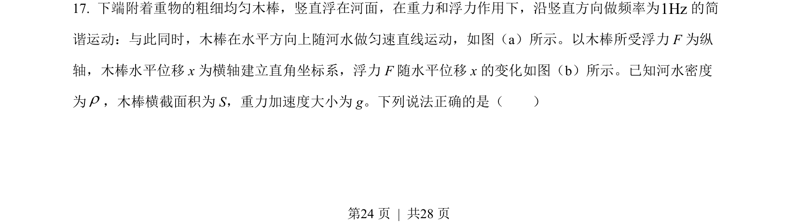
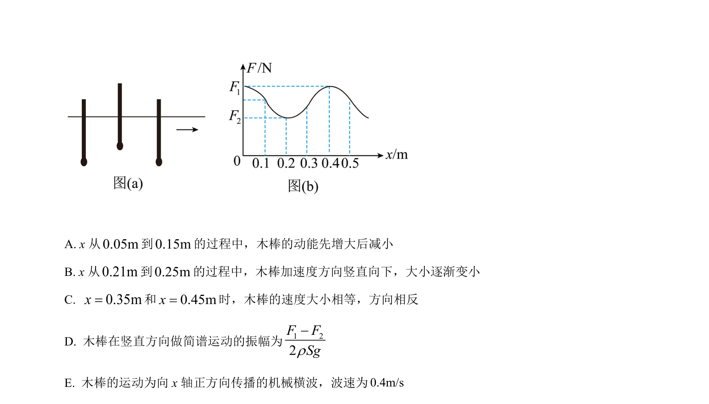
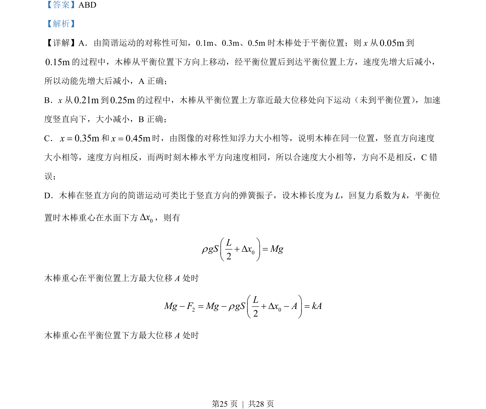
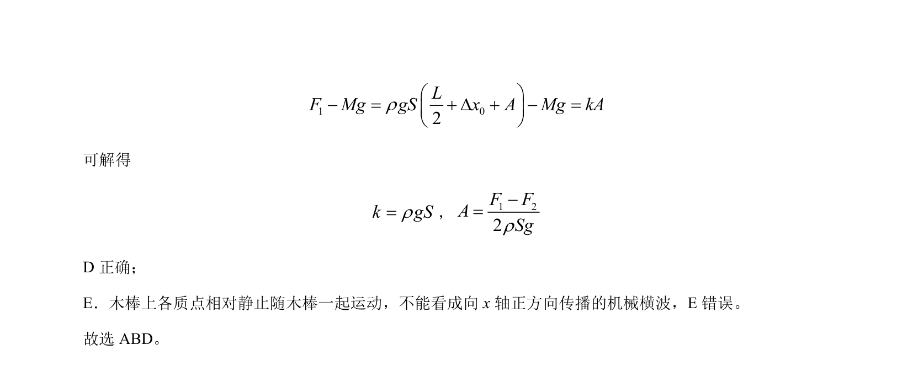

## 题面

## 摘要

木棒竖直简谐运动结合浮力与回复力，分析不同阶段的动能、加速度、速度关系和横波条件。

## 关联考点

- [[714-简谐运动对称性|简谐运动对称性]]
- [[动能变化]]
- [[356-回复力|回复力]]
- [[092-浮力|浮力]]
- [[机械横波]]

## 答案与解析

> 📄 原 PDF 第 24 页：`素材/真题/湖南/2008-2024·（湖南）物理高考真题/2022年高考物理试卷（湖南）（解析卷）.pdf`

<!-- 题干文本-start -->
## 题干文本
17. 下端附着重物的粗细均匀木棒，竖直浮在河面，在重力和浮力作用下，沿竖直方向做频率为1Hz的简
谐运动：与此同时，木棒在水平方向上随河水做匀速直线运动，如图（a）所示。以木棒所受浮力 F为纵
轴，木棒水平位移 x为横轴建立直角坐标系，浮力 F随水平位移 x的变化如图（b）所示。已知河水密度
为r，木棒横截面积为 S，重力加速度大小为 g。下列说法正确的是（　　）
<!-- 题干文本-end -->

<!-- 解析文本-start -->
## 解析文本

<!-- 解析文本-end -->
