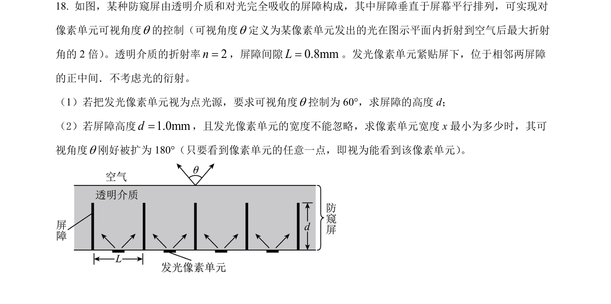
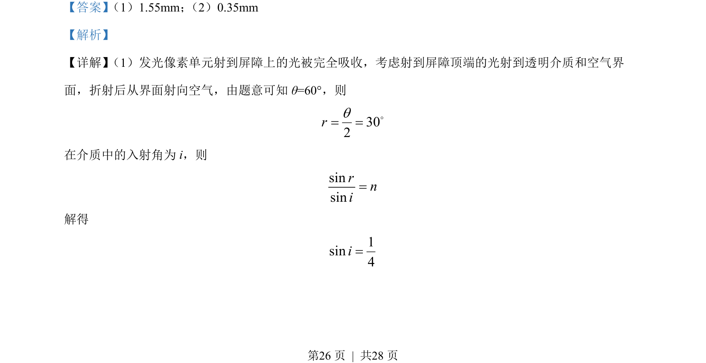
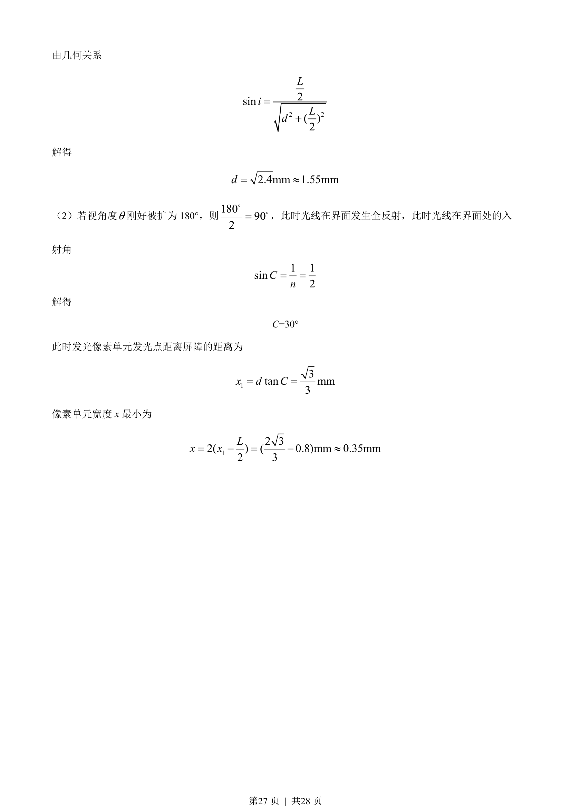

## 题面

## 摘要

该题通过发光像素单元与透明介质界面的光线传播，考查折射定律与全反射条件的几何应用计算。

## 关联考点

- [[003-光的折射|光的折射]]
- [[343-全反射|全反射]]
- [[455-几何光学|几何光学]]

## 答案与解析

> 📄 原 PDF 第 26 页：`素材/真题/湖南/2008-2024·（湖南）物理高考真题/2022年高考物理试卷（湖南）（解析卷）.pdf`
