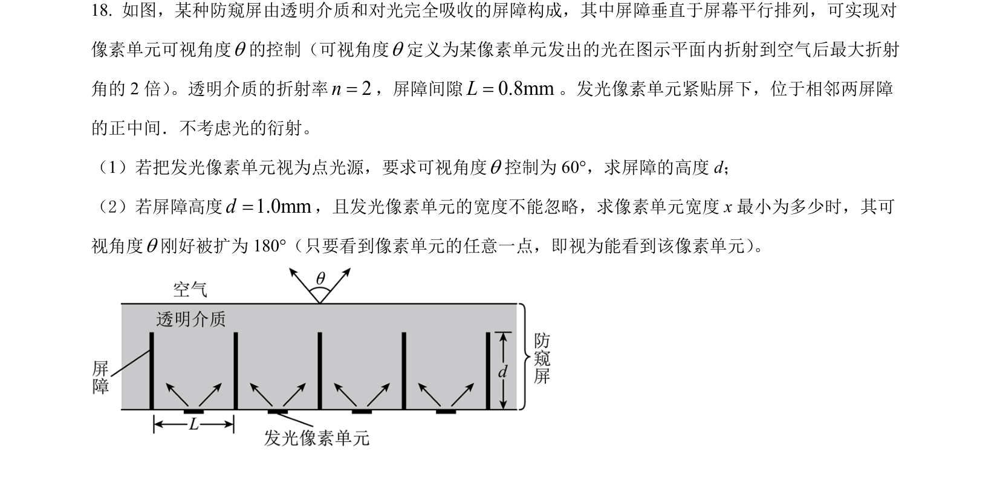
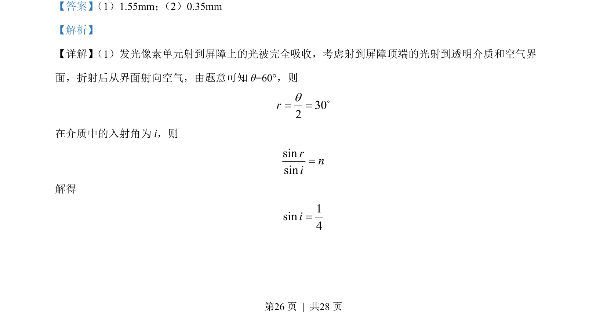
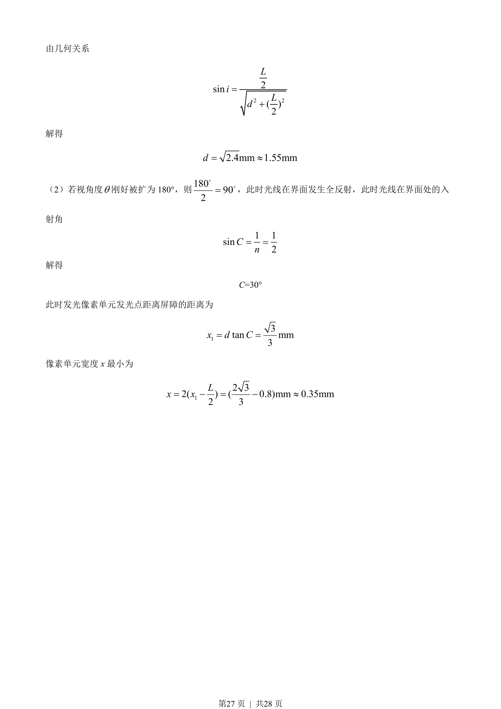

## 题面

## 摘要

该题通过发光像素单元与透明介质界面的光线传播，考查折射定律与全反射条件的几何应用计算。

## 关联考点

- [[003-光的折射|光的折射]]
- [[343-全反射|全反射]]
- [[455-几何光学|几何光学]]

## 答案与解析

> 📄 原 PDF 第 26 页：`素材/真题/湖南/2008-2024·（湖南）物理高考真题/2022年高考物理试卷（湖南）（解析卷）.pdf`

<!-- 题干文本-start -->
## 题干文本
18. 如图，某种防窥屏由透明介质和对光完全吸收的屏障构成，其中屏障垂直于屏幕平行排列，可实现对
像素单元可视角度q的控制（可视角度q定义为某像素单元发出的光在图示平面内折射到空气后最大折射
角的 2 倍） 。透明介质的折射率2n=，屏障间隙0.8mmL=。发光像素单元紧贴屏下，位于相邻两屏障
的正中间．不考虑光的衍射。
（1）若把发光像素单元视为点光源，要求可视角度q控制为 60°，求屏障的高度 d；
（2）若屏障高度1.0mmd=，且发光像素单元的宽度不能忽略，求像素单元宽度 x最小为多少时，其可
视角度q刚好被扩为 180°（只要看到像素单元的任意一点，即视为能看到该像素单元） 。
<!-- 题干文本-end -->

<!-- 解析文本-start -->
## 解析文本
【答案】 （1）1.55mm； （2）0.35mm
【解析】
【详解】 （1）发光像素单元射到屏障上的光被完全吸收，考虑射到屏障顶端的光射到透明介质和空气界
面，折射后从界面射向空气，由题意可知 θ=60°，则
302rq= =o
在介质中的入射角为 i，则
sinsinrni=
解得
1sin4i=
<!-- 解析文本-end -->
