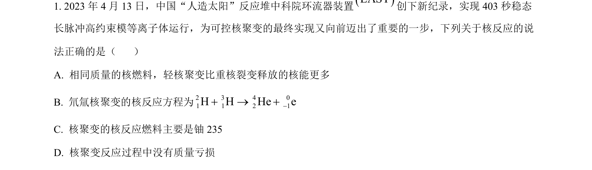
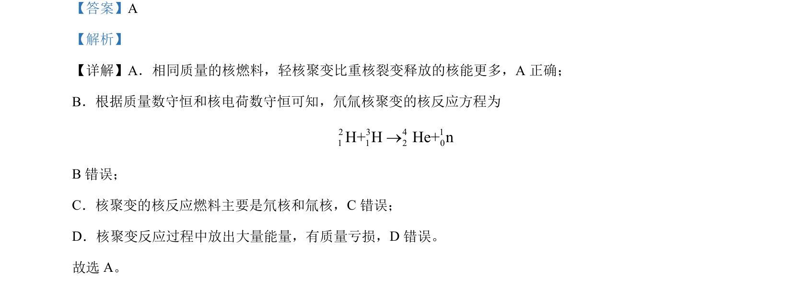

## 题面

## 摘要

本题比较轻核聚变与重核裂变的核能释放、核反应方程正误及质量亏损概念。

## 关联考点

- [[轻核聚变]]
- [[重核裂变]]
- [[629-核反应方程|核反应方程]]
- [[449-质能方程|质量亏损]]

## 答案与解析

> 📄 原 PDF 第 1 页：`素材/真题/湖南/2008-2024·（湖南）物理高考真题/2023年高考物理试卷（湖南）（解析卷）.pdf`
