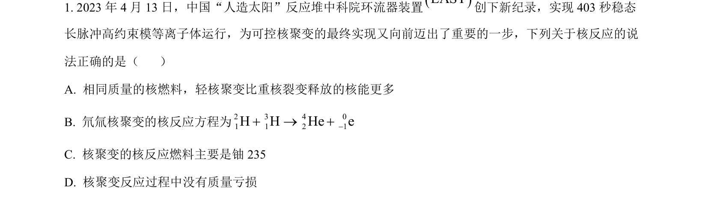
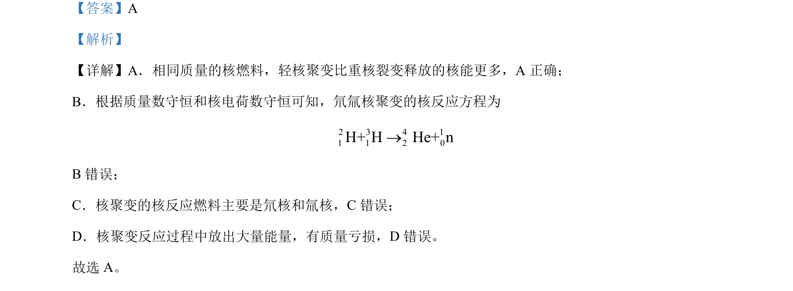

## 题面

## 摘要

本题比较轻核聚变与重核裂变的核能释放、核反应方程正误及质量亏损概念。

## 关联考点

- [[轻核聚变]]
- [[重核裂变]]
- [[629-核反应方程|核反应方程]]
- [[449-质能方程|质量亏损]]

## 答案与解析

> 📄 原 PDF 第 1 页：`素材/真题/湖南/2008-2024·（湖南）物理高考真题/2023年高考物理试卷（湖南）（解析卷）.pdf`

<!-- 题干文本-start -->
## 题干文本
1. 2023年4月13日，中国“人造太阳”反应堆中科院环流器装置EAST创下新纪录，实现403秒稳态
长脉冲高约束模等离子体运行，为可控核聚变的最终实现又向前迈出了重要的一步，下列关于核反应的说
法正确的是（    ）
A. 相同质量的核燃料，轻核聚变比重核裂变释放的核能更多
B. 氘氚核聚变的核反应方程为2 3 4 01 1 2 1H H He e-+ ® +
C. 核聚变的核反应燃料主要是铀 235
D. 核聚变反应过程中没有质量亏损
<!-- 题干文本-end -->

<!-- 解析文本-start -->
## 解析文本
【答案】A
【解析】
【详解】A．相同质量的核燃料，轻核聚变比重核裂变释放的核能更多，A 正确；
B．根据质量数守恒和核电荷数守恒可知，氘氚核聚变的核反应方程为
2 3 41 1 210nH+ H He+®
B错误；
C．核聚变的核反应燃料主要是氘核和氚核，C错误；
D．核聚变反应过程中放出大量能量，有质量亏损，D 错误。
故选 A。
<!-- 解析文本-end -->
