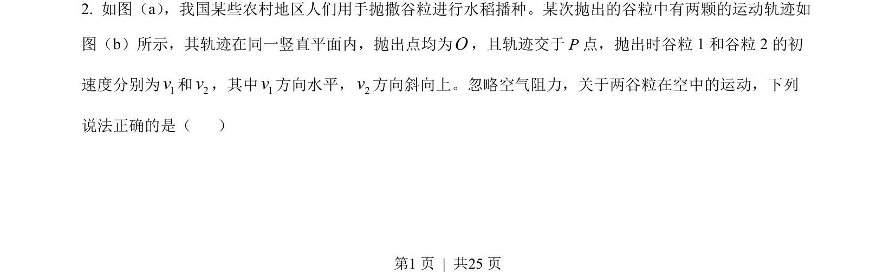
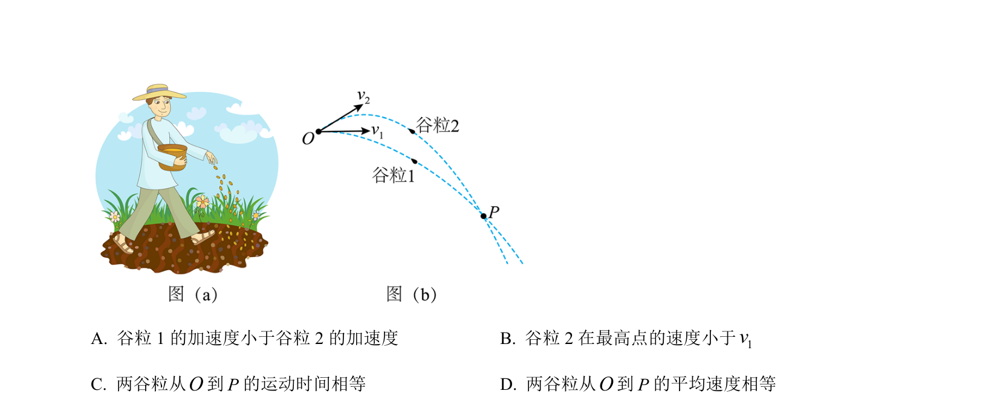
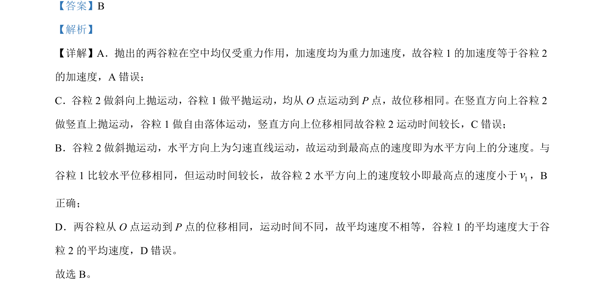

## 题面

## 摘要

比较平抛运动与斜抛运动物体的加速度、运动时间、速度和平均速度

## 关联考点

- [[261-平抛运动|平抛运动]]
- [[270-斜抛运动|斜抛运动]]
- [[运动时间比较]]
- [[023-平均速度|平均速度]]

## 答案与解析

> 📄 原 PDF 第 1 页：`素材/真题/湖南/2008-2024·（湖南）物理高考真题/2023年高考物理试卷（湖南）（解析卷）.pdf`
