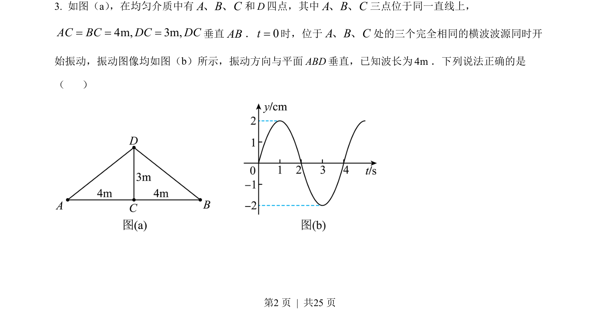
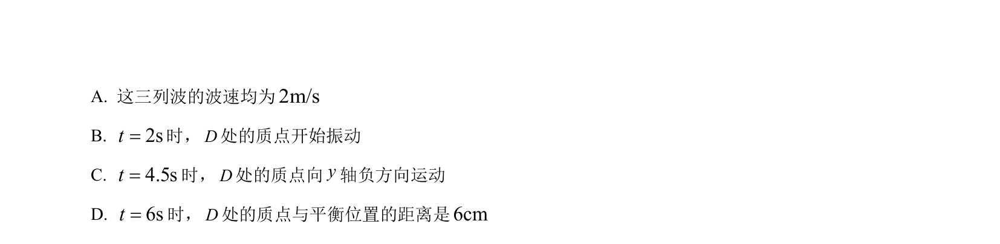
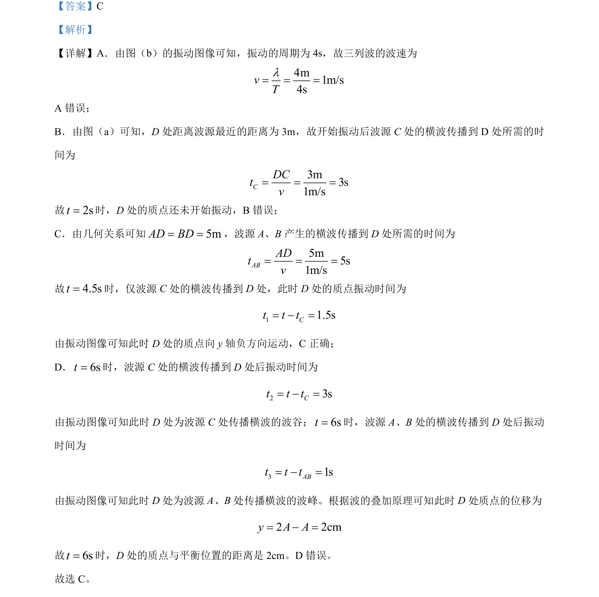

## 题面

## 摘要

考查振动图像与波速计算，分析多列波传播到某点的振动叠加问题。

## 关联考点

- [[机械波波速公式]]
- [[857-振动图像|振动图像]]
- [[波的传播时间]]
- [[波的叠加原理]]

## 答案与解析

> 📄 原 PDF 第 2 页：`素材/真题/湖南/2008-2024·（湖南）物理高考真题/2023年高考物理试卷（湖南）（解析卷）.pdf`
