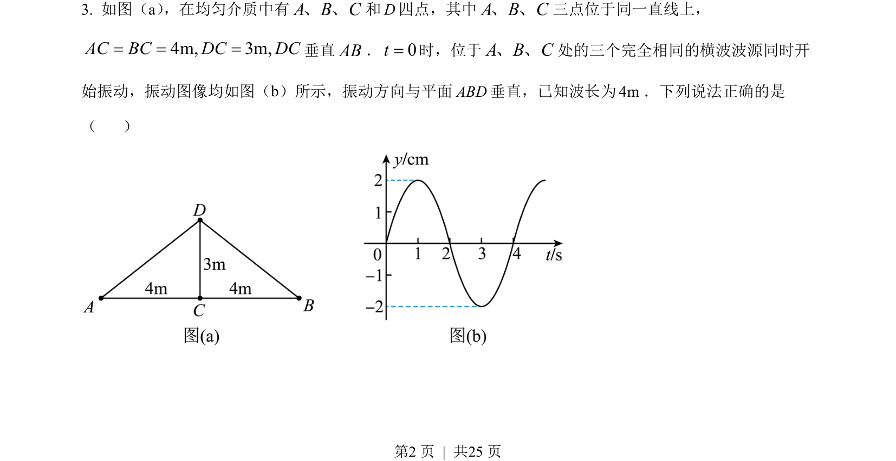
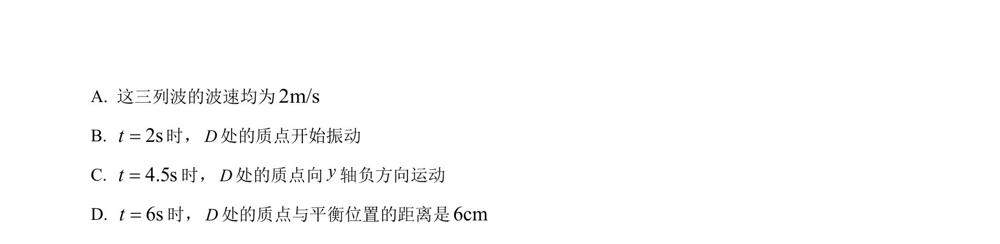
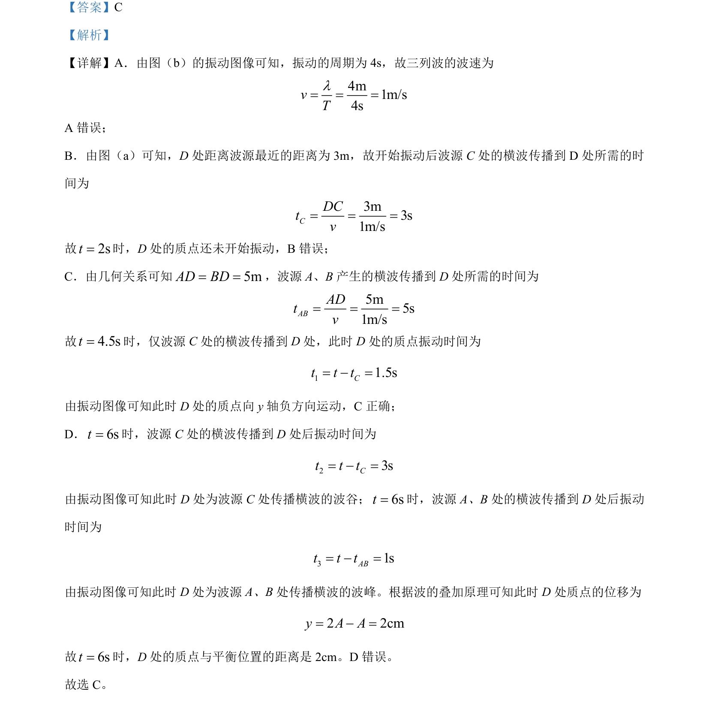

## 题面

## 摘要

考查振动图像与波速计算，分析多列波传播到某点的振动叠加问题。

## 关联考点

- [[机械波波速公式]]
- [[857-振动图像|振动图像]]
- [[波的传播时间]]
- [[波的叠加原理]]

## 答案与解析

> 📄 原 PDF 第 2 页：`素材/真题/湖南/2008-2024·（湖南）物理高考真题/2023年高考物理试卷（湖南）（解析卷）.pdf`

<!-- 题干文本-start -->
## 题干文本
3. 如图（a） ，在均匀介质中有、、A B C和D四点，其中、、A B C三点位于同一直线上，
4m, 3m,AC BC DC DC= = =垂直AB．0=t时，位于、、A B C处的三个完全相同的横波波源同时开
始振动，振动图像均如图（b）所示，振动方向与平面ABD垂直，已知波长为4m．下列说法正确的是
（    ）
<!-- 题干文本-end -->

<!-- 解析文本-start -->
## 解析文本

<!-- 解析文本-end -->
