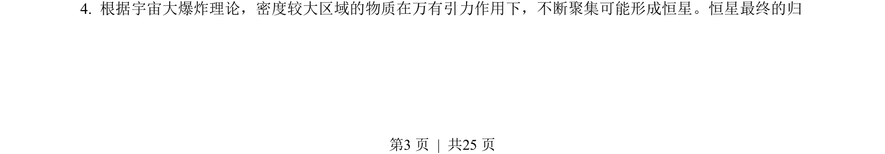
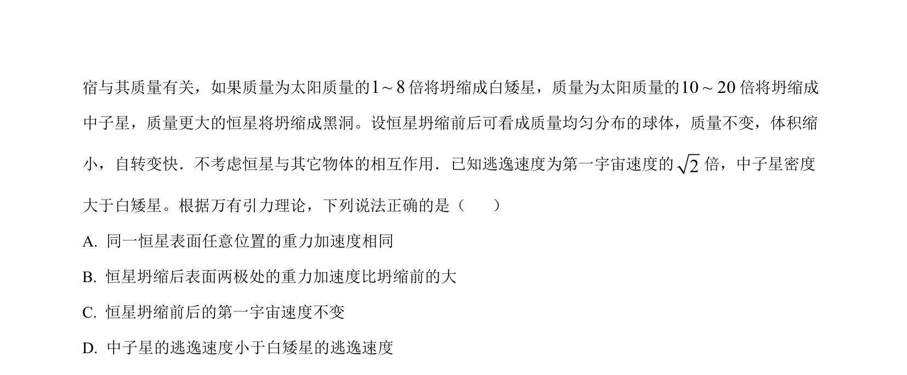
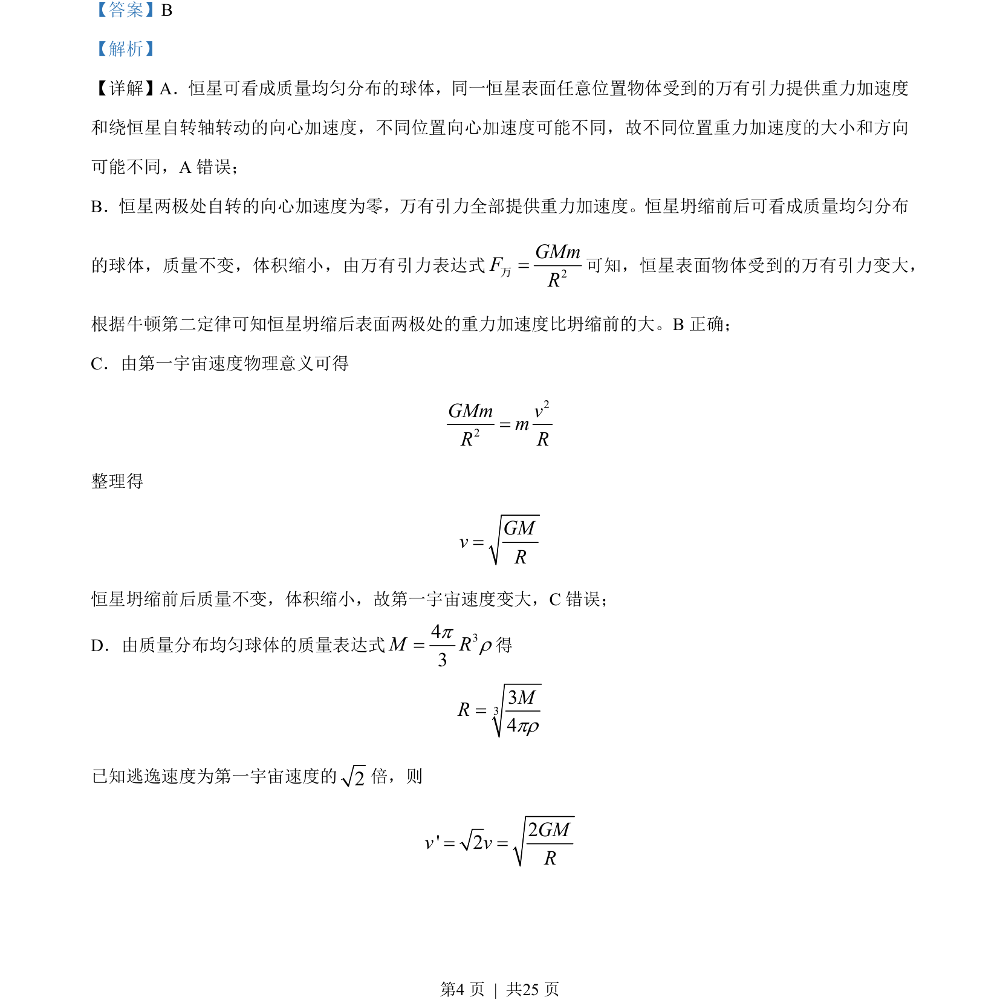
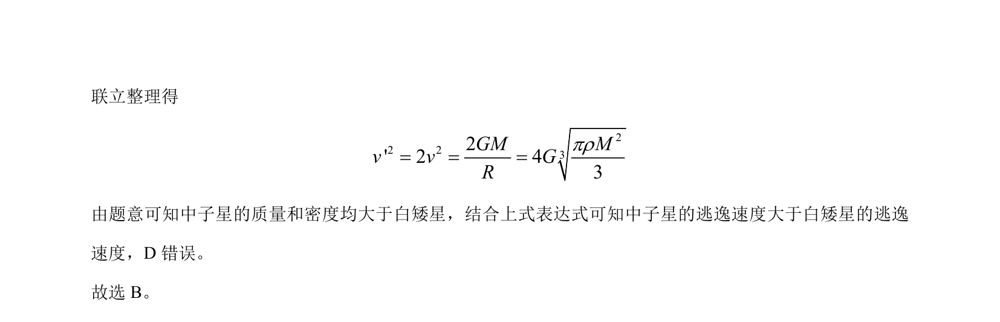

## 题面

## 摘要

恒星坍缩前后重力加速度、第一宇宙速度和逃逸速度的变化分析

## 关联考点

- [[246-万有引力定律|万有引力定律]]
- [[115-重力加速度-初中|重力加速度]]
- [[281-第一宇宙速度|第一宇宙速度]]
- [[851-第二宇宙速度|逃逸速度]]

## 答案与解析

> 📄 原 PDF 第 3 页：`素材/真题/湖南/2008-2024·（湖南）物理高考真题/2023年高考物理试卷（湖南）（解析卷）.pdf`
